# Module 8 - Transform data with Azure Data Factory or Azure Synapse Pipelines

This module teaches students how to build data integration pipelines to ingest from multiple data sources, transform data using mapping data flows and notebooks, and perform data movement into one or more data sinks.

In this module, the student will be able to:

- Execute code-free transformations at scale with Azure Synapse Pipelines
- Create data pipeline to import poorly formatted CSV files
- Create Mapping Data Flows

## Lab details

- [Module 8 - Transform data with Azure Data Factory or Azure Synapse Pipelines](#module-8---transform-data-with-azure-data-factory-or-azure-synapse-pipelines)
  - [Lab details](#lab-details)
  - [Lab setup and pre-requisites](#lab-setup-and-pre-requisites)
  - [Exercise 0: Start the dedicated SQL pool](#exercise-0-start-the-dedicated-sql-pool)
  - [Lab 1: Code-free transformation at scale with Azure Synapse Pipelines](#lab-1-code-free-transformation-at-scale-with-azure-synapse-pipelines)
    - [Exercise 1: Create artifacts](#exercise-1-create-artifacts)
      - [Task 1: Create SQL table](#task-1-create-sql-table)
      - [Task 2: Create linked service](#task-2-create-linked-service)
      - [Task 3: Create data sets](#task-3-create-data-sets)
      - [Task 4: Create campaign analytics dataset](#task-4-create-campaign-analytics-dataset)
    - [Exercise 2: Create data pipeline to import poorly formatted CSV](#exercise-2-create-data-pipeline-to-import-poorly-formatted-csv)
      - [Task 1: Create campaign analytics data flow](#task-1-create-campaign-analytics-data-flow)
      - [Task 2: Create campaign analytics data pipeline](#task-2-create-campaign-analytics-data-pipeline)
      - [Task 3: Run the campaign analytics data pipeline](#task-3-run-the-campaign-analytics-data-pipeline)
      - [Task 4: View campaign analytics table contents](#task-4-view-campaign-analytics-table-contents)
    - [Exercise 3: Create Mapping Data Flow for top product purchases](#exercise-3-create-mapping-data-flow-for-top-product-purchases)
      - [Task 1: Create Mapping Data Flow](#task-1-create-mapping-data-flow)
  - [Lab 2: Orchestrate data movement and transformation in Azure Synapse Pipelines](#lab-2-orchestrate-data-movement-and-transformation-in-azure-synapse-pipelines)
    - [Exercise 1: Create, trigger, and monitor pipeline](#exercise-1-create-trigger-and-monitor-pipeline)
      - [Task 1: Create pipeline](#task-1-create-pipeline)
      - [Task 2: Trigger, monitor, and analyze the user profile data pipeline](#task-2-trigger-monitor-and-analyze-the-user-profile-data-pipeline)
    - [Exercise 2: Cleanup](#exercise-2-cleanup)
      - [Task 1: Pause the dedicated SQL pool](#task-1-pause-the-dedicated-sql-pool)

## Lab setup and pre-requisites

> **Note:** Only complete the `Lab setup and pre-requisites` steps if you are **not** using a hosted lab environment, and are instead using your own Azure subscription. Otherwise, skip ahead to Exercise 0.

**Complete the [lab setup instructions](https://github.com/solliancenet/microsoft-data-engineering-ilt-deploy/blob/main/setup/04/README.md)** for this module.

Note, the following modules share this same environment:

- [Module 4](labs/04/README.md)
- [Module 5](labs/05/README.md)
- [Module 7](labs/07/README.md)
- [Module 8](labs/08/README.md)
- [Module 9](labs/09/README.md)
- [Module 10](labs/10/README.md)
- [Module 11](labs/11/README.md)
- [Module 12](labs/12/README.md)
- [Module 13](labs/13/README.md)
- [Module 16](labs/16/README.md)

## Exercise 0: Start the dedicated SQL pool

This lab uses the dedicated SQL pool. As a first step, make sure it is not paused. If so, start it by following these instructions:

1. Open Synapse Studio (<https://web.azuresynapse.net/>).

2. Select the **Manage** hub.

    

3. Select **SQL pools** in the left-hand menu **(1)**. If the dedicated SQL pool is paused, hover over the name of the pool and select **Resume (2)**.

    

4. When prompted, select **Resume**. It will take a minute or two to resume the pool.

    

> **Continue to the next exercise** while the dedicated SQL pool resumes.

## Lab 1: Code-free transformation at scale with Azure Synapse Pipelines

Tailwind Traders would like code-free options for data engineering tasks. Their motivation is driven by the desire to allow junior-level data engineers who understand the data but do not have a lot of development experience build and maintain data transformation operations. The other driver for this requirement is to reduce fragility caused by complex code with reliance on libraries pinned to specific versions, remove code testing requirements, and improve ease of long-term maintenance.

Their other requirement is to maintain transformed data in a data lake in addition to the dedicated SQL pool. This gives them the flexibility to retain more fields in their data sets than they otherwise store in fact and dimension tables, and doing this allows them to access the data when they have paused the dedicated SQL pool, as a cost optimization.

Given these requirements, you recommend building Mapping Data Flows.

Mapping Data flows are pipeline activities that provide a visual way of specifying how to transform data, through a code-free experience. This feature offers data cleansing, transformation, aggregation, conversion, joins, data copy operations, etc.

Additional benefits

- Cloud scale via Spark execution
- Guided experience to easily build resilient data flows
- Flexibility to transform data per user’s comfort
- Monitor and manage data flows from a single pane of glass

### Exercise 1: Create artifacts

#### Task 1: Create SQL table

The Mapping Data Flow we will build will write user purchase data to a dedicated SQL pool. Tailwind Traders does not yet have a table to store this data. We will execute a SQL script to create this table as a pre-requisite.

1. Open Synapse Analytics Studio (<https://web.azuresynapse.net/>), and then navigate to the **Develop** hub.

    

2. From the **Develop** menu, select the **+** button **(1)** and choose **SQL Script (2)** from the context menu.

    

3. In the toolbar menu, connect to the **SQLPool01** database to execute the query.

    

4. In the query window, replace the script with the following to create a new table that joins users' preferred products stored in Azure Cosmos DB with top product purchases per user from the e-commerce site, stored in JSON files within the data lake:

    ```sql
    CREATE TABLE [wwi].[UserTopProductPurchases]
    (
        [UserId] [int]  NOT NULL,
        [ProductId] [int]  NOT NULL,
        [ItemsPurchasedLast12Months] [int]  NULL,
        [IsTopProduct] [bit]  NOT NULL,
        [IsPreferredProduct] [bit]  NOT NULL
    )
    WITH
    (
        DISTRIBUTION = HASH ( [UserId] ),
        CLUSTERED COLUMNSTORE INDEX
    )
    ```

5. Select **Run** from the toolbar menu to execute the SQL command.

    

6. In the query window, replace the script with the following to create a new table for the Campaign Analytics CSV file:

    ```sql
    CREATE TABLE [wwi].[CampaignAnalytics]
    (
        [Region] [nvarchar](50)  NOT NULL,
        [Country] [nvarchar](30)  NOT NULL,
        [ProductCategory] [nvarchar](50)  NOT NULL,
        [CampaignName] [nvarchar](500)  NOT NULL,
        [Revenue] [decimal](10,2)  NULL,
        [RevenueTarget] [decimal](10,2)  NULL,
        [City] [nvarchar](50)  NULL,
        [State] [nvarchar](25)  NULL
    )
    WITH
    (
        DISTRIBUTION = HASH ( [Region] ),
        CLUSTERED COLUMNSTORE INDEX
    )
    ```

7. Select **Run** from the toolbar menu to execute the SQL command.

    

#### Task 2: Create linked service

Azure Cosmos DB is one of the data sources that will be used in the Mapping Data Flow. Tailwind Traders has not yet created the linked service. Follow the steps in this section to create one.

> **Note**: Skip this section if you have already created a Cosmos DB linked service.

1. Navigate to the **Manage** hub.

    

2. Open **Linked services** and select **+ New** to create a new linked service. Select **Azure Cosmos DB (SQL API)** in the list of options, then select **Continue**.

    

3. Name the linked service `asacosmosdb01` **(1)**, select the **Cosmos DB account name** (`asacosmosdbSUFFIX`) and set the **Database name** value to `CustomerProfile` **(2)**. Select **Test connection** to ensure success **(3)**, then select **Create (4)**.

    

#### Task 3: Create data sets

User profile data comes from two different data sources, which we will create now: `asal400_ecommerce_userprofiles_source` and `asal400_customerprofile_cosmosdb`. The customer profile data from an e-commerce system that provides top product purchases for each visitor of the site (customer) over the past 12 months is stored within JSON files in the data lake. User profile data containing, among other things, product preferences and product reviews is stored as JSON documents in Cosmos DB.

In this section, you'll create datasets for the SQL tables that will serve as data sinks for data pipelines you'll create later in this lab.

Complete the steps below to create the following two datasets: `asal400_ecommerce_userprofiles_source` and `asal400_customerprofile_cosmosdb`.

1. Navigate to the **Data** hub.

    

2. Select **+** in the toolbar **(1)**, then select **Integration dataset (2)** to create a new dataset.

    

3. Select **Azure Cosmos DB (SQL API)** from the list **(1)**, then select **Continue (2)**.

    

4. Configure the dataset with the following characteristics, then select **OK (4)**:

    - **Name**: Enter `asal400_customerprofile_cosmosdb` **(1)**.
    - **Linked service**: Select the Azure Cosmos DB linked service **(2)**.
    - **Collection**: Select `OnlineUserProfile01` **(3)**.

    

5. After creating the dataset, select **Preview data** under its **Connection** tab.

    

6. Preview data queries the selected Azure Cosmos DB collection and returns a sample of the documents within. The documents are stored in JSON format and include a `userId` field, `cartId`, `preferredProducts` (an array of product IDs that may be empty), and `productReviews` (an array of written product reviews that may be empty).

    

7. Select **+** in the toolbar **(1)**, then select **Integration dataset (2)** to create a new dataset.

    

8. Select **Azure Data Lake Storage Gen2** from the list **(1)**, then select **Continue (2)**.

    

9. Select the **JSON** format **(1)**, then select **Continue (2)**.

    

10. Configure the dataset with the following characteristics, then select **OK (5)**:

    - **Name**: Enter `asal400_ecommerce_userprofiles_source` **(1)**.
    - **Linked service**: Select the `asadatalakeXX` linked service that already exists **(2)**.
    - **File path**: Browse to the `wwi-02/online-user-profiles-02` path **(3)**.
    - **Import schema**: Select `From connection/store` **(4)**.

    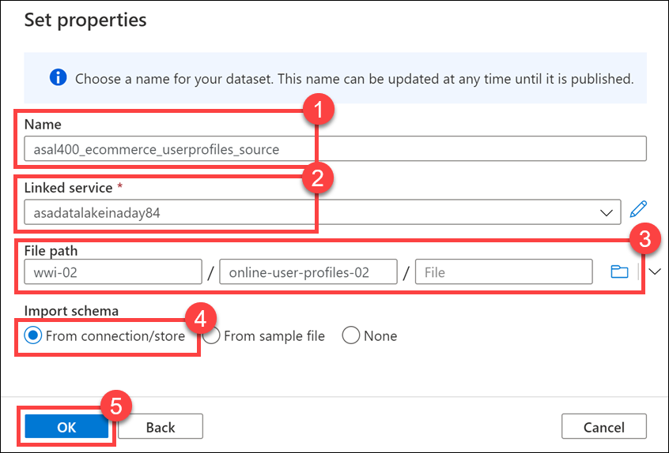

11. Select **+** in the toolbar **(1)**, then select **Integration dataset (2)** to create a new dataset.

    

12. Select **Azure Synapse Analytics** from the list **(1)**, then select **Continue (2)**.

    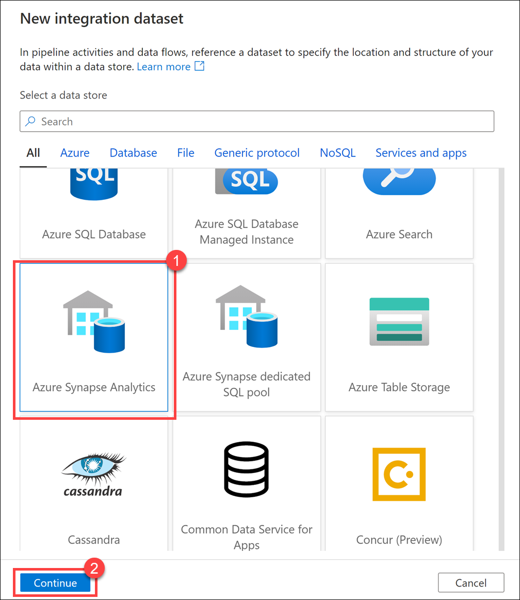

13. Configure the dataset with the following characteristics, then select **OK (5)**:

    - **Name**: Enter `asal400_wwi_campaign_analytics_asa` **(1)**.
    - **Linked service**: Select the `SqlPool01` service **(2)**.
    - **Table name**: Select `wwi.CampaignAnalytics` **(3)**.
    - **Import schema**: Select `From connection/store` **(4)**.

    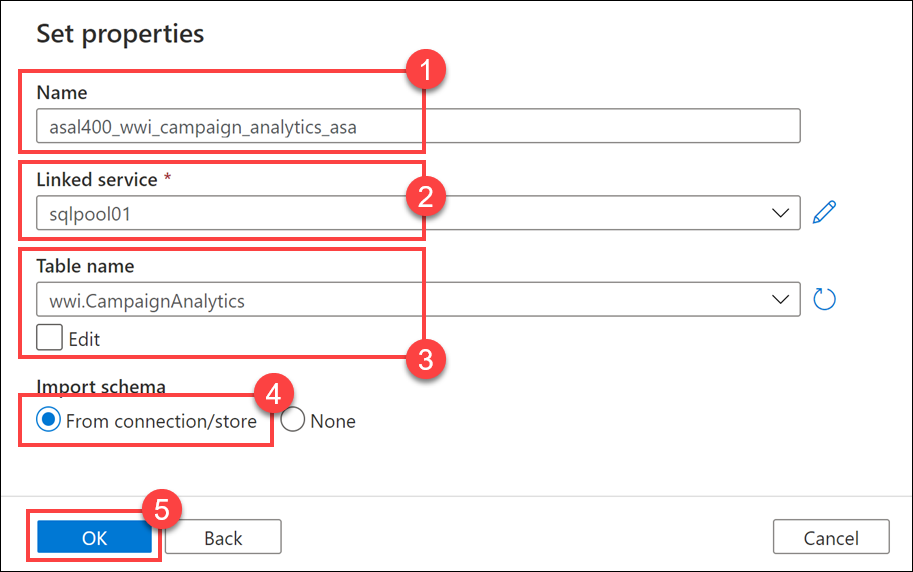

14. Select **+** in the toolbar **(1)**, then select **Integration dataset (2)** to create a new dataset.

    

15. Select **Azure Synapse Analytics** from the list **(1)**, then select **Continue (2)**.

    

16. Configure the dataset with the following characteristics, then select **OK (5)**:

    - **Name**: Enter `asal400_wwi_usertopproductpurchases_asa` **(1)**.
    - **Linked service**: Select the `SqlPool01` service **(2)**.
    - **Table name**: Select `wwi.UserTopProductPurchases` **(3)**.
    - **Import schema**: Select `From connection/store` **(4)**.

    

#### Task 4: Create campaign analytics dataset

Your organization was provided a poorly formatted CSV file containing marketing campaign data. The file was uploaded to the data lake and now it must be imported into the data warehouse.


Issues include invalid characters in the revenue currency data, and misaligned columns.

1. Navigate to the **Data** hub.

    

2. Select **+** in the toolbar **(1)**, then select **Integration dataset (2)** to create a new dataset.

    

3. Select **Azure Data Lake Storage Gen2** from the list **(1)**, then select **Continue (2)**.

    

4. Select the **DelimitedText** format **(1)**, then select **Continue (2)**.

    

5. Configure the dataset with the following characteristics, then select **OK (6)**:

    - **Name**: Enter `asal400_campaign_analytics_source` **(1)**.
    - **Linked service**: Select the `asadatalakeSUFFIX` linked service **(2)**.
    - **File path**: Browse to the `wwi-02/campaign-analytics/campaignanalytics.csv` path **(3)**.
    - **First row as header**: Leave `unchecked` **(4)**. **We are skipping the header** because there is a mismatch between the number of columns in the header and the number of columns in the data rows.
    - **Import schema**: Select `From connection/store` **(5)**.

    

6. After creating the dataset, navigate to its **Connection** tab. Leave the default settings. They should match the following configuration:

    - **Compression type**: Select `none`.
    - **Column delimiter**: Select `Comma (,)`.
    - **Row delimiter**: Select `Default (\r,\n, or \r\n)`.
    - **Encoding**: Select `Default(UTF-8).
    - **Escape character**: Select `Backslash (\)`.
    - **Quote character**: Select `Double quote (")`.
    - **First row as header**: Leave `unchecked`.
    - **Null value**: Leave the field empty.

    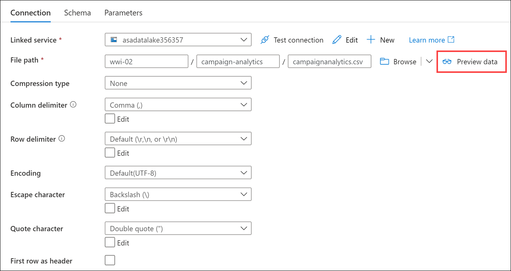

7. Select **Preview data**.

8. Preview data displays a sample of the CSV file. You can see some of the issues shown in the screenshot at the beginning of this task. Notice that since we are not setting the first row as the header, the header columns appear as the first row. Also, notice that the city and state values seen in the earlier screenshot do not appear. This is because of the mismatch in the number of columns in the header row compared to the rest of the file. We will exclude the first row when we create the data flow in the next exercise.

    

9. Select **Publish all** then **Publish** to save your new resources.

    

### Exercise 2: Create data pipeline to import poorly formatted CSV

#### Task 1: Create campaign analytics data flow

1. Navigate to the **Develop** hub.

    

2. Select + then **Data flow** to create a new data flow.

    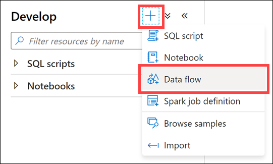

3. In the **General** settings of the **Properties** blade of the new data flow, update the **Name** to the following: `asal400_lab2_writecampaignanalyticstoasa`.

    

4. Select **Add Source** on the data flow canvas.

    

5. Under **Source settings**, configure the following:

    - **Output stream name**: Enter `CampaignAnalytics`.
    - **Source type**: Select `Dataset`.
    - **Dataset**: Select `asal400_campaign_analytics_source`.
    - **Options**: Select `Allow schema drift` and leave the other options unchecked.
    - **Skip line count**: Enter `1`. This allows us to skip the header row which has two fewer columns than the rest of the rows in the CSV file, truncating the last two data columns.
    - **Sampling**: Select `Disable`.

    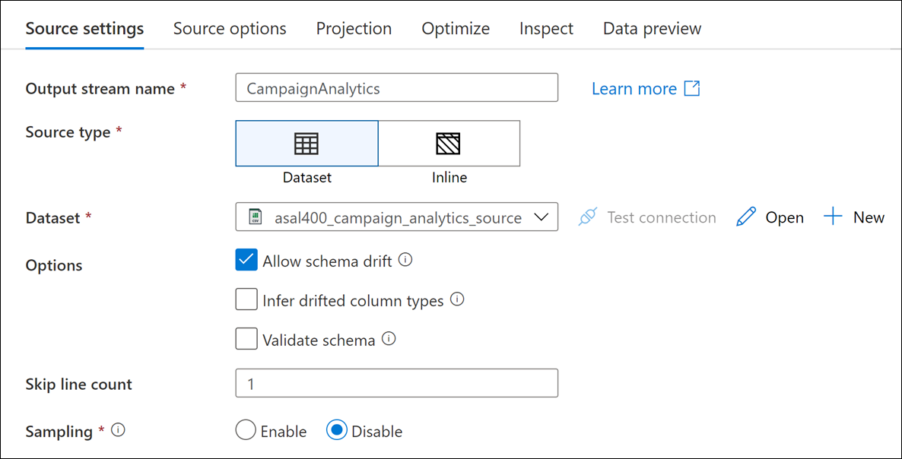

6. When you create data flows, certain features are enabled by turning on debug, such as previewing data and importing a schema (projection). Due to the amount of time it takes to enable this option, as well as environmental constraints of the lab environment, we will bypass these features. The data source has a schema we need to set. To do this, select **Script** above the design canvas.

    

7. Replace the script with the following to provide the column mappings (`output`), then select **OK**:

    ```json
    source(output(
            {_col0_} as string,
            {_col1_} as string,
            {_col2_} as string,
            {_col3_} as string,
            {_col4_} as string,
            {_col5_} as double,
            {_col6_} as string,
            {_col7_} as double,
            {_col8_} as string,
            {_col9_} as string
        ),
        allowSchemaDrift: true,
        validateSchema: false,
        ignoreNoFilesFound: false) ~> CampaignAnalytics
    ```

    Your script should match the following:

    

8. Select the **CampaignAnalytics** data source, then select **Projection**. The projection should display the following schema:

    

9. Select the **+** to the right of the `CampaignAnalytics` source, then select the **Select** schema modifier from the context menu.

    

10. Under **Select settings**, configure the following:

    - **Output stream name**: Enter `MapCampaignAnalytics`.
    - **Incoming stream**: Select `CampaignAnalytics`.
    - **Options**: Check both options.
    - **Input columns**: make sure `Auto mapping` is unchecked, then provide the following values in the **Name as** fields:
      - Region
      - Country
      - ProductCategory
      - CampaignName
      - RevenuePart1
      - Revenue
      - RevenueTargetPart1
      - RevenueTarget
      - City
      - State

    

11. Select the **+** to the right of the `MapCampaignAnalytics` source, then select the **Derived Column** schema modifier from the context menu.

    

12. Under **Derived column's settings**, configure the following:

    - **Output stream name**: Enter `ConvertColumnTypesAndValues`.
    - **Incoming stream**: Select `MapCampaignAnalytics`.
    - **Columns**: Provide the following information:

        | Column | Expression | Description |
        | --- | --- | --- |
        | Revenue | `toDecimal(replace(concat(toString(RevenuePart1), toString(Revenue)), '\\', ''), 10, 2, '$###,###.##')` | Concatenate the `RevenuePart1` and `Revenue` fields, replace the invalid `\` character, then convert and format the data to a decimal type. |
        | RevenueTarget | `toDecimal(replace(concat(toString(RevenueTargetPart1), toString(RevenueTarget)), '\\', ''), 10, 2, '$###,###.##')` | Concatenate the `RevenueTargetPart1` and `RevenueTarget` fields, replace the invalid `\` character, then convert and format the data to a decimal type. |

    > **Note**: To insert the second column, select **+ Add** above the Columns list, then select **Add column**.

    

13. Select the **+** to the right of the `ConvertColumnTypesAndValues` step, then select the **Select** schema modifier from the context menu.

    

14. Under **Select settings**, configure the following:

    - **Output stream name**: Enter `SelectCampaignAnalyticsColumns`.
    - **Incoming stream**: Select `ConvertColumnTypesAndValues`.
    - **Options**: Check both options.
    - **Input columns**: make sure `Auto mapping` is unchecked, then **Delete** `RevenuePart1` and `RevenueTargetPart1`. We no longer need these fields.

    

15. Select the **+** to the right of the `SelectCampaignAnalyticsColumns` step, then select the **Sink** destination from the context menu.

    

16. Under **Sink**, configure the following:

    - **Output stream name**: Enter `CampaignAnalyticsASA`.
    - **Incoming stream**: Select `SelectCampaignAnalyticsColumns`.
    - **Sink type**: Select `Dataset`.
    - **Dataset**: Select `asal400_wwi_campaign_analytics_asa`, which is the CampaignAnalytics SQL table.
    - **Options**: Check `Allow schema drift` and uncheck `Validate schema`.

    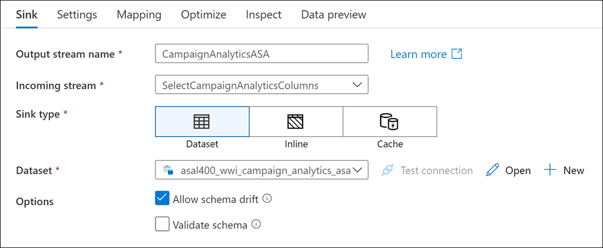

17. Select **Settings**, then configure the following:

    - **Update method**: Check `Allow insert` and leave the rest unchecked.
    - **Table action**: Select `Truncate table`.
    - **Enable staging**: Uncheck this option. The sample CSV file is small, making the staging option unnecessary.

    

18. Your completed data flow should look similar to the following:

    

19. Select **Publish all** then **Publish** to save your new data flow.

    

#### Task 2: Create campaign analytics data pipeline

In order to run the new data flow, you need to create a new pipeline and add a data flow activity to it.

1. Navigate to the **Integrate** hub.

    

2. Select + then **Pipeline** to create a new pipeline.

    

3. In the **General** section of the **Properties** blade for the new pipeline, enter the following **Name**: `Write Campaign Analytics to ASA`.

4. Expand **Move & transform** within the Activities list, then drag the **Data flow** activity onto the pipeline canvas.

    

5. In the `General` section, set the **Name** value to `asal400_lab2_writecampaignanalyticstoasa`.

    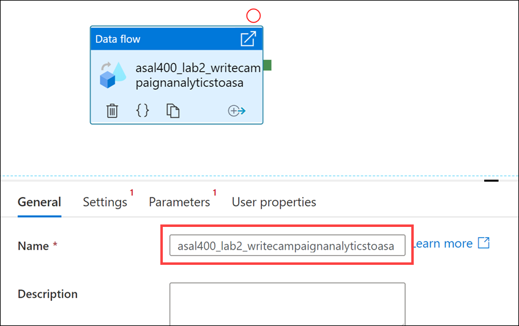

6. Select the **Settings** tab, then select `asal400_lab2_writecampaignanalyticstoasa` under **Data flow**.

    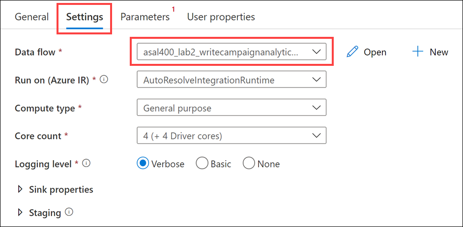

8. Select **Publish all** to save your new pipeline.

    

#### Task 3: Run the campaign analytics data pipeline

1. Select **Add trigger**, and then select **Trigger now** in the toolbar at the top of the pipeline canvas.

    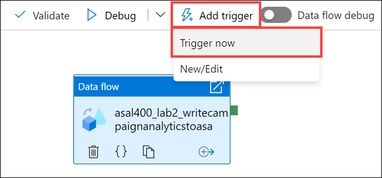

2. In the `Pipeline run` blade, select **OK** to start the pipeline run.

    

3. Navigate to the **Monitor** hub.

    

4. Wait for the pipeline run to successfully complete. You may need to refresh the view.

    > While this is running, read the rest of the lab instructions to familiarize yourself with the content.

    

#### Task 4: View campaign analytics table contents

Now that the pipeline run is complete, let's take a look at the SQL table to verify the data successfully copied.

1. Navigate to the **Data** hub.

    

2. Expand the `SqlPool01` database underneath the **Workspace** section, then expand `Tables`.

3. Right-click the `wwi.CampaignAnalytics` table, then select the **Select TOP 1000 rows** menu item under the New SQL script context menu. You may need to refresh to see the new tables.

    

4. The properly transformed data should appear in the query results.

    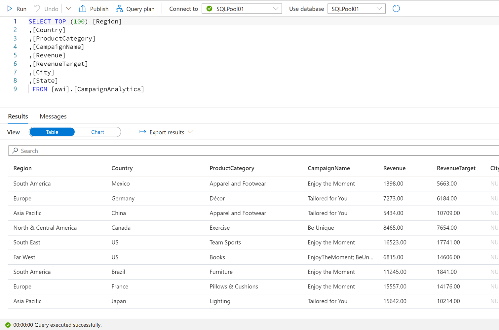

5. Update the query to the following and **Run**:

    ```sql
    SELECT ProductCategory
    ,SUM(Revenue) AS TotalRevenue
    ,SUM(RevenueTarget) AS TotalRevenueTarget
    ,(SUM(RevenueTarget) - SUM(Revenue)) AS Delta
    FROM [wwi].[CampaignAnalytics]
    GROUP BY ProductCategory
    ```

6. In the query results, select the **Chart** view. Configure the columns as defined:

    - **Chart type**: Select `Column`.
    - **Category column**: Select `ProductCategory`.
    - **Legend (series) columns**: Select `TotalRevenue`, `TotalRevenueTarget`, and `Delta`.

    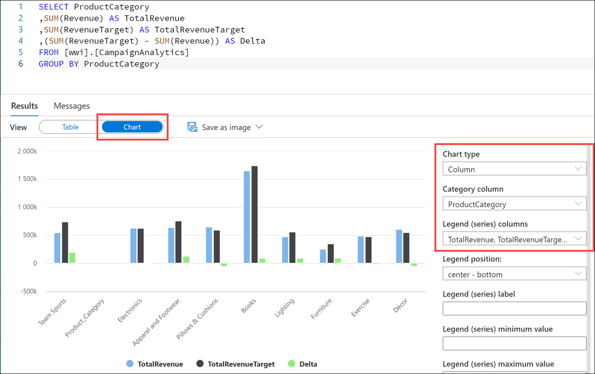

### Exercise 3: Create Mapping Data Flow for top product purchases

Tailwind Traders needs to combine top product purchases imported as JSON files from their eCommerce system with user preferred products from profile data stored as JSON documents in Azure Cosmos DB. They want to store the combined data in a dedicated SQL pool as well as their data lake for further analysis and reporting.

To do this, you will build a mapping data flow that performs the following tasks:

- Adds two ADLS Gen2 data sources for the JSON data
- Flattens the hierarchical structure of both sets of files
- Performs data transformations and type conversions
- Joins both data sources
- Creates new fields on the joined data set based on conditional logic
- Filters null records for required fields
- Writes to the dedicated SQL pool
- Simultaneously writes to the data lake

#### Task 1: Create Mapping Data Flow

1. Navigate to the **Develop** hub.

    

2. Select **+** then **Data flow** to create a new data flow.

    

3. In the **General** section of the **Profiles** pane of the new data flow, update the **Name** to the following: `write_user_profile_to_asa`.

    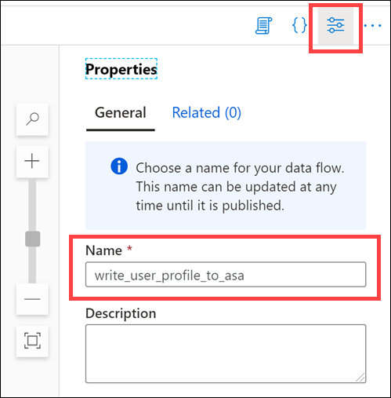

4. Select the **Properties** button to hide the pane.

    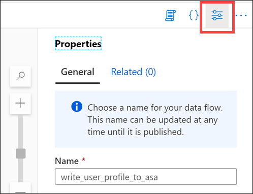

5. Select **Add Source** on the data flow canvas.

    

6. Under **Source settings**, configure the following:

    - **Output stream name**: Enter `EcommerceUserProfiles`.
    - **Source type**: Select `Dataset`.
    - **Dataset**: Select `asal400_ecommerce_userprofiles_source`.

    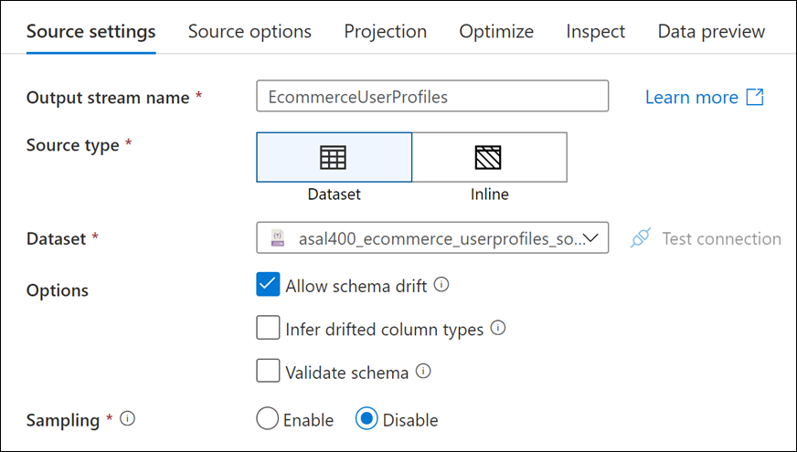

7. Select the **Source options** tab, then configure the following:

    - **Wildcard paths**: Enter `online-user-profiles-02/*.json`.
    - **JSON Settings**: Expand this section, then select the **Array of documents** setting. This denotes that each file contains an array of JSON documents.

    

8. Select the **+** to the right of the `EcommerceUserProfiles` source, then select the **Derived Column** schema modifier from the context menu.

    

9. Under **Derived column's settings**, configure the following:

    - **Output stream name**: Enter `userId`.
    - **Incoming stream**: Select `EcommerceUserProfiles`.
    - **Columns**: Provide the following information:

        | Column | Expression | Description |
        | --- | --- | --- |
        | visitorId | `toInteger(visitorId)` | Converts the `visitorId` column from a string to an integer. |

    

10. Select the **+** to the right of the `userId` step, then select the **Flatten** formatter from the context menu.

    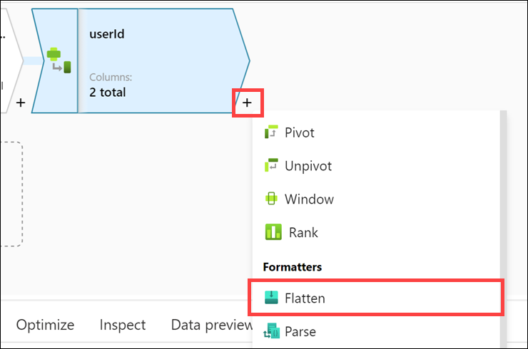

11. Under **Flatten settings**, configure the following:

    - **Output stream name**: Enter `UserTopProducts`.
    - **Incoming stream**: Select `userId`.
    - **Unroll by**: Select `[] topProductPurchases`.
    - **Input columns**: Provide the following information:

        | userId's column | Name as |
        | --- | --- |
        | visitorId | `visitorId` |
        | topProductPurchases.productId | `productId` |
        | topProductPurchases.itemsPurchasedLast12Months | `itemsPurchasedLast12Months` |

        > Select **+ Add mapping**, then select **Fixed mapping** to add each new column mapping.

    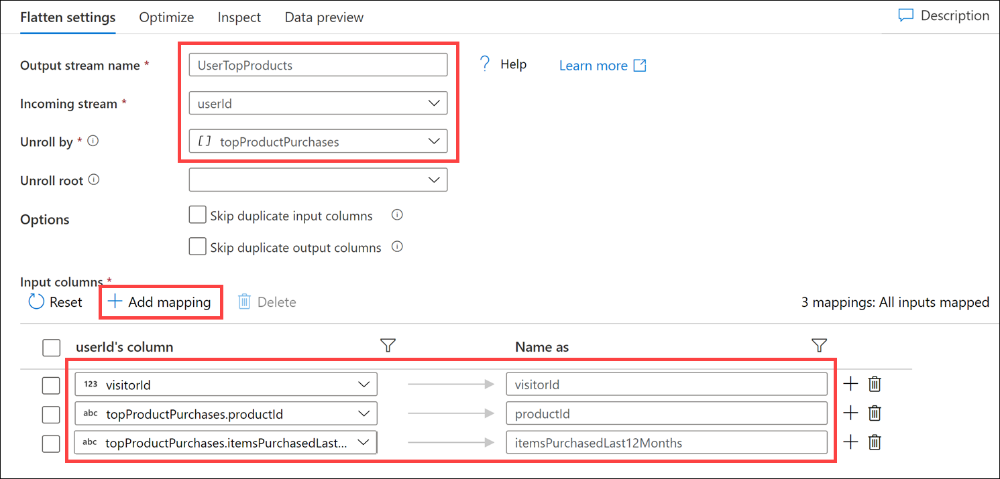

    These settings provide a flattened view of the data source with one or more rows per `visitorId`, similar to when we explored the data within the Spark notebook in the previous module. Using data preview requires you to enable Debug mode, which we are not enabling for this lab. *The following screenshot is for illustration only*:

    

    > **IMPORTANT**: A bug was introduced with the latest release, and the userId source columns are not being updated from the user interface. As a temporary fix, access the script for the data flow (located in the toolbar). Find the `userId` activity in the script, and in the mapColumn function, ensure you append the appropriate source field. For `productId`, ensure it is sourced from **topProductPurchases.productId**, and that **itemsPurchasedLast12Months** is sourced from **topProductPurchases.itemsPurchasedLast12Months**.

    

    ```javascript
    userId foldDown(unroll(topProductPurchases),
        mapColumn(
            visitorId,
            productId = topProductPurchases.productId,
            itemsPurchasedLast12Months = topProductPurchases.itemsPurchasedLast12Months
        )
    ```

    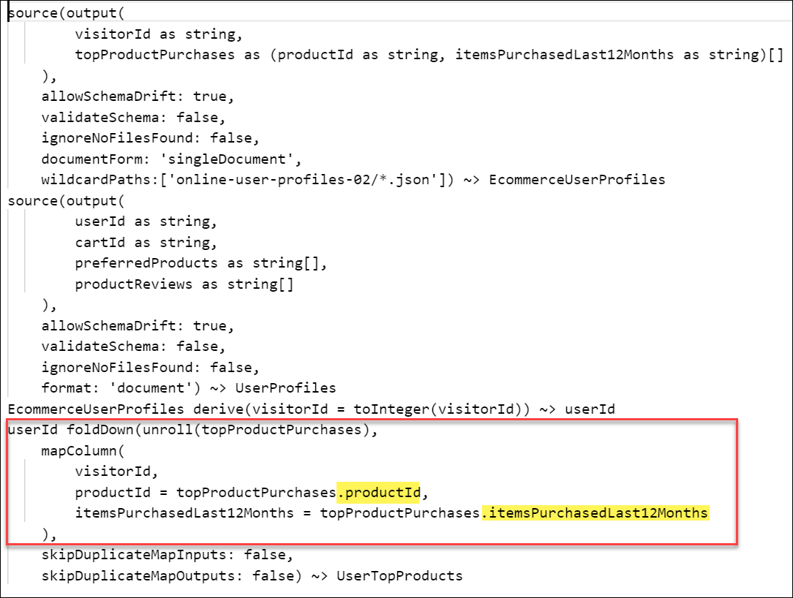

12. Select the **+** to the right of the `UserTopProducts` step, then select the **Derived Column** schema modifier from the context menu.

    

13. Under **Derived column's settings**, configure the following:

    - **Output stream name**: Enter `DeriveProductColumns`.
    - **Incoming stream**: Select `UserTopProducts`.
    - **Columns**: Provide the following information:

        | Column | Expression | Description |
        | --- | --- | --- |
        | productId | `toInteger(productId)` | Converts the `productId` column from a string to an integer. |
        | itemsPurchasedLast12Months | `toInteger(itemsPurchasedLast12Months)` | Converts the `itemsPurchasedLast12Months` column from a string to an integer. |

    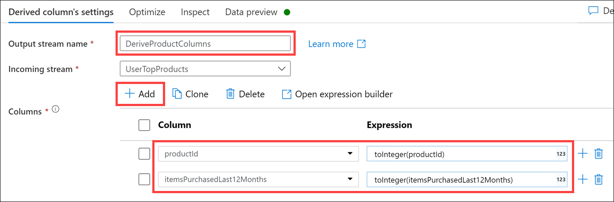

    > **Note**: To add a column to the derived column settings, select **+** to the right of the first column, then select **Add column**.

    

14. Select **Add Source** on the data flow canvas beneath the `EcommerceUserProfiles` source.

    

15. Under **Source settings**, configure the following:

    - **Output stream name**: Enter `UserProfiles`.
    - **Source type**: Select `Dataset`.
    - **Dataset**: Select `asal400_customerprofile_cosmosdb`.

    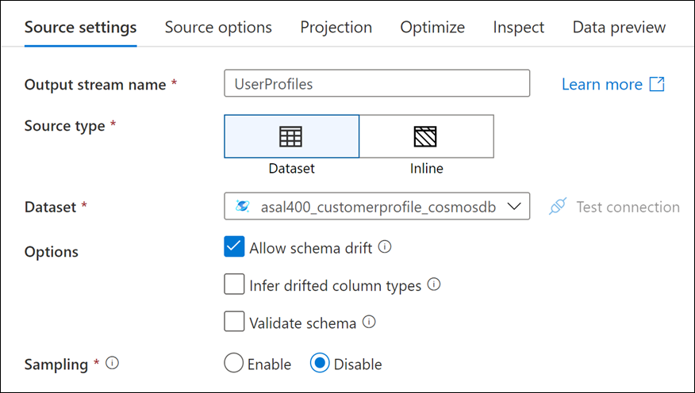

16. Since we are not using the data flow debugger, we need to enter the data flow's Script view to update the source projection. Select **Script** in the toolbar above the canvas.

    

17. Locate the **UserProfiles** `source` in the script and replace its script block with the following to set `preferredProducts` as an `integer[]` array and ensure the data types within the `productReviews` array are correctly defined:

    ```json
    source(output(
            cartId as string,
            preferredProducts as integer[],
            productReviews as (productId as integer, reviewDate as string, reviewText as string)[],
            userId as integer
        ),
        allowSchemaDrift: true,
        validateSchema: false,
        ignoreNoFilesFound: false,
        format: 'document') ~> UserProfiles
    ```

    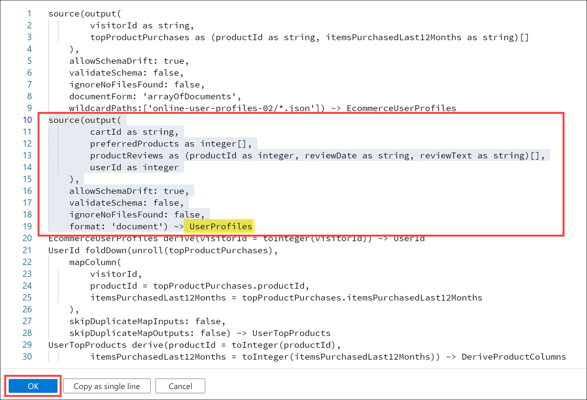

18. Select **OK** to apply the script changes. The data source has now been updated with the new schema. The following screenshot shows what the source data looks like if you are able to view it with the data preview option. Using data preview requires you to enable Debug mode, which we are not enabling for this lab. *The following screenshot is for illustration only*:

    

19. Select the **+** to the right of the `UserProfiles` source, then select the **Flatten** formatter from the context menu.

    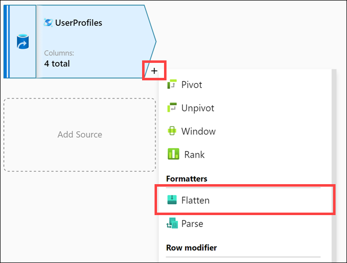

20. Under **Flatten settings**, configure the following:

    - **Output stream name**: Enter `UserPreferredProducts`.
    - **Incoming stream**: Select `UserProfiles`.
    - **Unroll by**: Select `[] preferredProducts`.
    - **Input columns**: Provide the following information. Be sure to **delete** `cartId` and `[] productReviews`:

        | UserProfiles's column | Name as |
        | --- | --- |
        | [] preferredProducts | `preferredProductId` |
        | userId | `userId` |

        > Select **+ Add mapping**, then select **Fixed mapping** to add each new column mapping.

    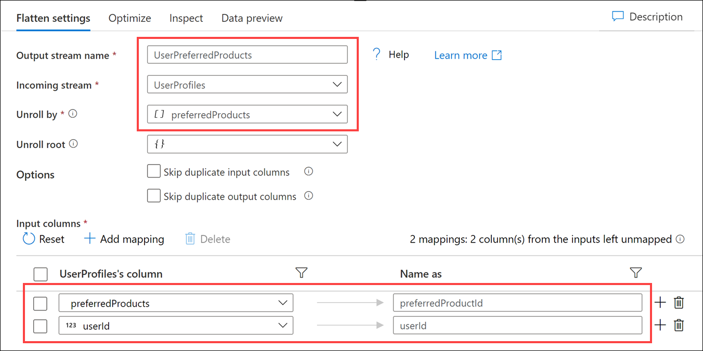

    These settings provide a flattened view of the data source with one or more rows per `userId`. Using data preview requires you to enable Debug mode, which we are not enabling for this lab. *The following screenshot is for illustration only*:

    

21. Now it is time to join the two data sources. Select the **+** to the right of the `DeriveProductColumns` step, then select the **Join** option from the context menu.

    

22. Under **Join settings**, configure the following:

    - **Output stream name**: Enter `JoinTopProductsWithPreferredProducts`.
    - **Left stream**: Select `DeriveProductColumns`.
    - **Right stream**: Select `UserPreferredProducts`.
    - **Join type**: Select `Full outer`.
    - **Join conditions**: Provide the following information:

        | Left: DeriveProductColumns's column | Right: UserPreferredProducts's column |
        | --- | --- |
        | `visitorId` | `userId` |

    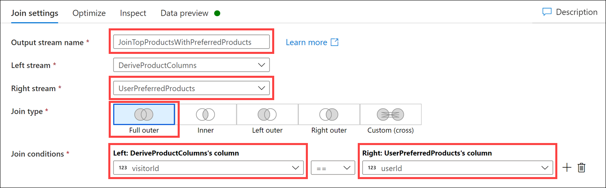

23. Select **Optimize** and configure the following:

    - **Broadcast**: Select `Fixed`.
    - **Broadcast options**: Check `Left: 'DeriveProductColumns'`.
    - **Partition option**: Select `Set partitioning`.
    - **Partition type**: Select `Hash`.
    - **Number of partitions**: Enter `30`.
    - **Column**: Select `productId`.

    

    <!-- **TODO**: Add optimization description. -->

24. Select the **Inspect** tab to see the join mapping, including the column feed source and whether the column is used in a join.

    

    **For illustrative purposes of data preview only:** Since we are not turning on data flow debugging, do not perform this step. In this small sample of data, likely the `userId` and `preferredProductId` columns will only show null values. If you want to get a sense of how many records contain values for these fields, select a column, such as `preferredProductId`, then select **Statistics** in the toolbar above. This displays a chart for the column showing the ratio of values.

    

25. Select the **+** to the right of the `JoinTopProductsWithPreferredProducts` step, then select the **Derived Column** schema modifier from the context menu.

    

26. Under **Derived column's settings**, configure the following:

    - **Output stream name**: Enter `DerivedColumnsForMerge`.
    - **Incoming stream**: Select `JoinTopProductsWithPreferredProducts`.
    - **Columns**: Provide the following information (**_type in_ the _first two_ column names**):

        | Column | Expression | Description |
        | --- | --- | --- |
        | isTopProduct | `toBoolean(iif(isNull(productId), 'false', 'true'))` | Returns `true` if `productId` is not null. Recall that `productId` is fed by the e-commerce top user products data lineage. |
        | isPreferredProduct | `toBoolean(iif(isNull(preferredProductId), 'false', 'true'))` | Returns `true` if `preferredProductId` is not null. Recall that `preferredProductId` is fed by the Azure Cosmos DB user profile data lineage. |
        | productId | `iif(isNull(productId), preferredProductId, productId)` | Sets the `productId` output to either the `preferredProductId` or `productId` value, depending on whether `productId` is null.
        | userId | `iif(isNull(userId), visitorId, userId)` | Sets the `userId` output to either the `visitorId` or `userId` value, depending on whether `userId` is null.

    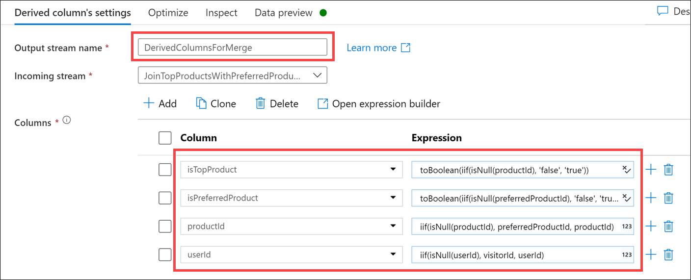

    > **Note**: Remember, select **+**, then **Add column** to the right of a derived column to add a new column below.

    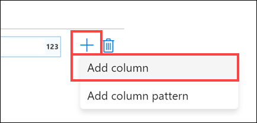

    The derived column settings provide the following result:

    

27. Select the **+** to the right of the `DerivedColumnsForMerge` step, then select the **Filter** destination from the context menu.

    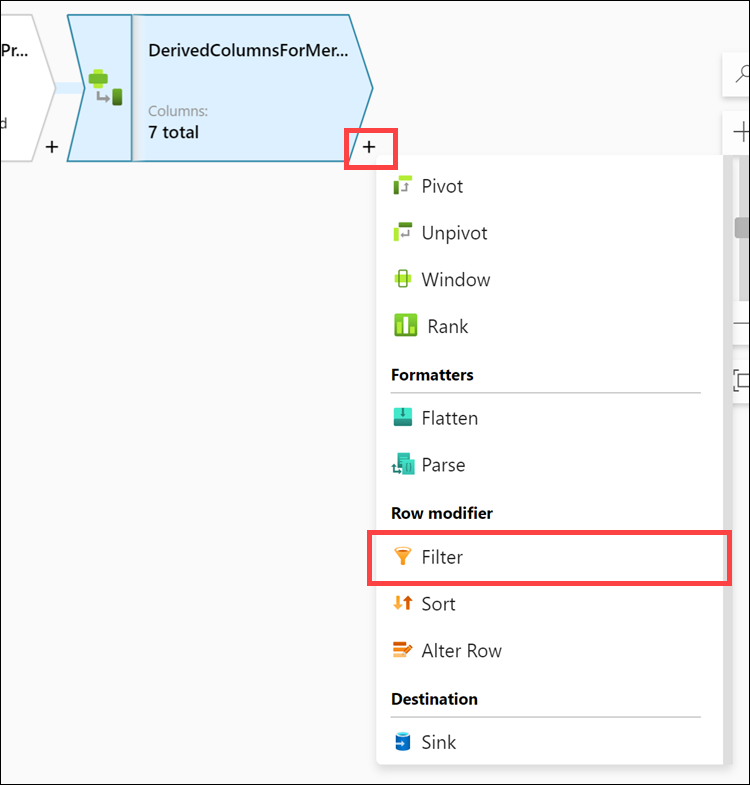

    We are adding the Filter step to remove any records where the `ProductId` is null. The data sets have a small percentage of invalid records, and null `ProductId` values will cause errors when loading into the `UserTopProductPurchases` dedicated SQL pool table.

28. Set the **Filter on** expression to **`!isNull(productId)`**.

    

29. Select the **+** to the right of the `Filter1` step, then select the **Sink** destination from the context menu.

    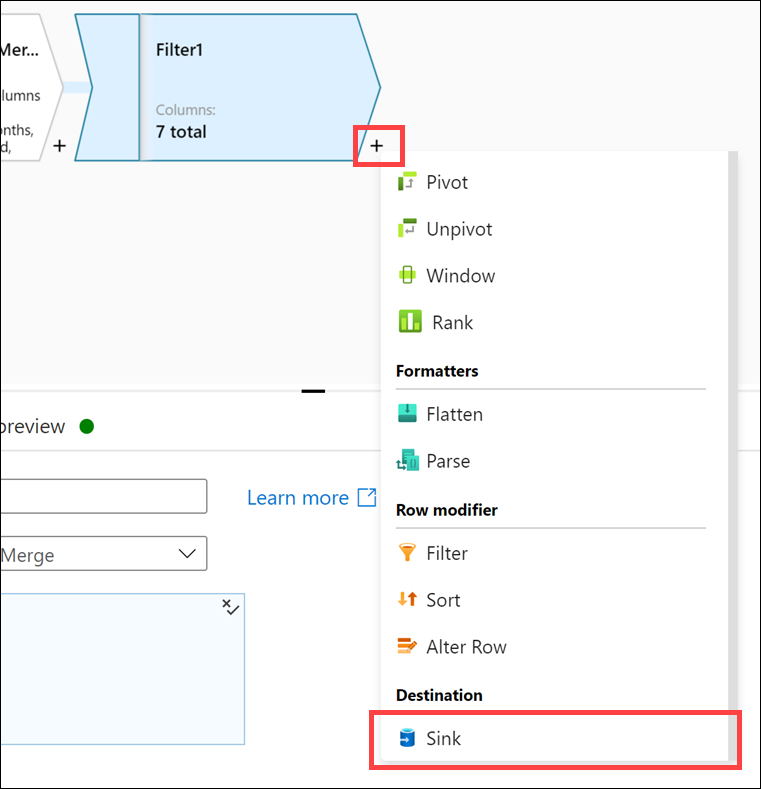

30. Under **Sink**, configure the following:

    - **Output stream name**: Enter `UserTopProductPurchasesASA`.
    - **Incoming stream**: Select `Filter1`.
    - **Sink type**: select `Dataset`.
    - **Dataset**: Select `asal400_wwi_usertopproductpurchases_asa`, which is the UserTopProductPurchases SQL table.
    - **Options**: Check `Allow schema drift` and uncheck `Validate schema`.

    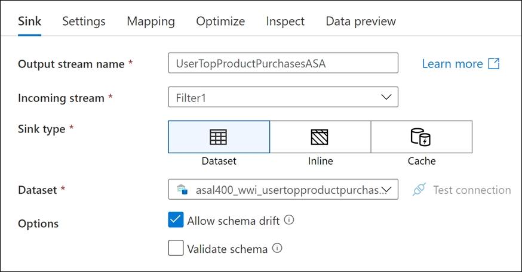

31. Select **Settings**, then configure the following:

    - **Update method**: Check `Allow insert` and leave the rest unchecked.
    - **Table action**: Select `Truncate table`.
    - **Enable staging**: `Check` this option. Since we are importing a lot of data, we want to enable staging to improve performance.

    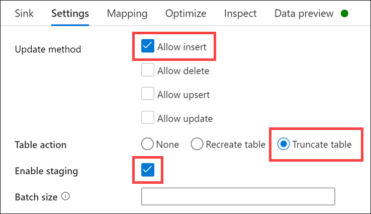

32. Select **Mapping**, then configure the following:

    - **Auto mapping**: `Uncheck` this option.
    - **Columns**: Provide the following information:

        | Input columns | Output columns |
        | --- | --- |
        | userId | UserId |
        | productId | ProductId |
        | itemsPurchasedLast12Months | ItemsPurchasedLast12Months |
        | isTopProduct | IsTopProduct |
        | isPreferredProduct | IsPreferredProduct |

    

33. Select the **+** to the right of the `Filter1` step, then select the **Sink** destination from the context menu to add a second sink.

    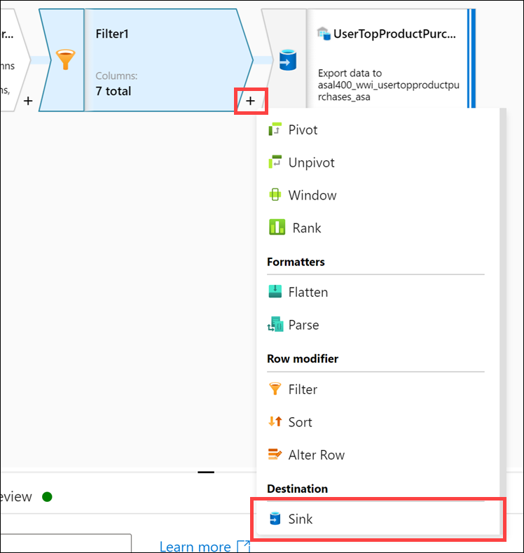

34. Under **Sink**, configure the following:

    - **Output stream name**: Enter `DataLake`.
    - **Incoming stream**: Select `Filter1`.
    - **Sink type**: select `Inline`.
    - **Inline dataset type**: select `Delta`.
    - **Linked service**: Select the default workspace data lake storage account (example: `asaworkspaceinaday84-WorspaceDefaultStorage`).
    - **Options**: Check `Allow schema drift` and uncheck `Validate schema`.

    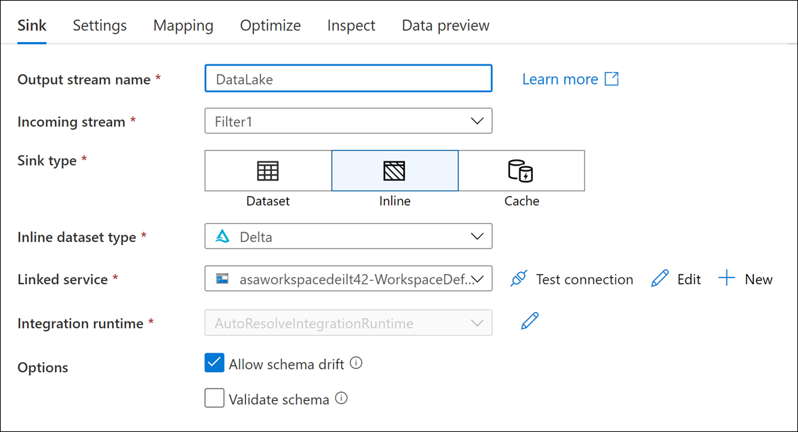

35. Select **Settings**, then configure the following:

    - **Folder path**: Enter `wwi-02/top-products` (**copy and paste** these two values into the fields since the `top-products` folder does not yet exist).
    - **Compression type**: Select `snappy`.
    - **Compression level**: Select `Fastest`.
    - **Vacuum**: Enter 0.
    - **Truncate table**: Select.
    - **Update method**: Check `Allow insert` and leave the rest unchecked.
    - **Merge schema (under Delta options)**: Unchecked.

    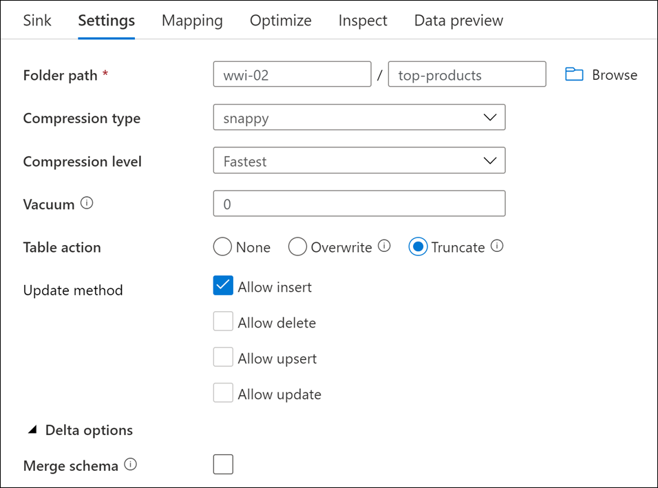

36. Select **Mapping**, then configure the following:

    - **Auto mapping**: `Uncheck` this option.
    - **Columns**: Provide the following information:

        | Input columns | Output columns |
        | --- | --- |
        | visitorId | visitorId |
        | productId | productId |
        | itemsPurchasedLast12Months | itemsPurchasedLast12Months |
        | preferredProductId | preferredProductId |
        | userId | userId |
        | isTopProduct | isTopProduct |
        | isPreferredProduct | isPreferredProduct |

    

    > Notice that we have chosen to keep more fields for the data lake sink vs. the SQL pool sink (`visitorId` and `preferredProductId`). This is because we aren't adhering to a fixed destination schema (like a SQL table), and because we want to retain the original data as much as possible in the data lake.

37. Your completed data flow should look similar to the following:

    

38. Select **Publish all**, then **Publish** to save your new data flow.

    

## Lab 2: Orchestrate data movement and transformation in Azure Synapse Pipelines

Tailwind Traders is familiar with Azure Data Factory (ADF) pipelines and wants to know if Azure Synapse Analytics can either integrate with ADF or has a similar capability. They want to orchestrate data ingest, transformation, and load activities across their entire data catalog, both internal and external to their data warehouse.

You recommend using Synapse Pipelines, which includes over 90 built-in connectors, can load data by manual execution of the pipeline or by orchestration, supports common loading patterns, enables fully parallel loading into the data lake or SQL tables, and shares a code base with ADF.

By using Synapse Pipelines, Tailwind Traders can experience the same familiar interface as ADF without having to use an orchestration service outside of Azure Synapse Analytics.

### Exercise 1: Create, trigger, and monitor pipeline

#### Task 1: Create pipeline

Let's start by executing our new Mapping Data Flow. In order to run the new data flow, we need to create a new pipeline and add a data flow activity to it.

1. Navigate to the **Integrate** hub.

    

2. Select **+ (1)**, then **Pipeline (2)**.

    

3. In the **General** section of the **Profiles** pane of the new data flow, update the **Name** to the following: `Write User Profile Data to ASA`.

    

4. Select the **Properties** button to hide the pane.

    

5. Expand **Move & transform** within the Activities list, then drag the **Data flow** activity onto the pipeline canvas.

    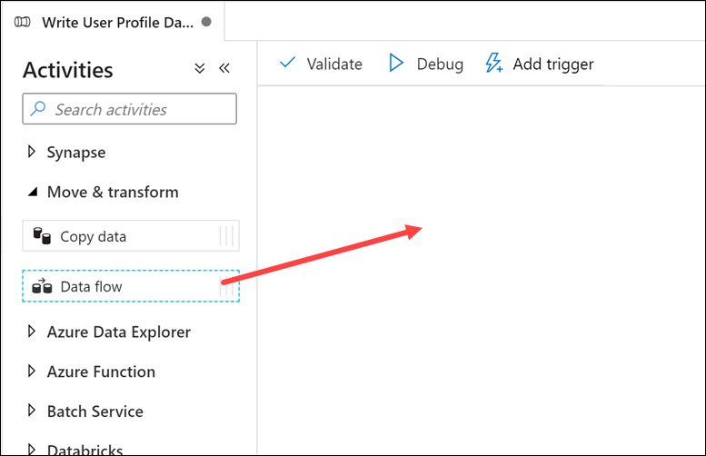

6. Under the **General** tab, set the Name to `write_user_profile_to_asa`.

    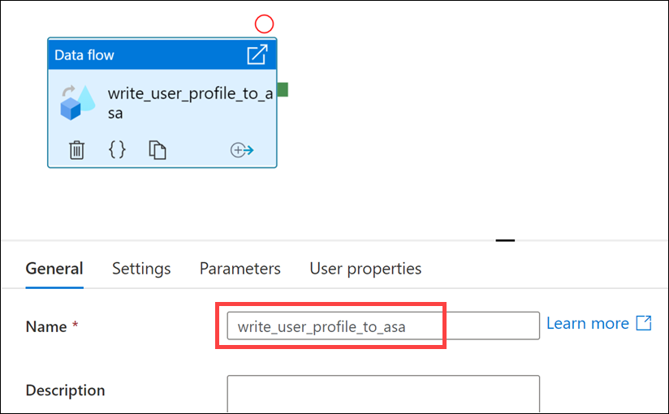

7. Select the **Settings** tab **(1)**. Select `write_user_profile_to_asa` for **Data flow (2)**, then ensure `AutoResolveIntegrationRuntime` is selected for **Run on (Azure IR) (3)**. Choose the `General purpose` **Compute type (4)** and select `8 (+ 8 cores)` for the **Core count (5)**.

    

8. Expand **Staging** and configure the following:

    - **Staging linked service**: Select the `asadatalakeSUFFIX` linked service.
    - **Staging storage folder**: Enter `staging/userprofiles`. The `userprofiles` folder will be automatically created for you during the first pipeline run.

    > **Copy and paste** the `staging` and `userprofiles` folder names into the two fields.

    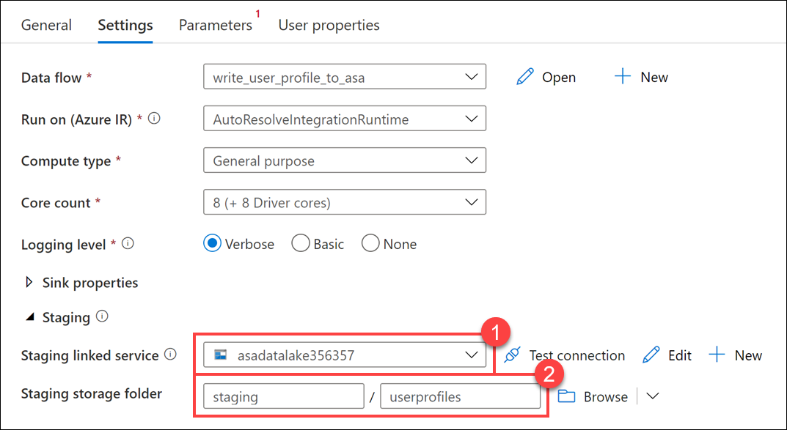

    The staging options under PolyBase are recommended when you have a large amount of data to move into or out of Azure Synapse Analytics. You will want to experiment with enabling and disabling staging on the data flow in a production environment to evaluate the difference in performance.

9. Select **Publish all** then **Publish** to save your pipeline.

    

#### Task 2: Trigger, monitor, and analyze the user profile data pipeline

Tailwind Traders wants to monitor all pipeline runs and view statistics for performance tuning and troubleshooting purposes.

You have decided to show Tailwind Traders how to manually trigger, monitor, then analyze a pipeline run.

1. At the top of the pipeline, select **Add trigger (1)**, then **Trigger now (2)**.

    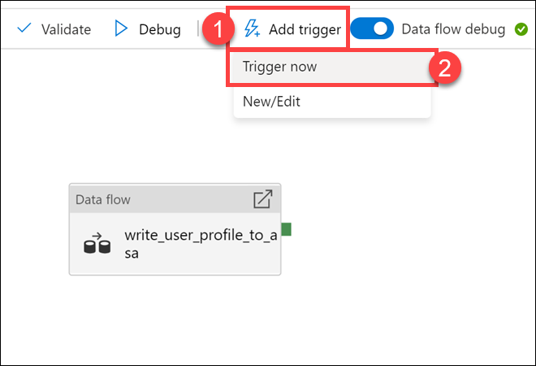

2. There are no parameters for this pipeline, so select **OK** to run the trigger.

    

3. Navigate to the **Monitor** hub.

    

4. Select **Pipeline runs (1)** and wait for the pipeline run to successfully complete **(2)**. You may need to refresh **(3)** the view.

    > While this is running, read the rest of the lab instructions to familiarize yourself with the content.

    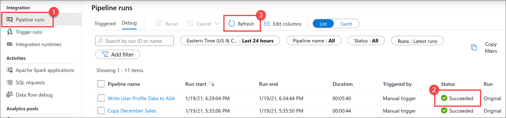

5. Select the name of the pipeline to view the pipeline's activity runs.

    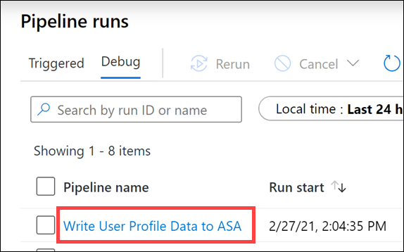

6. Hover over the data flow activity name in the `Activity runs` list, then select the **Data flow details** icon.

    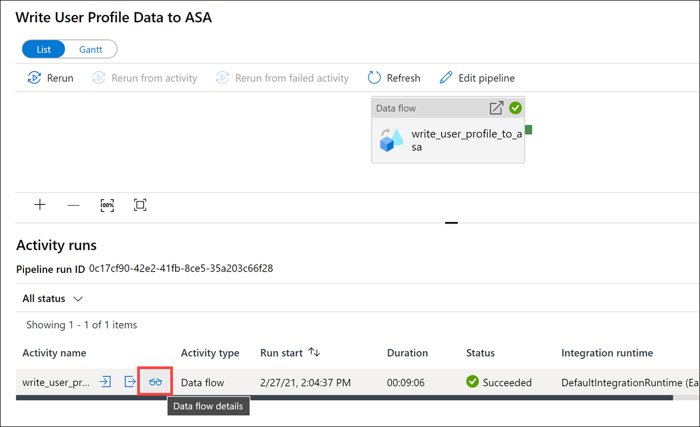

7. The data flow details displays the data flow steps and processing details. In our example, processing time took around **44 seconds to process** the SQL pool sink **(1)**, and around **12 seconds to process** the Data Lake sink **(2)**. The Filter1 output was around **1 million rows (3)** for both. You can see which activities took the longest to complete. The cluster startup time contributed over **2.5 minutes (4)** to the total pipeline run.

    

8. Select the `UserTopProductPurchasesASA` sink **(1)** to view its details. We can see that **1,622,203 rows** were calculated **(2)** with a total of 30 partitions. It took around **eight seconds** to stage the data **(3)** in ADLS Gen2 prior to writing the data to the SQL table. The total sink processing time in our case was around **44 seconds (4)**. It is also apparent that we have a **hot partition (5)** that is significantly larger than the others. If we need to squeeze extra performance out of this pipeline, we can re-evaluate data partitioning to more evenly spread the partitions to better facilitate parallel data loading and filtering. We could also experiment with disabling staging to see if there's a processing time difference. Finally, the size of the dedicated SQL pool plays a factor in how long it takes to ingest data into the sink.

    

### Exercise 2: Cleanup

Complete these steps to free up resources you no longer need.

#### Task 1: Pause the dedicated SQL pool

1. Open Synapse Studio (<https://web.azuresynapse.net/>).

2. Select the **Manage** hub.

    

3. Select **SQL pools** in the left-hand menu **(1)**. Hover over the name of the dedicated SQL pool and select **Pause (2)**.

    

4. When prompted, select **Pause**.

    
