# Module 9 - Integrate data from notebooks with Azure Data Factory or Azure Synapse Pipelines

The student will learn how to create linked services, and orchestrate data movement and transformation in Azure Synapse Pipelines.

In this module, the student will be able to:

- Orchestrate data movement and transformation in Azure Synapse Pipelines

## Lab details

- [Module 9 - Integrate data from notebooks with Azure Data Factory or Azure Synapse Pipelines](#module-9---integrate-data-from-notebooks-with-azure-data-factory-or-azure-synapse-pipelines)
  - [Lab details](#lab-details)
  - [Lab setup and pre-requisites](#lab-setup-and-pre-requisites)
  - [Exercise 1: Linked service and datasets](#exercise-1-linked-service-and-datasets)
    - [Task 1: Create linked service](#task-1-create-linked-service)
    - [Task 2: Create datasets](#task-2-create-datasets)
  - [Exercise 2: Create mapping data flow and pipeline](#exercise-2-create-mapping-data-flow-and-pipeline)
    - [Task 1: Retrieve the ADLS Gen2 linked service name](#task-1-retrieve-the-adls-gen2-linked-service-name)
    - [Task 2: Create mapping data flow](#task-2-create-mapping-data-flow)
    - [Task 3: Create pipeline](#task-3-create-pipeline)
    - [Task 4: Trigger the pipeline](#task-4-trigger-the-pipeline)
  - [Exercise 3: Create Synapse Spark notebook to find top products](#exercise-3-create-synapse-spark-notebook-to-find-top-products)
    - [Task 1: Create notebook](#task-1-create-notebook)
    - [Task 2: Add the Notebook to the pipeline](#task-2-add-the-notebook-to-the-pipeline)

> **TODO:** Include the data sources, mapping data flow, and pipeline from Module 9 in the setup for Module 10.

## Lab setup and pre-requisites

> **Note:** Only complete the `Lab setup and pre-requisites` steps if you are **not** using a hosted lab environment, and are instead using your own Azure subscription. Otherwise, skip ahead to Exercise 1.

**Complete the [lab setup instructions](https://github.com/solliancenet/microsoft-data-engineering-ilt-deploy/blob/main/setup/04/README.md)** for this module.

Note, the following modules share this same environment:

- [Module 4](labs/04/README.md)
- [Module 5](labs/05/README.md)
- [Module 7](labs/07/README.md)
- [Module 8](labs/08/README.md)
- [Module 9](labs/09/README.md)
- [Module 10](labs/10/README.md)
- [Module 11](labs/11/README.md)
- [Module 12](labs/12/README.md)
- [Module 13](labs/13/README.md)
- [Module 16](labs/16/README.md)

## Exercise 1: Linked service and datasets

**Note**: Complete this exercise if you **have not** completed Module 8, or if you do not have the following Synapse artifacts:

- Linked services:
  - `asacosmosdb01`
- Datasets:
  - `asal400_ecommerce_userprofiles_source`
  - `asal400_customerprofile_cosmosdb`

If you completed Module 8 or already have these artifacts, skip ahead to Exercise 2.

### Task 1: Create linked service

Complete the steps below to create an Azure Cosmos DB linked service.

> **Note**: Skip this section if you have already created a Cosmos DB linked service.

1. Open Synapse Studio (<https://web.azuresynapse.net/>), and then navigate to the **Manage** hub.

    

2. Open **Linked services** and select **+ New** to create a new linked service. Select **Azure Cosmos DB (SQL API)** in the list of options, then select **Continue**.

    

3. Name the linked service `asacosmosdb01` **(1)**, select the **Cosmos DB account name** (`asacosmosdbSUFFIX`) and set the **Database name** value to `CustomerProfile` **(2)**. Select **Test connection** to ensure success **(3)**, then select **Create (4)**.

    

### Task 2: Create datasets

Complete the steps below to create the `asal400_customerprofile_cosmosdb` dataset.

> **Note to presenter**: Skip this section if you have already completed Module 4.

1. Navigate to the **Data** hub.

    

2. Select **+** in the toolbar **(1)**, then select **Integration dataset (2)** to create a new dataset.

    

3. Select **Azure Cosmos DB (SQL API)** from the list **(1)**, then select **Continue (2)**.

    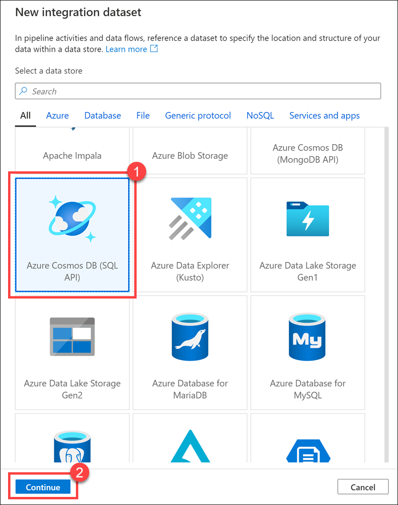

4. Configure the dataset with the following characteristics, then select **OK (4)**:

    - **Name**: Enter `asal400_customerprofile_cosmosdb` **(1)**.
    - **Linked service**: Select the Azure Cosmos DB linked service **(2)**.
    - **Collection**: Select `OnlineUserProfile01` **(3)**.

    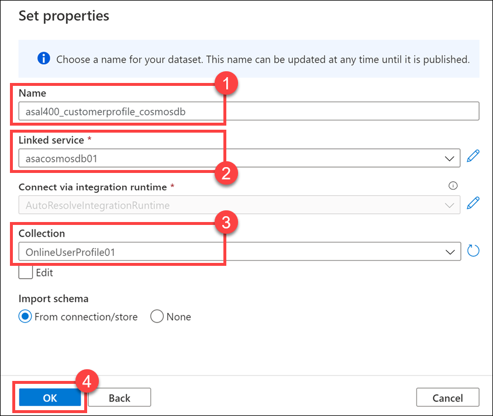

5. Select **+** in the toolbar **(1)**, then select **Integration dataset (2)** to create a new dataset.

    

6. Select **Azure Data Lake Storage Gen2** from the list **(1)**, then select **Continue (2)**.

    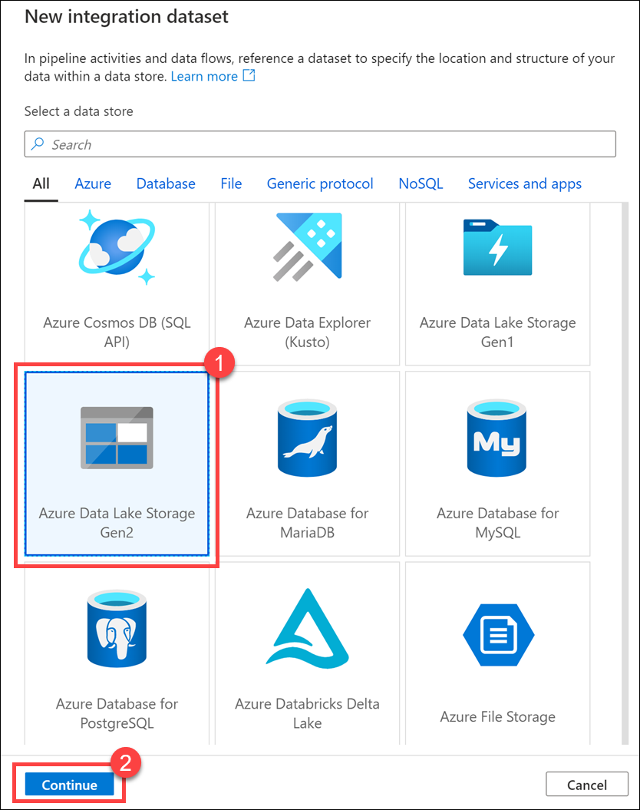

7. Select the **JSON** format **(1)**, then select **Continue (2)**.

    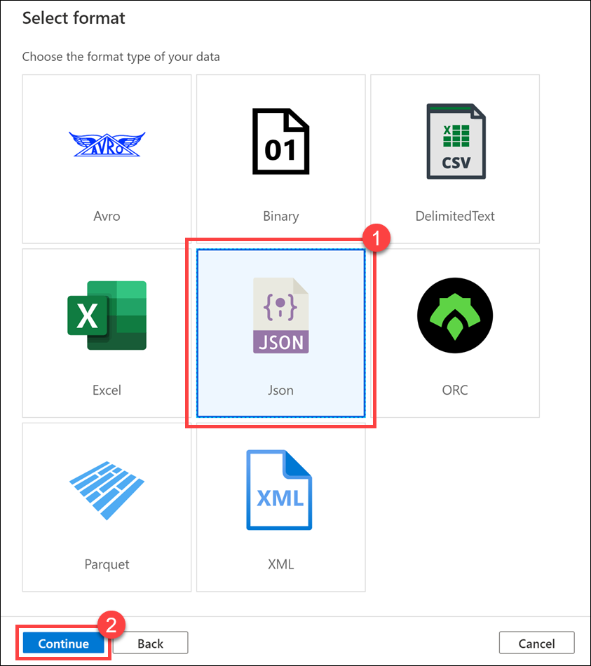

8. Configure the dataset with the following characteristics, then select **OK (5)**:

    - **Name**: Enter `asal400_ecommerce_userprofiles_source` **(1)**.
    - **Linked service**: Select the `asadatalakeXX` linked service that already exists **(2)**.
    - **File path**: Browse to the `wwi-02/online-user-profiles-02` path **(3)**.
    - **Import schema**: Select `From connection/store` **(4)**.

    

9. Select **Publish all** then **Publish** to save your new resources.

    

## Exercise 2: Create mapping data flow and pipeline

In this exercise, you create a mapping data flow that copies user profile data to the data lake, then create a pipeline that orchestrates executing the data flow, and later on, the Spark notebook you create later in this lab.

### Task 1: Retrieve the ADLS Gen2 linked service name

1. Navigate to the **Manage** hub.

    

2. Select **Liked services** on the left-hand menu. Locate an **Azure Data Lake Storage Gen2** linked service in the list, hover over the service, then select **{} Code**.

    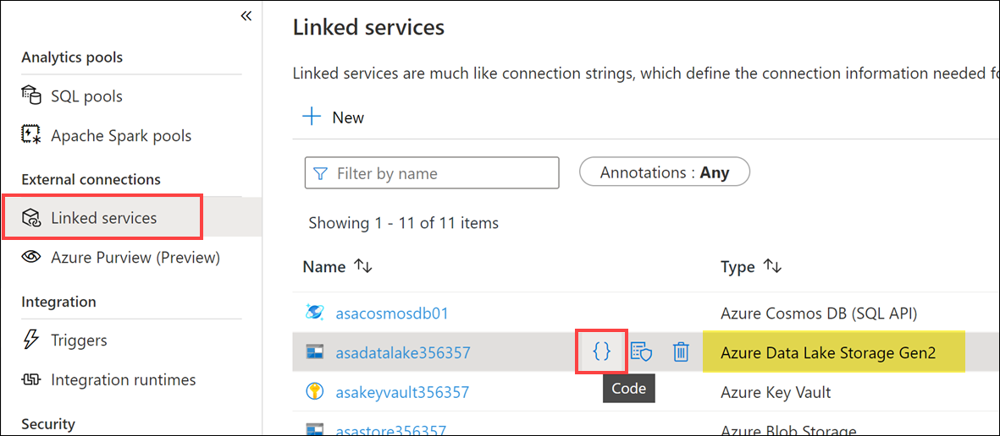

3. Copy the **name** of the linked service, then select **Cancel** to close the dialog. Save this value to Notepad or similar text editor to use later.

    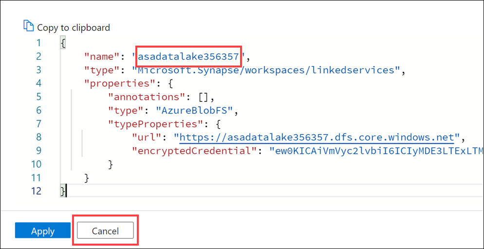

### Task 2: Create mapping data flow

1. Navigate to the **Develop** hub.

    

2. Select + then **Data flow** to create a new data flow.

    

3. In the **General** settings of the **Properties** blade of the new data flow, update the **Name** to the following: `user_profiles_to_datalake`. Make sure the name exactly matches. Otherwise, you will receive an error when you close the code view in a few steps.

    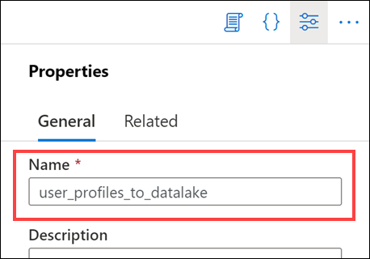

4. Select the **{} Code** button at the top-right above the data flow properties.

    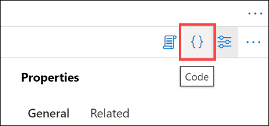

5. **Replace** the existing code with the following:

    ```json
    {
        "name": "user_profiles_to_datalake",
        "properties": {
            "type": "MappingDataFlow",
            "typeProperties": {
                "sources": [
                    {
                        "dataset": {
                            "referenceName": "asal400_ecommerce_userprofiles_source",
                            "type": "DatasetReference"
                        },
                        "name": "EcommerceUserProfiles"
                    },
                    {
                        "dataset": {
                            "referenceName": "asal400_customerprofile_cosmosdb",
                            "type": "DatasetReference"
                        },
                        "name": "UserProfiles"
                    }
                ],
                "sinks": [
                    {
                        "linkedService": {
                            "referenceName": "INSERT_YOUR_DATALAKE_SERVICE_NAME",
                            "type": "LinkedServiceReference"
                        },
                        "name": "DataLake"
                    }
                ],
                "transformations": [
                    {
                        "name": "userId"
                    },
                    {
                        "name": "UserTopProducts"
                    },
                    {
                        "name": "DerivedProductColumns"
                    },
                    {
                        "name": "UserPreferredProducts"
                    },
                    {
                        "name": "JoinTopProductsWithPreferredProducts"
                    },
                    {
                        "name": "DerivedColumnsForMerge"
                    },
                    {
                        "name": "Filter1"
                    }
                ],
                "script": "source(output(\n\t\tvisitorId as string,\n\t\ttopProductPurchases as (productId as string, itemsPurchasedLast12Months as string)[]\n\t),\n\tallowSchemaDrift: true,\n\tvalidateSchema: false,\n\tignoreNoFilesFound: false,\n\tdocumentForm: 'arrayOfDocuments',\n\twildcardPaths:['online-user-profiles-02/*.json']) ~> EcommerceUserProfiles\nsource(output(\n\t\tcartId as string,\n\t\tpreferredProducts as integer[],\n\t\tproductReviews as (productId as integer, reviewDate as string, reviewText as string)[],\n\t\tuserId as integer\n\t),\n\tallowSchemaDrift: true,\n\tvalidateSchema: false,\n\tformat: 'document') ~> UserProfiles\nEcommerceUserProfiles derive(visitorId = toInteger(visitorId)) ~> userId\nuserId foldDown(unroll(topProductPurchases),\n\tmapColumn(\n\t\tvisitorId,\n\t\tproductId = topProductPurchases.productId,\n\t\titemsPurchasedLast12Months = topProductPurchases.itemsPurchasedLast12Months\n\t),\n\tskipDuplicateMapInputs: false,\n\tskipDuplicateMapOutputs: false) ~> UserTopProducts\nUserTopProducts derive(productId = toInteger(productId),\n\t\titemsPurchasedLast12Months = toInteger(itemsPurchasedLast12Months)) ~> DerivedProductColumns\nUserProfiles foldDown(unroll(preferredProducts),\n\tmapColumn(\n\t\tpreferredProductId = preferredProducts,\n\t\tuserId\n\t),\n\tskipDuplicateMapInputs: false,\n\tskipDuplicateMapOutputs: false) ~> UserPreferredProducts\nDerivedProductColumns, UserPreferredProducts join(visitorId == userId,\n\tjoinType:'outer',\n\tpartitionBy('hash', 30,\n\t\tproductId\n\t),\n\tbroadcast: 'left')~> JoinTopProductsWithPreferredProducts\nJoinTopProductsWithPreferredProducts derive(isTopProduct = toBoolean(iif(isNull(productId), 'false', 'true')),\n\t\tisPreferredProduct = toBoolean(iif(isNull(preferredProductId), 'false', 'true')),\n\t\tproductId = iif(isNull(productId), preferredProductId, productId),\n\t\tuserId = iif(isNull(userId), visitorId, userId)) ~> DerivedColumnsForMerge\nDerivedColumnsForMerge filter(!isNull(productId)) ~> Filter1\nFilter1 sink(allowSchemaDrift: true,\n\tvalidateSchema: false,\n\tformat: 'delta',\n\tcompressionType: 'snappy',\n\tcompressionLevel: 'Fastest',\n\tfileSystem: 'wwi-02',\n\tfolderPath: 'top-products',\n\ttruncate:true,\n\tmergeSchema: false,\n\tautoCompact: false,\n\toptimizedWrite: false,\n\tvacuum: 0,\n\tdeletable:false,\n\tinsertable:true,\n\tupdateable:false,\n\tupsertable:false,\n\tmapColumn(\n\t\tvisitorId,\n\t\tproductId,\n\t\titemsPurchasedLast12Months,\n\t\tpreferredProductId,\n\t\tuserId,\n\t\tisTopProduct,\n\t\tisPreferredProduct\n\t),\n\tskipDuplicateMapInputs: true,\n\tskipDuplicateMapOutputs: true) ~> DataLake"
            }
        }
    }
    ```

6. Replace **INSERT_YOUR_DATALAKE_SERVICE_NAME** on `line 25` with the name of your ADLS Gen2 linked service that you copied in the previous task (Task 1) above.

    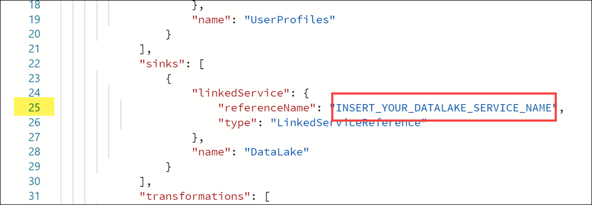

    The value should now include the name of your linked service:

    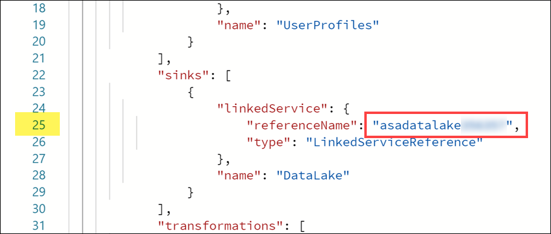

7. Select **OK**.

8. The data flow should look like the following:

    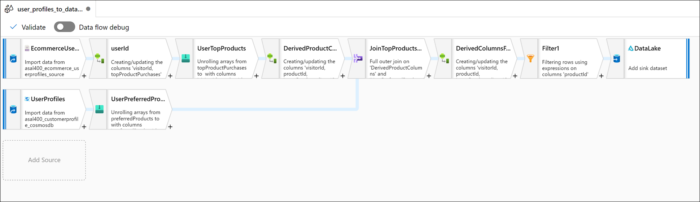

### Task 3: Create pipeline

In this step, you create a new integration pipeline to execute the data flow.

1. Navigate to the **Integrate** hub.

    

2. Select **+ (1)**, then **Pipeline (2)**.

    

3. In the **General** section of the **Profiles** pane of the new data flow, update the **Name** to the following: `User Profiles to Datalake`. Select the **Properties** button to hide the pane.

    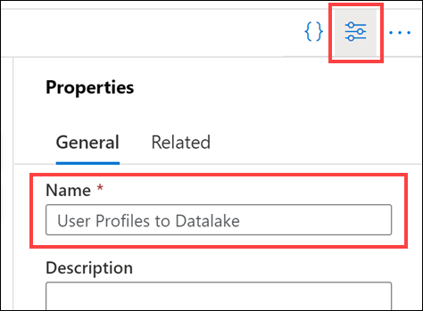

4. Expand **Move & transform** within the Activities list, then drag the **Data flow** activity onto the pipeline canvas.

    

5. Under the **General** tab, set the Name to `user_profiles_to_datalake`.

    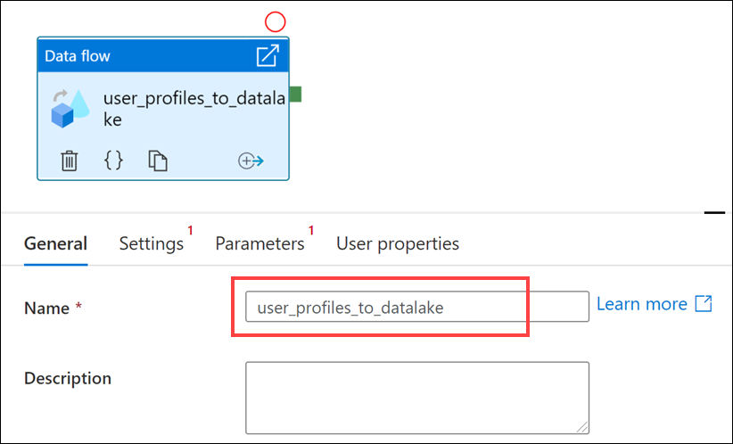

6. Select the **Settings** tab **(1)**. Select `user_profiles_to_datalake` for **Data flow (2)**, then ensure `AutoResolveIntegrationRuntime` is selected for **Run on (Azure IR) (3)**. Choose the `General purpose` **Compute type (4)** and select `8 (+ 8 cores)` for the **Core count (5)**.

    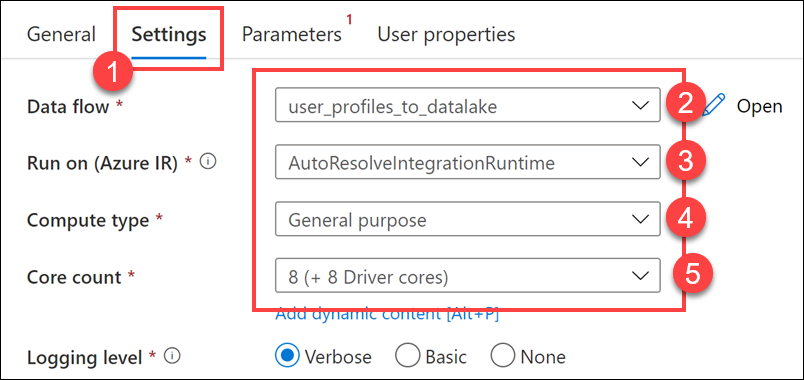

7. Select **Publish all** then **Publish** to save your pipeline.

    

### Task 4: Trigger the pipeline

1. At the top of the pipeline, select **Add trigger (1)**, then **Trigger now (2)**.

    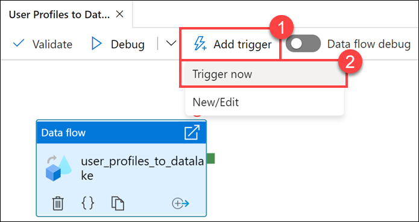

2. There are no parameters for this pipeline, so select **OK** to run the trigger.

    

3. Navigate to the **Monitor** hub.

    

4. Select **Pipeline runs (1)** and wait for the pipeline run to successfully complete **(2)**. You may need to refresh **(3)** the view.

    > While this is running, read the rest of the lab instructions to familiarize yourself with the content.

    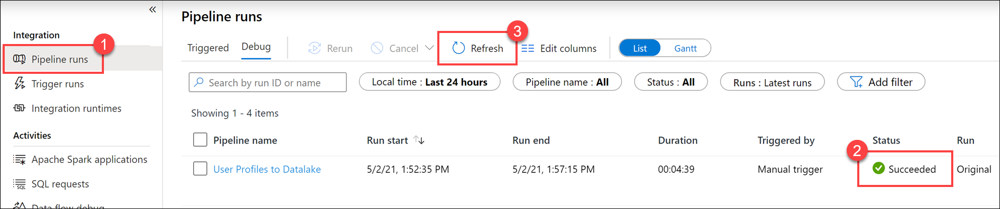

## Exercise 3: Create Synapse Spark notebook to find top products

Tailwind Traders uses a Mapping Data flow in Synapse Analytics to process, join, and import user profile data. Now they want to find the top 5 products for each user, based on which ones are both preferred and top, and have the most purchases in the past 12 months. Then, they want to calculate the top 5 products overall.

In this segment of the lab, you will create a Synapse Spark notebook to make these calculations.

> We will access the data from the data lake that was added as a second sink in the data flow, removing the dedicated SQL pool dependency.

### Task 1: Create notebook

1. Open Synapse Analytics Studio (<https://web.azuresynapse.net/>), and then navigate to the **Data** hub.

    

2. Select the **Linked** tab **(1)** and expand the **primary data lake storage account (2)** underneath the **Azure Data Lake Storage Gen2**. Select the **wwi-02** container **(3)** and open the **top-products** folder **(4)**. Right-click on any Parquet file **(5)**, select the **New notebook** menu item **(6)**, then select **Load to DataFrame (7)**. If you don't see the folder, select `Refresh` above.

    

3. Make sure the notebook is attached to your Spark pool.

    

4. Replace the Parquet file name with `*.parquet` **(1)** to select all Parquet files in the `top-products` folder. For example, the path should be similar to: `abfss://wwi-02@YOUR_DATALAKE_NAME.dfs.core.windows.net/top-products/*.parquet`.

    

5. Select **Run all** on the notebook toolbar to execute the notebook.

    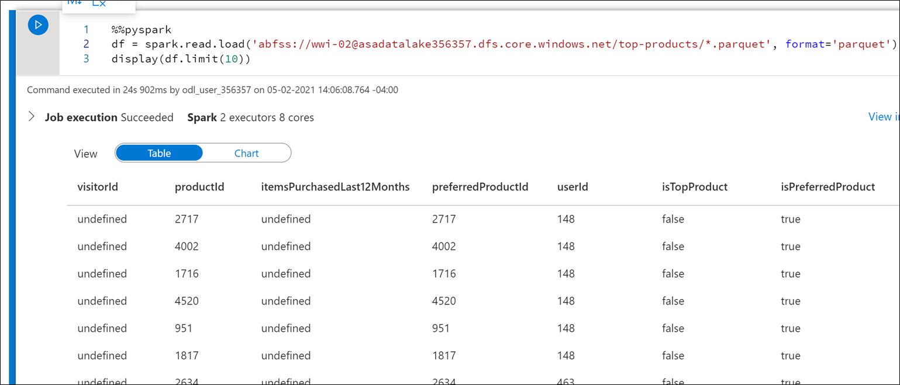

    > **Note:** The first time you run a notebook in a Spark pool, Synapse creates a new session. This can take approximately 3-5 minutes.

    > **Note:** To run just the cell, either hover over the cell and select the _Run cell_ icon to the left of the cell, or select the cell then type **Ctrl+Enter** on your keyboard.

6. Create a new cell underneath by selecting the **+** button and selecting the **</> Code cell** item. The + button is located beneath the notebook cell on the left.

    

7. Enter and execute the following in the new cell to populate a new dataframe called `topPurchases`, create a new temporary view named `top_purchases`, and show the first 100 rows:

    ```python
    topPurchases = df.select(
        "UserId", "ProductId",
        "ItemsPurchasedLast12Months", "IsTopProduct",
        "IsPreferredProduct")

    # Populate a temporary view so we can query from SQL
    topPurchases.createOrReplaceTempView("top_purchases")

    topPurchases.show(100)
    ```

    The output should look similar to the following:

    ```text
    +------+---------+--------------------------+------------+------------------+
    |UserId|ProductId|ItemsPurchasedLast12Months|IsTopProduct|IsPreferredProduct|
    +------+---------+--------------------------+------------+------------------+
    |   148|     2717|                      null|       false|              true|
    |   148|     4002|                      null|       false|              true|
    |   148|     1716|                      null|       false|              true|
    |   148|     4520|                      null|       false|              true|
    |   148|      951|                      null|       false|              true|
    |   148|     1817|                      null|       false|              true|
    |   463|     2634|                      null|       false|              true|
    |   463|     2795|                      null|       false|              true|
    |   471|     1946|                      null|       false|              true|
    |   471|     4431|                      null|       false|              true|
    |   471|      566|                      null|       false|              true|
    |   471|     2179|                      null|       false|              true|
    |   471|     3758|                      null|       false|              true|
    |   471|     2434|                      null|       false|              true|
    |   471|     1793|                      null|       false|              true|
    |   471|     1620|                      null|       false|              true|
    |   471|     1572|                      null|       false|              true|
    |   833|      957|                      null|       false|              true|
    |   833|     3140|                      null|       false|              true|
    |   833|     1087|                      null|       false|              true|
    ```

8. Execute the following in a new cell to create a new DataFrame to hold only top preferred products where both `IsTopProduct` and `IsPreferredProduct` are true:

    ```python
    from pyspark.sql.functions import *

    topPreferredProducts = (topPurchases
        .filter( col("IsTopProduct") == True)
        .filter( col("IsPreferredProduct") == True)
        .orderBy( col("ItemsPurchasedLast12Months").desc() ))

    topPreferredProducts.show(100)
    ```

    

9. Execute the following in a new cell to create a new temporary view by using SQL:

    ```sql
    %%sql

    CREATE OR REPLACE TEMPORARY VIEW top_5_products
    AS
        select UserId, ProductId, ItemsPurchasedLast12Months
        from (select *,
                    row_number() over (partition by UserId order by ItemsPurchasedLast12Months desc) as seqnum
            from top_purchases
            ) a
        where seqnum <= 5 and IsTopProduct == true and IsPreferredProduct = true
        order by a.UserId
    ```

    *Note that there is no output for the above query.* The query uses the `top_purchases` temporary view as a source and applies a `row_number() over` method to apply a row number for the records for each user where `ItemsPurchasedLast12Months` is greatest. The `where` clause filters the results so we only retrieve up to five products where both `IsTopProduct` and `IsPreferredProduct` are set to true. This gives us the top five most purchased products for each user where those products are _also_ identified as their favorite products, according to their user profile stored in Azure Cosmos DB.

10. Execute the following in a new cell to create and display a new DataFrame that stores the results of the `top_5_products` temporary view you created in the previous cell:

    ```python
    top5Products = sqlContext.table("top_5_products")

    top5Products.show(100)
    ```

    You should see an output similar to the following, which displays the top five preferred products per user:

    

11. Execute the following in a new cell to compare the number of top preferred products to the top five preferred products per customer:

    ```python
    print('before filter: ', topPreferredProducts.count(), ', after filter: ', top5Products.count())
    ```

    The output should be similar to `before filter:  997873 , after filter:  85020`.

12. Calculate the top five products overall, based on those that are both preferred by customers and purchased the most. To do this, execute the following in a new cell:

    ```python
    top5ProductsOverall = (top5Products.select("ProductId","ItemsPurchasedLast12Months")
        .groupBy("ProductId")
        .agg( sum("ItemsPurchasedLast12Months").alias("Total") )
        .orderBy( col("Total").desc() )
        .limit(5))

    top5ProductsOverall.show()
    ```

    In this cell, we grouped the top five preferred products by product ID, summed up the total items purchased in the last 12 months, sorted that value in descending order, and returned the top five results. Your output should be similar to the following:

    ```text
    +---------+-----+
    |ProductId|Total|
    +---------+-----+
    |      347| 4523|
    |     4833| 4314|
    |     3459| 4233|
    |     2486| 4135|
    |     2107| 4113|
    +---------+-----+
    ```

13. We are going to execute this notebook from a pipeline. We want to pass in a parameter that sets a `runId` variable value that will be used to name the Parquet file. Execute the following in a new cell:

    ```python
    import uuid

    # Generate random GUID
    runId = uuid.uuid4()
    ```

    We are using the `uuid` library that comes with Spark to generate a random GUID. We want to override the `runId` variable with a parameter passed in by the pipeline. To do this, we need to toggle this as a parameter cell.

14. Select the actions ellipses **(...)** above the cell **(1)**, then select **Toggle parameter cell (2)**.

    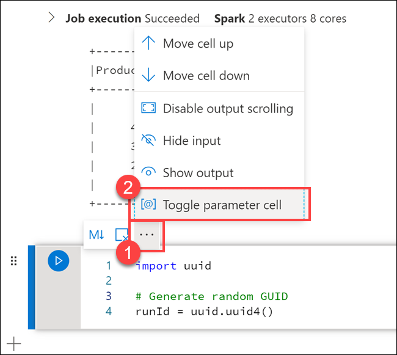

    After toggling this option, you will see the **Parameters** tag on the cell.

    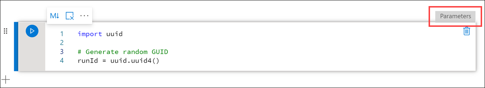

15. Paste the following code in a new cell to use the `runId` variable as the Parquet filename in the `/top5-products/` path in the primary data lake account. **Replace `YOUR_DATALAKE_NAME`** in the path with the name of your primary data lake account. To find this, scroll up to **Cell 1** at the top of the page **(1)**. Copy the data lake storage account from the path **(2)**. Paste this value as a replacement for **`YOUR_DATALAKE_NAME`** in the path **(3)** inside the new cell, then execute the cell.

    ```python
    %%pyspark

    top5ProductsOverall.write.parquet('abfss://wwi-02@YOUR_DATALAKE_NAME.dfs.core.windows.net/top5-products/' + str(runId) + '.parquet')
    ```

    

16. Verify that the file was written to the data lake. Navigate to the **Data** hub and select the **Linked** tab **(1)**. Expand the primary data lake storage account and select the **wwi-02** container **(2)**. Navigate to the **top5-products** folder **(3)**. You should see a folder for the Parquet file in the directory with a GUID as the file name **(4)**.

    

    The Parquet write method on the dataframe in the Notebook cell created this directory since it did not previously exist.

17. Return to the notebook. Select **Stop session** on the upper-right of the notebook. We want to stop the session to free up the compute resources for when we run the notebook inside the pipeline in the next section.

    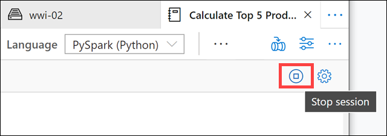

18. Select **Stop now** in the Stop current session.

    

### Task 2: Add the Notebook to the pipeline

Tailwind Traders wants to execute this notebook after the Mapping Data Flow runs as part of their orchestration process. To do this, we will add this notebook to our pipeline as a new Notebook activity.

1. Return to the notebook. Select the **Properties** button **(1)** at the top-right corner of the notebook, then enter `Calculate Top 5 Products` for the **Name (2)**.

    

2. Select the **Add to pipeline** button **(1)** at the top-right corner of the notebook, then select **Existing pipeline (2)**.

    

3. Select the **User Profiles to Datalake** pipeline **(1)**, then select **Add *2)**.

    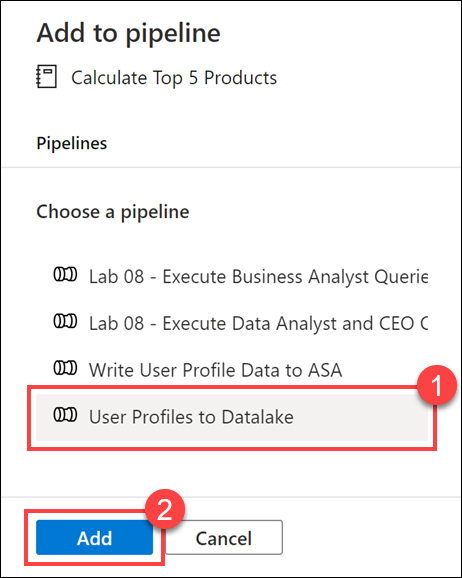

4. Synapse Studio adds the Notebook activity to the pipeline. Rearrange the **Notebook activity** so it sits to the right of the **Data flow activity**. Select the **Data flow activity** and drag a **Success** activity pipeline connection **green box** to the **Notebook activity**.

    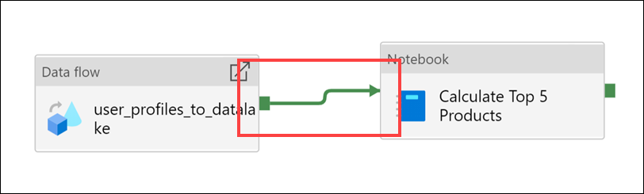

    The Success activity arrow instructs the pipeline to execute the Notebook activity after the Data flow activity successfully runs.

5. Select the **Notebook activity (1)**, select the **Settings** tab **(2)**, expand **Base parameters (3)**, and select **+ New (4)**. Enter **`runId`** in the **Name** field **(5)**. Select **String** for the **Type (6)**. For the **Value**, select **Add dynamic content (7)**.

    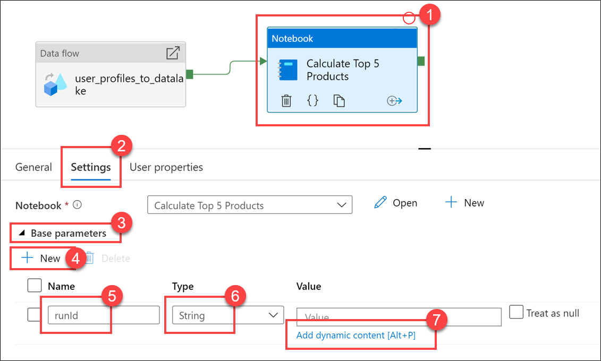

6. Select **Pipeline run ID** under **System variables (1)**. This adds `@pipeline().RunId` to the dynamic content box **(2)**. Select **Finish (3)** to close the dialog.

    

    The Pipeline run ID value is a unique GUID assigned to each pipeline run. We will use this value for the name of the Parquet file by passing this value in as the `runId` Notebook parameter. We can then look through the pipeline run history and find the specific Parquet file created for each pipeline run.

7. Select **Publish all** then **Publish** to save your changes.

    

8. **OPTIONAL - Pipeline run now takes >10 minutes -** After publishing is complete, select **Add trigger (1)**, then **Trigger now (2)** to run the updated pipeline.

    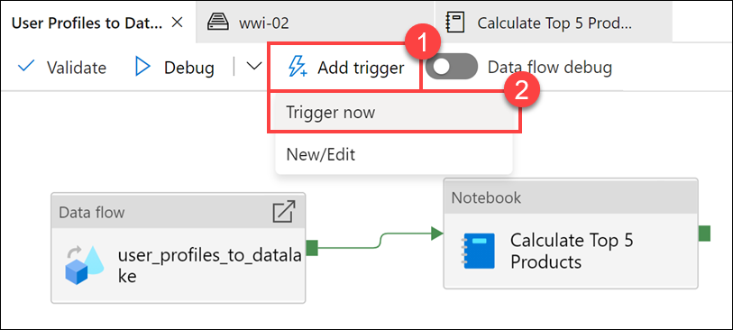

9. Select **OK** to run the trigger.

    

10. Navigate to the **Monitor** hub.

    

11. Select **Pipeline runs (1)** and wait for the pipeline run to successfully complete **(2)**. You may need to refresh **(3)** the view.

    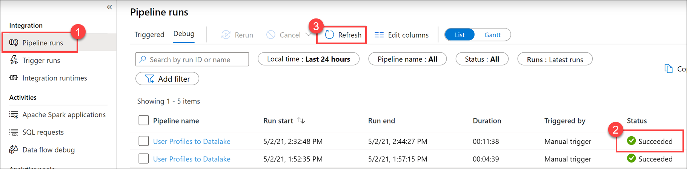

    > It can take over 10 minutes for the run to complete with the addition of the notebook activity.
    > While this is running, read the rest of the lab instructions to familiarize yourself with the content.

12. Select the name of the pipeline to view the pipeline's activity runs.

    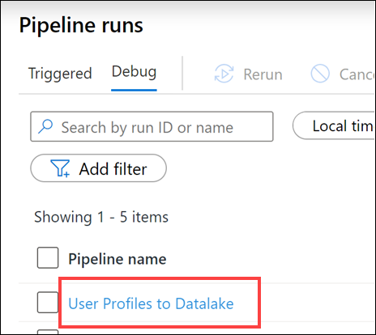

13. This time, we see both the **Data flow** activity, and the new **Notebook** activity **(1)**. Make note of the **Pipeline run ID** value **(2)**. We will compare this to the Parquet file name generated by the notebook. Select the **Calculate Top 5 Products** Notebook name to view its details **(3)**.

    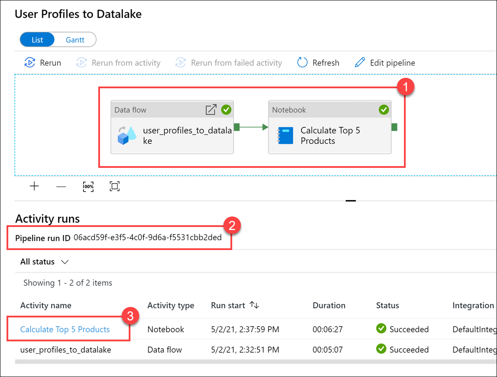

14. Here we see the Notebook run details. You can select the **Playback** button **(1)** to watch a playback of the progress through the **jobs (2)**. At the bottom, you can view the **Diagnostics** and **Logs** with different filter options **(3)**. Hover over a stage to view its details, such as the duration, total tasks, data details, etc. Select the **View details** link on the **stage** to view its details **(5)**.

    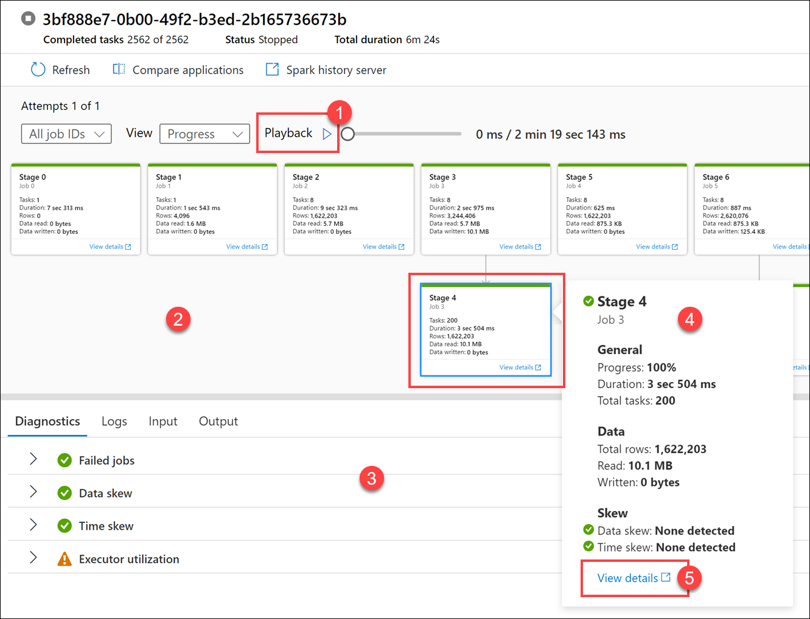

15. The Spark application UI opens in a new tab where we can see the stage details. Expand the **DAG Visualization** to view the stage details.

    

16. Navigate back to the **Data** hub.

    

17. Select the **Linked** tab **(1)**, select the **wwi-02** container **(2)** on the primary data lake storage account, navigate to the **top5-products** folder **(3)**, and verify that a folder exists for the Parquet file whose name matches the **Pipeline run ID**.

    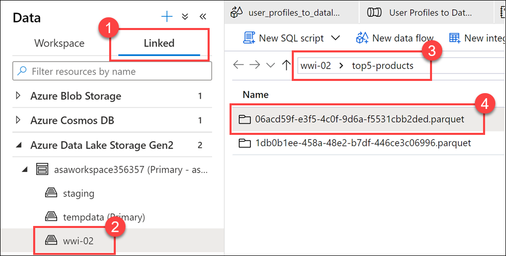

    As you can see, we have a file whose name matches the **Pipeline run ID** we noted earlier:

    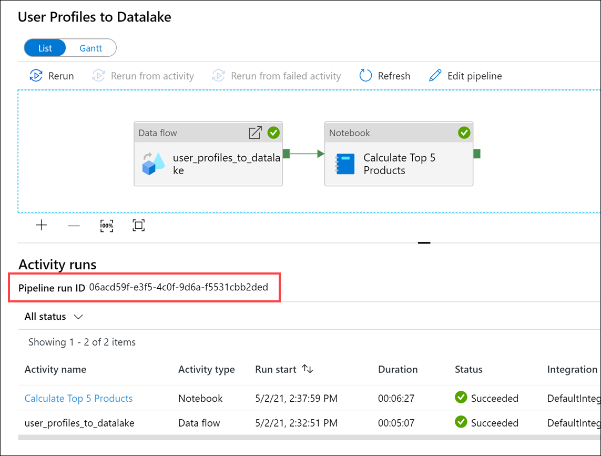

    These values match because we passed in the Pipeline run ID to the `runId` parameter on the Notebook activity.
