# Module 10 - Optimize query performance with dedicated SQL pools in Azure Synapse

In this module, students will learn strategies to optimize data storage and processing when using dedicated SQL pools in Azure Synapse Analytics. The student will know how to use developer features, such as windowing and HyperLogLog functions, use data loading best practices, and optimize and improve query performance.

In this module, the student will be able to:

- Understand developer features of Azure Synapse Analytics
- Optimize data warehouse query performance in Azure Synapse Analytics
- Improve query performance

## Lab details

- [Module 10 - Optimize query performance with dedicated SQL pools in Azure Synapse](#module-10---optimize-query-performance-with-dedicated-sql-pools-in-azure-synapse)
  - [Lab details](#lab-details)
  - [Lab setup and pre-requisites](#lab-setup-and-pre-requisites)
  - [Exercise 0: Start the dedicated SQL pool](#exercise-0-start-the-dedicated-sql-pool)
  - [Exercise 1: Understanding developer features of Azure Synapse Analytics](#exercise-1-understanding-developer-features-of-azure-synapse-analytics)
    - [Task 1: Create tables and load data](#task-1-create-tables-and-load-data)
    - [Task 2: Using window functions](#task-2-using-window-functions)
      - [Task 2.1: OVER clause](#task-21-over-clause)
      - [Task 2.2: Aggregate functions](#task-22-aggregate-functions)
      - [Task 2.3: Analytic functions](#task-23-analytic-functions)
      - [Task 2.4: ROWS clause](#task-24-rows-clause)
    - [Task 3: Approximate execution using HyperLogLog functions](#task-3-approximate-execution-using-hyperloglog-functions)
  - [Exercise 2: Using data loading best practices in Azure Synapse Analytics](#exercise-2-using-data-loading-best-practices-in-azure-synapse-analytics)
    - [Task 1: Implement workload management](#task-1-implement-workload-management)
    - [Task 2: Create a workload classifier to add importance to certain queries](#task-2-create-a-workload-classifier-to-add-importance-to-certain-queries)
    - [Task 3: Reserve resources for specific workloads through workload isolation](#task-3-reserve-resources-for-specific-workloads-through-workload-isolation)
  - [Exercise 3: Optimizing data warehouse query performance in Azure Synapse Analytics](#exercise-3-optimizing-data-warehouse-query-performance-in-azure-synapse-analytics)
    - [Task 1: Identify performance issues related to tables](#task-1-identify-performance-issues-related-to-tables)
    - [Task 2: Improve table structure with hash distribution and columnstore index](#task-2-improve-table-structure-with-hash-distribution-and-columnstore-index)
    - [Task 4: Improve further the table structure with partitioning](#task-4-improve-further-the-table-structure-with-partitioning)
      - [Task 4.1: Table distributions](#task-41-table-distributions)
      - [Task 4.2: Indexes](#task-42-indexes)
      - [Task 4.3: Partitioning](#task-43-partitioning)
  - [Exercise 4: Improve query performance](#exercise-4-improve-query-performance)
    - [Task 1: Use materialized views](#task-1-use-materialized-views)
    - [Task 2: Use result set caching](#task-2-use-result-set-caching)
    - [Task 3: Create and update statistics](#task-3-create-and-update-statistics)
    - [Task 4: Create and update indexes](#task-4-create-and-update-indexes)
    - [Task 5: Ordered Clustered Columnstore Indexes](#task-5-ordered-clustered-columnstore-indexes)
  - [Exercise 5: Cleanup](#exercise-5-cleanup)
    - [Task 1: Pause the dedicated SQL pool](#task-1-pause-the-dedicated-sql-pool)

## Lab setup and pre-requisites

> **Note:** Only complete the `Lab setup and pre-requisites` steps if you are **not** using a hosted lab environment, and are instead using your own Azure subscription. Otherwise, skip ahead to Exercise 0.

**Complete the [lab setup instructions](https://github.com/solliancenet/microsoft-data-engineering-ilt-deploy/blob/main/setup/04/README.md)** for this module.

Note, the following modules share this same environment:

- [Module 4](labs/04/README.md)
- [Module 5](labs/05/README.md)
- [Module 7](labs/07/README.md)
- [Module 8](labs/08/README.md)
- [Module 9](labs/09/README.md)
- [Module 10](labs/10/README.md)
- [Module 11](labs/11/README.md)
- [Module 12](labs/12/README.md)
- [Module 13](labs/13/README.md)
- [Module 16](labs/16/README.md)

## Exercise 0: Start the dedicated SQL pool

This lab uses the dedicated SQL pool. As a first step, make sure it is not paused. If so, start it by following these instructions:

1. Open Synapse Studio (<https://web.azuresynapse.net/>).

2. Select the **Manage** hub.

    

3. Select **SQL pools** in the left-hand menu **(1)**. If the dedicated SQL pool is paused, hover over the name of the pool and select **Resume (2)**.

    

4. When prompted, select **Resume**. It will take a minute or two to resume the pool.

    

> **Wait** until the dedicated SQL pool resumes.

## Exercise 1: Understanding developer features of Azure Synapse Analytics

### Task 1: Create tables and load data

Before you begin, we need to create a few new tables and load them with data.

1. Open Synapse Studio (<https://web.azuresynapse.net/>).

2. Select the **Develop** hub.

    

3. From the **Develop** menu, select the **+** button **(1)** and choose **SQL Script (2)** from the context menu.

    

4. In the toolbar menu, connect to the **SQLPool01** database to execute the query.

    

5. In the query window, replace the script with the following to use the `OVER` clause with data from the `wwi_security.Sale` table:

    ```sql
    IF OBJECT_ID(N'[dbo].[Category]', N'U') IS NOT NULL
    DROP TABLE [dbo].[Category]

    CREATE TABLE [dbo].[Category]
    ( 
        [ID] [float]  NOT NULL,
        [Category] [varchar](255)  NULL,
        [SubCategory] [varchar](255)  NULL
    )
    WITH
    (
        DISTRIBUTION = ROUND_ROBIN,
        CLUSTERED COLUMNSTORE INDEX
    )
    GO

    IF OBJECT_ID(N'[dbo].[Books]', N'U') IS NOT NULL
    DROP TABLE [dbo].[Books]

    CREATE TABLE [dbo].[Books]
    ( 
        [ID] [float]  NOT NULL,
        [BookListID] [float]  NULL,
        [Title] [varchar](255)  NULL,
        [Author] [varchar](255)  NULL,
        [Duration] [float]  NULL,
        [Image] [varchar](255)  NULL
    )
    WITH
    (
        DISTRIBUTION = ROUND_ROBIN,
        CLUSTERED COLUMNSTORE INDEX
    )
    GO

    IF OBJECT_ID(N'[dbo].[BookConsumption]', N'U') IS NOT NULL
    DROP TABLE [dbo].[BookConsumption]

    CREATE TABLE [dbo].[BookConsumption]
    ( 
        [BookID] [float]  NULL,
        [Clicks] [float]  NULL,
        [Downloads] [float]  NULL,
        [Time Spent] [float]  NULL,
        [Country] [varchar](255)  NULL
    )
    WITH
    (
        DISTRIBUTION = ROUND_ROBIN,
        CLUSTERED COLUMNSTORE INDEX
    )
    GO

    IF OBJECT_ID(N'[dbo].[BookList]', N'U') IS NOT NULL
    DROP TABLE [dbo].[BookList]

    CREATE TABLE [dbo].[BookList]
    ( 
        [ID] [float]  NOT NULL,
        [CategoryID] [float]  NULL,
        [BookList] [varchar](255)  NULL
    )
    WITH
    (
        DISTRIBUTION = ROUND_ROBIN,
        CLUSTERED COLUMNSTORE INDEX
    )
    GO

    COPY INTO Category 
    FROM 'https://solliancepublicdata.blob.core.windows.net/dataengineering/dp-203/books/Category.csv'
    WITH (
        FILE_TYPE = 'CSV',
        FIRSTROW = 2
    )
    GO

    COPY INTO Books 
    FROM 'https://solliancepublicdata.blob.core.windows.net/dataengineering/dp-203/books/Books.csv'
    WITH (
        FILE_TYPE = 'CSV',
        FIRSTROW = 2
    )
    GO

    COPY INTO BookConsumption 
    FROM 'https://solliancepublicdata.blob.core.windows.net/dataengineering/dp-203/books/BookConsumption.csv'
    WITH (
        FILE_TYPE = 'CSV',
        FIRSTROW = 2
    )
    GO

    COPY INTO BookList 
    FROM 'https://solliancepublicdata.blob.core.windows.net/dataengineering/dp-203/books/BookList.csv'
    WITH (
        FILE_TYPE = 'CSV',
        FIRSTROW = 2
    )
    GO
    ```

6. Select **Run** from the toolbar menu to execute the SQL command.

    

    After a few seconds, you should see that the query successfully completed.

### Task 2: Using window functions

Tailwind Traders is looking for ways to more efficiently analyze their sales data without relying on expensive cursors, subqueries, and other outdated methods they use today.

You propose using window functions to perform calculations over a set of rows. With these functions, you treat groups of rows as an entity.

#### Task 2.1: OVER clause

One of the key components of window functions is the **`OVER`** clause. This clause determines the partitioning and ordering of a rowset before the associated window function is applied. That is, the OVER clause defines a window or user-specified set of rows within a query result set. A window function then computes a value for each row in the window. You can use the OVER clause with functions to compute aggregated values such as moving averages, cumulative aggregates, running totals, or a top N per group results.

1. Select the **Develop** hub.

    

2. From the **Develop** menu, select the **+** button **(1)** and choose **SQL Script (2)** from the context menu.

    

3. In the toolbar menu, connect to the **SQLPool01** database to execute the query.

    

4. In the query window, replace the script with the following to use the `OVER` clause with data from the `wwi_security.Sale` table:

    ```sql
    SELECT
      ROW_NUMBER() OVER(PARTITION BY Region ORDER BY Quantity DESC) AS "Row Number",
      Product,
      Quantity,
      Region
    FROM wwi_security.Sale
    WHERE Quantity <> 0  
    ORDER BY Region;
    ```

5. Select **Run** from the toolbar menu to execute the SQL command.

    

    When we use `PARTITION BY` with the `OVER` clause **(1)**, we divide the query result set into partitions. The window function is applied to each partition separately and computation restarts for each partition.

    

    The script we executed uses the OVER clause with ROW_NUMBER function **(1)** to display a row number for each row within a partition. The partition in our case is the `Region` column. The ORDER BY clause **(2)** specified in the OVER clause orders the rows in each partition by the column `Quantity`. The ORDER BY clause in the SELECT statement determines the order in which the entire query result set is returned.

    **Scroll down** in the results view until the **Row Number** count **(3)** starts over with a **different region (4)**. Since the partition is set to `Region`, the `ROW_NUMBER` resets when the region changes. Essentially, we've partitioned by region and have a result set identified by the number of rows in that region.

#### Task 2.2: Aggregate functions

Now let's use aggregate functions with our window by expanding on our query that uses the OVER clause.

1. In the query window, replace the script with the following to add aggregate functions:

    ```sql
    SELECT
      ROW_NUMBER() OVER(PARTITION BY Region ORDER BY Quantity DESC) AS "Row Number",
      Product,
      Quantity,
      SUM(Quantity) OVER(PARTITION BY Region) AS Total,  
      AVG(Quantity) OVER(PARTITION BY Region) AS Avg,  
      COUNT(Quantity) OVER(PARTITION BY Region) AS Count,  
      MIN(Quantity) OVER(PARTITION BY Region) AS Min,  
      MAX(Quantity) OVER(PARTITION BY Region) AS Max,
      Region
    FROM wwi_security.Sale
    WHERE Quantity <> 0  
    ORDER BY Region;
    ```

2. Select **Run** from the toolbar menu to execute the SQL command.

    

    In our query, we added the `SUM`, `AVG`, `COUNT`, `MIN`, and `MAX` aggregate functions. Using the OVER clause is more efficient than using subqueries.

    

#### Task 2.3: Analytic functions

Analytic functions calculate an aggregate value based on a group of rows. Unlike aggregate functions, however, analytic functions can return multiple rows for each group. Use analytic functions to compute moving averages, running totals, percentages, or top-N results within a group.

Tailwind Traders has book sales data they import from their online store and wish to compute percentages of book downloads by category.

To do this, you decide to build window functions that use the `PERCENTILE_CONT` and `PERCENTILE_DISC` functions.

1. In the query window, replace the script with the following to add aggregate functions:

    ```sql
    -- PERCENTILE_CONT, PERCENTILE_DISC
    SELECT DISTINCT c.Category  
    ,PERCENTILE_CONT(0.5) WITHIN GROUP (ORDER BY bc.Downloads)
                          OVER (PARTITION BY Category) AS MedianCont  
    ,PERCENTILE_DISC(0.5) WITHIN GROUP (ORDER BY bc.Downloads)
                          OVER (PARTITION BY Category) AS MedianDisc  
    FROM dbo.Category AS c  
    INNER JOIN dbo.BookList AS bl
        ON bl.CategoryID = c.ID
    INNER JOIN dbo.BookConsumption AS bc  
        ON bc.BookID = bl.ID
    ORDER BY Category
    ```

2. Select **Run** from the toolbar menu to execute the SQL command.

    

    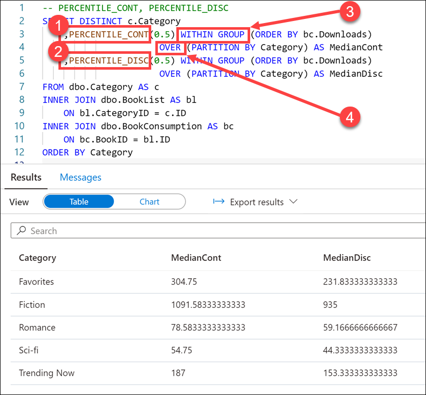

    In this query, we use **PERCENTILE_CONT (1)** and **PERCENTILE_DISC (2)** to find the median number of downloads in each book category. These functions may not return the same value. PERCENTILE_CONT interpolates the appropriate value, which may or may not exist in the data set, while PERCENTILE_DISC always returns an actual value from the set. To explain further, PERCENTILE_DISC computes a specific percentile for sorted values in an entire rowset or within a rowset's distinct partitions.

    > The `0.5` value passed to the **percentile functions (1 & 2)** computes the 50th percentile, or the median, of the downloads.

    The **WITHIN GROUP** expression **(3)** specifies a list of values to sort and compute the percentile over. Only one ORDER BY expression is allowed, and the default sort order is ascending.

    The **OVER** clause **(4)** divides the FROM clause's result set into partitions, in this case, `Category`. The percentile function is applied to these partitions.

3. In the query window, replace the script with the following to use the LAG analytic function:

    ```sql
    --LAG Function
    SELECT ProductId,
        [Hour],
        [HourSalesTotal],
        LAG(HourSalesTotal,1,0) OVER (ORDER BY [Hour]) AS PreviousHouseSalesTotal,
        [HourSalesTotal] - LAG(HourSalesTotal,1,0) OVER (ORDER BY [Hour]) AS Diff
    FROM ( 
        SELECT ProductId,
            [Hour],
            SUM(TotalAmount) AS HourSalesTotal
        FROM [wwi_perf].[Sale_Index]
        WHERE ProductId = 3848 AND [Hour] BETWEEN 8 AND 20
        GROUP BY ProductID, [Hour]) as HourTotals
    ```

    Tailwind Traders wants to compare the sales totals for a product over an hourly basis over time, showing the difference in value.

    To accomplish this, you use the LAG analytic function. This function accesses data from a previous row in the same result set without the use of a self-join. LAG provides access to a row at a given physical offset that comes before the current row. We use this analytic function to compare values in the current row with values in a previous row.

4. Select **Run** from the toolbar menu to execute the SQL command.

    

    

    In this query, we use the **LAG function (1)** to return the **difference in sales (2)** for a specific product over peak sales hours (8-20). We also calculate the difference in sales from one row to the next **(3)**. Notice that because there is no lag value available for the first row, the default of zero (0) is returned.

#### Task 2.4: ROWS clause

The ROWS and RANGE clauses further limit the rows within the partition by specifying start and end points within the partition. This is done by specifying a range of rows with respect to the current row either by logical association or physical association. Physical association is achieved by using the ROWS clause.

Tailwind Traders wants to find the books that have the fewest downloads by country, while displaying the total number of downloads for each book within each country in ascending order.

To achieve this, you use ROWS in combination with UNBOUNDED PRECEDING to limit the rows within the `Country` partition, specifying that the window start with the first row of the partition.

1. In the query window, replace the script with the following to add aggregate functions:

    ```sql
    -- ROWS UNBOUNDED PRECEDING
    SELECT DISTINCT bc.Country, b.Title AS Book, bc.Downloads
        ,FIRST_VALUE(b.Title) OVER (PARTITION BY Country  
            ORDER BY Downloads ASC ROWS UNBOUNDED PRECEDING) AS FewestDownloads
    FROM dbo.BookConsumption AS bc
    INNER JOIN dbo.Books AS b
        ON b.ID = bc.BookID
    ORDER BY Country, Downloads
    ```

2. Select **Run** from the toolbar menu to execute the SQL command.

    

    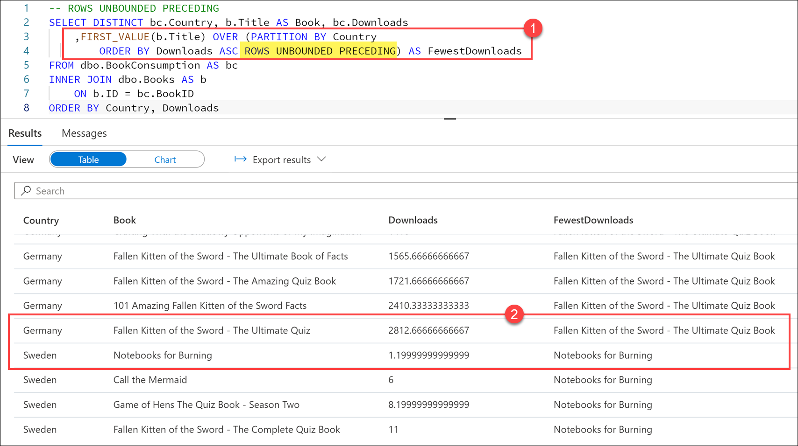

    In this query, we use the `FIRST_VALUE` analytic function to retrieve the book title with the fewest downloads, as indicated by the **`ROWS UNBOUNDED PRECEDING`** clause over the `Country` partition **(1)**. The `UNBOUNDED PRECEDING` option set the window start to the first row of the partition, giving us the title of the book with the fewest downloads for the country within the partition.

    In the result set, we can scroll through the list that of books by country, sorted by number of downloads in ascending order. Here we see that for Germany, `Fallen Kitten of the Sword - The Ultimate Quiz` had the most downloads, and `Notebooks for Burning` had the fewest in Sweden **(2)**.

### Task 3: Approximate execution using HyperLogLog functions

As Tailwind Traders starts to work with very large data sets, they struggle with slow running queries. For instance, obtaining a distinct count of all customers in the early stages of data exploration slows down the process. How can they speed up these queries?

You decide to use approximate execution using HyperLogLog accuracy to reduce query latency in exchange for a small reduction in accuracy. This tradeoff works for Tailwind Trader's situation where they just need to get a feel for the data.

To understand their requirements, let's first execute a distinct count over the large `Sale_Heap` table to find the count of distinct customers.

1. In the query window, replace the script with the following:

    ```sql
    SELECT COUNT(DISTINCT CustomerId) from wwi_poc.Sale
    ```

2. Select **Run** from the toolbar menu to execute the SQL command.

    

    The query takes between 50 and 70 seconds to execute. That is expected, as distinct counts are one of the most difficult types of queries to optimize.

    The result should be `1,000,000`.

3. In the query window, replace the script with the following to use the HyperLogLog approach:

    ```sql
    SELECT APPROX_COUNT_DISTINCT(CustomerId) from wwi_poc.Sale
    ```

4. Select **Run** from the toolbar menu to execute the SQL command.

    

    The query should take much less time to execute. The result isn't quite the same, for example, it may be `1,001,619`.

    APPROX_COUNT_DISTINCT returns a result with a **2% accuracy** of true cardinality on average.

    This means, if COUNT (DISTINCT) returns `1,000,000`, HyperLogLog will return a value in the range of `999,736` to `1,016,234`.

## Exercise 2: Using data loading best practices in Azure Synapse Analytics

### Task 1: Implement workload management

Running mixed workloads can pose resource challenges on busy systems. Solution Architects seek ways to separate classic data warehousing activities (such as loading, transforming, and querying data) to ensure that enough resources exist to hit SLAs.

Workload management for dedicated SQL pools in Azure Synapse consists of three high-level concepts: Workload Classification, Workload Importance and Workload Isolation. These capabilities give you more control over how your workload utilizes system resources.

Workload importance influences the order in which a request gets access to resources. On a busy system, a request with higher importance has first access to resources. Importance can also ensure ordered access to locks.

Workload isolation reserves resources for a workload group. Resources reserved in a workload group are held exclusively for that workload group to ensure execution. Workload groups also allow you to define the amount of resources that are assigned per request, much like resource classes do. Workload groups give you the ability to reserve or cap the amount of resources a set of requests can consume. Finally, workload groups are a mechanism to apply rules, such as query timeout, to requests.

### Task 2: Create a workload classifier to add importance to certain queries

Tailwind Traders has asked you if there is a way to mark queries executed by the CEO as more important than others, so they don't appear slow due to heavy data loading or other workloads in the queue. You decide to create a workload classifier and add importance to prioritize the CEO's queries.

1. Select the **Develop** hub.

    

2. From the **Develop** menu, select the **+** button **(1)** and choose **SQL Script (2)** from the context menu.

    

3. In the toolbar menu, connect to the **SQLPool01** database to execute the query.

    

4. In the query window, replace the script with the following to confirm that there are no queries currently being run by users logged in as `asa.sql.workload01`, representing the CEO of the organization or `asa.sql.workload02` representing the data analyst working on the project:

    ```sql
    --First, let's confirm that there are no queries currently being run by users logged in workload01 or workload02

    SELECT s.login_name, r.[Status], r.Importance, submit_time, 
    start_time ,s.session_id FROM sys.dm_pdw_exec_sessions s 
    JOIN sys.dm_pdw_exec_requests r ON s.session_id = r.session_id
    WHERE s.login_name IN ('asa.sql.workload01','asa.sql.workload02') and Importance
    is not NULL AND r.[status] in ('Running','Suspended') 
    --and submit_time>dateadd(minute,-2,getdate())
    ORDER BY submit_time ,s.login_name
    ```

5. Select **Run** from the toolbar menu to execute the SQL command.

    

    Now that we have confirmed that there are no running queries, we need to flood the system with queries and see what happens for `asa.sql.workload01` and `asa.sql.workload02`. To do this, we'll run a Synapse Pipeline which triggers queries.

6. Select the **Integrate** hub.

    

7. Select the **Lab 08 - Execute Data Analyst and CEO Queries** pipeline **(1)**, which will run / trigger the `asa.sql.workload01` and `asa.sql.workload02` queries. Select **Add trigger (2)**, then **Trigger now (3)**. In the dialog that appears, select **OK**.

    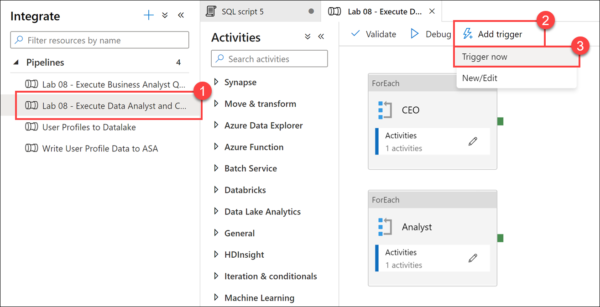

    > **Note**: Leave this tab open since you will come back to this pipeline again.

8. Let's see what happened to all the queries we just triggered as they flood the system. In the query window, replace the script with the following:

    ```sql
    SELECT s.login_name, r.[Status], r.Importance, submit_time, start_time ,s.session_id FROM sys.dm_pdw_exec_sessions s 
    JOIN sys.dm_pdw_exec_requests r ON s.session_id = r.session_id
    WHERE s.login_name IN ('asa.sql.workload01','asa.sql.workload02') and Importance
    is not NULL AND r.[status] in ('Running','Suspended') and submit_time>dateadd(minute,-2,getdate())
    ORDER BY submit_time ,status
    ```

9. Select **Run** from the toolbar menu to execute the SQL command.

    

    You should see an output similar to the following:

    

    > **Note**: This query could take over a minute to execute. If it takes longer than this, cancel the query and run it again.

    Notice that the **Importance** level for all queries is set to **normal**.

10. We will give our `asa.sql.workload01` user queries priority by implementing the **Workload Importance** feature. In the query window, replace the script with the following:

    ```sql
    IF EXISTS (SELECT * FROM sys.workload_management_workload_classifiers WHERE name = 'CEO')
    BEGIN
        DROP WORKLOAD CLASSIFIER CEO;
    END
    CREATE WORKLOAD CLASSIFIER CEO
      WITH (WORKLOAD_GROUP = 'largerc'
      ,MEMBERNAME = 'asa.sql.workload01',IMPORTANCE = High);
    ```

    We are executing this script to create a new **Workload Classifier** named `CEO` that uses the `largerc` Workload Group and sets the **Importance** level of the queries to **High**.

11. Select **Run** from the toolbar menu to execute the SQL command.

    

12. Let's flood the system again with queries and see what happens this time for `asa.sql.workload01` and `asa.sql.workload02` queries. To do this, we'll run a Synapse Pipeline which triggers queries. **Select** the `Integrate` Tab, **run** the **Lab 08 - Execute Data Analyst and CEO Queries** pipeline, which will run / trigger the `asa.sql.workload01` and `asa.sql.workload02` queries.

13. In the query window, replace the script with the following to see what happens to the `asa.sql.workload01` queries this time:

    ```sql
    SELECT s.login_name, r.[Status], r.Importance, submit_time, start_time ,s.session_id FROM sys.dm_pdw_exec_sessions s 
    JOIN sys.dm_pdw_exec_requests r ON s.session_id = r.session_id
    WHERE s.login_name IN ('asa.sql.workload01','asa.sql.workload02') and Importance
    is not NULL AND r.[status] in ('Running','Suspended') and submit_time>dateadd(minute,-2,getdate())
    ORDER BY submit_time ,status desc
    ```

14. Select **Run** from the toolbar menu to execute the SQL command.

    

    You should see an output similar to the following:

    

    Notice that the queries executed by the `asa.sql.workload01` user have a **high** importance.

15. Select the **Monitor** hub.

    

16. Select **Pipeline runs (1)**, and then select **Cancel recursive (2)** for each running Lab 08 pipelines, marked **In progress (3)**. This will help speed up the remaining tasks.

    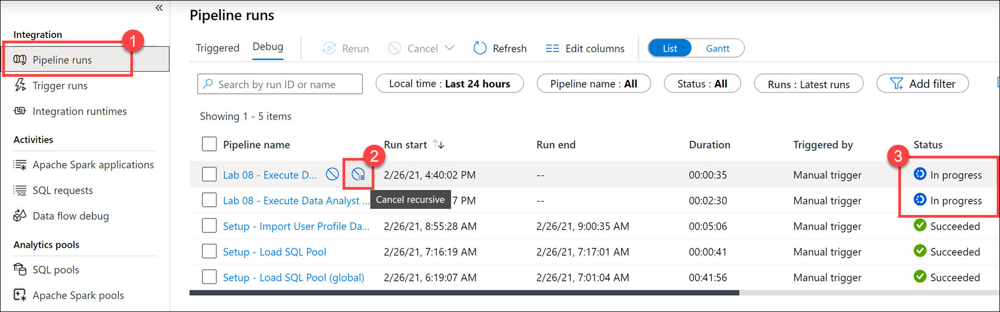

    > **Please note**: If you see that any of these pipeline activities failed, that is OK. The activities within have a 2-minute timeout so they do not disrupt the queries run during this lab.

### Task 3: Reserve resources for specific workloads through workload isolation

Workload isolation means resources are reserved, exclusively, for a workload group. Workload groups are containers for a set of requests and are the basis for how workload management, including workload isolation, is configured on a system. A simple workload management configuration can manage data loads and user queries.

In the absence of workload isolation, requests operate in the shared pool of resources. Access to resources in the shared pool is not guaranteed and is assigned on an importance basis.

Given the workload requirements provided by Tailwind Traders, you decide to create a new workload group called `CEODemo` to reserve resources for queries executed by the CEO.

Let's start by experimenting with different parameters.

1. In the query window, replace the script with the following:

    ```sql
    IF NOT EXISTS (SELECT * FROM sys.workload_management_workload_groups where name = 'CEODemo')
    BEGIN
        Create WORKLOAD GROUP CEODemo WITH  
        ( MIN_PERCENTAGE_RESOURCE = 50        -- integer value
        ,REQUEST_MIN_RESOURCE_GRANT_PERCENT = 25 --  
        ,CAP_PERCENTAGE_RESOURCE = 100
        )
    END
    ```

    The script creates a workload group called `CEODemo` to reserve resources exclusively for the workload group. In this example, a workload group with a `MIN_PERCENTAGE_RESOURCE` set to 50% and `REQUEST_MIN_RESOURCE_GRANT_PERCENT` set to 25% is guaranteed 2 concurrency.

    > **Note**: This query could take up to a minute to execute. If it takes longer than this, cancel the query and run it again.

2. Select **Run** from the toolbar menu to execute the SQL command.

    

3. In the query window, replace the script with the following to create a Workload Classifier called `CEODreamDemo` that assigns a workload group and importance to incoming requests:

    ```sql
    IF NOT EXISTS (SELECT * FROM sys.workload_management_workload_classifiers where  name = 'CEODreamDemo')
    BEGIN
        Create Workload Classifier CEODreamDemo with
        ( Workload_Group ='CEODemo',MemberName='asa.sql.workload02',IMPORTANCE = BELOW_NORMAL);
    END
    ```

    This script sets the Importance to **BELOW_NORMAL** for the `asa.sql.workload02` user, through the new `CEODreamDemo` Workload Classifier.

4. Select **Run** from the toolbar menu to execute the SQL command.

    

5. In the query window, replace the script with the following to confirm that there are no active queries being run by `asa.sql.workload02` (suspended queries are OK):

    ```sql
    SELECT s.login_name, r.[Status], r.Importance, submit_time,
    start_time ,s.session_id FROM sys.dm_pdw_exec_sessions s
    JOIN sys.dm_pdw_exec_requests r ON s.session_id = r.session_id
    WHERE s.login_name IN ('asa.sql.workload02') and Importance
    is not NULL AND r.[status] in ('Running','Suspended')
    ORDER BY submit_time, status
    ```

    > **Note:** If there are still active queries, wait a minute or two. They are configured to time out after two minutes since canceling the pipeline does not always cancel the queries.

6. Select **Run** from the toolbar menu to execute the SQL command.

    

7. Select the **Integrate** hub.

    

8. Select the **Lab 08 - Execute Business Analyst Queries** Pipeline **(1)**, which will run / trigger  `asa.sql.workload02` queries. Select **Add trigger (2)**, then **Trigger now (3)**. In the dialog that appears, select **OK**.

    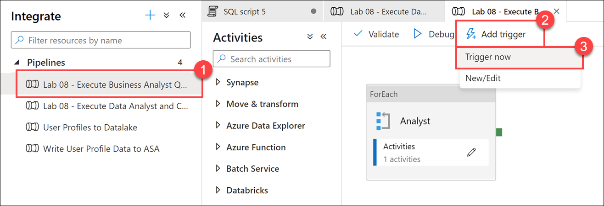

    > **Note**: Leave this tab open since you will come back to this pipeline again.

9. In the query window, replace the script with the following to see what happened to all the `asa.sql.workload02` queries we just triggered as they flood the system:

    ```sql
    SELECT s.login_name, r.[Status], r.Importance, submit_time,
    start_time ,s.session_id FROM sys.dm_pdw_exec_sessions s
    JOIN sys.dm_pdw_exec_requests r ON s.session_id = r.session_id
    WHERE s.login_name IN ('asa.sql.workload02') and Importance
    is not NULL AND r.[status] in ('Running','Suspended')
    ORDER BY submit_time, status
    ```

10. Select **Run** from the toolbar menu to execute the SQL command.

    

    You should see an output similar to the following that shows the importance for each session set to `below_normal`:

    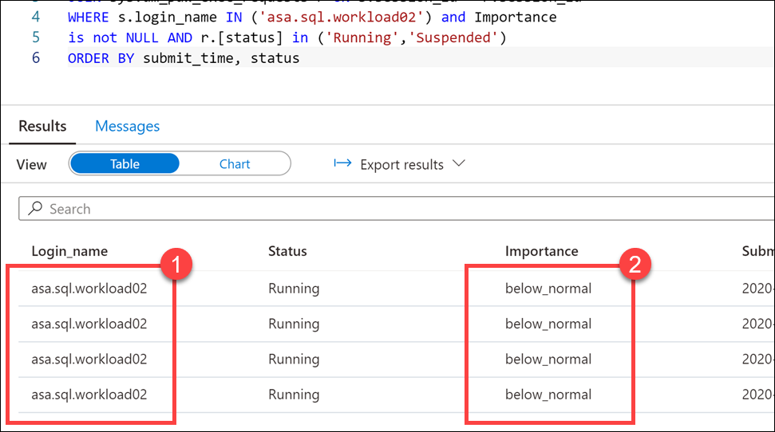

    Notice that the running scripts are executed by the `asa.sql.workload02` user **(1)** with an Importance level of **below_normal (2)**. We have successfully configured the business analyst queries to execute at a lower importance than the CEO queries. We can also see that the `CEODreamDemo` Workload Classifier works as expected.

11. Select the **Monitor** hub.

    

12. Select **Pipeline runs (1)**, and then select **Cancel recursive (2)** for each running Lab 08 pipelines, marked **In progress (3)**. This will help speed up the remaining tasks.

    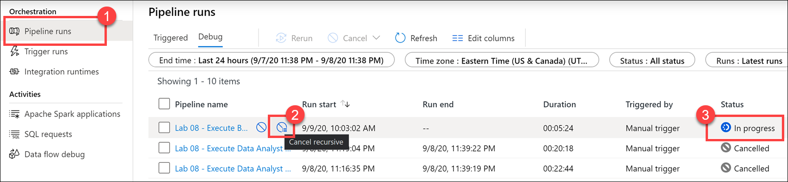

13. Return to the query window under the **Develop** hub. In the query window, replace the script with the following to set 3.25% minimum resources per request:

    ```sql
    IF  EXISTS (SELECT * FROM sys.workload_management_workload_classifiers where group_name = 'CEODemo')
    BEGIN
        Drop Workload Classifier CEODreamDemo
        DROP WORKLOAD GROUP CEODemo
    END
    --- Creates a workload group 'CEODemo'.
    Create  WORKLOAD GROUP CEODemo WITH  
    (
        MIN_PERCENTAGE_RESOURCE = 26 -- integer value
        ,REQUEST_MIN_RESOURCE_GRANT_PERCENT = 3.25 -- factor of 26 (guaranteed more than 4 concurrencies)
        ,CAP_PERCENTAGE_RESOURCE = 100
    )
    --- Creates a workload Classifier 'CEODreamDemo'.
    Create Workload Classifier CEODreamDemo with
    (Workload_Group ='CEODemo',MemberName='asa.sql.workload02',IMPORTANCE = BELOW_NORMAL);
    ```

    > **Note**: If this query takes more than 45 seconds to run, cancel it, then run it again.

    > **Note**: Configuring workload containment implicitly defines a maximum level of concurrency. With a CAP_PERCENTAGE_RESOURCE set to 60% and a REQUEST_MIN_RESOURCE_GRANT_PERCENT set to 1%, up to a 60-concurrency level is allowed for the workload group. Consider the method included below for determining the maximum concurrency:
    > 
    > [Max Concurrency] = [CAP_PERCENTAGE_RESOURCE] / [REQUEST_MIN_RESOURCE_GRANT_PERCENT]

14. Select **Run** from the toolbar menu to execute the SQL command.

    

## Exercise 3: Optimizing data warehouse query performance in Azure Synapse Analytics

### Task 1: Identify performance issues related to tables

1. Select the **Develop** hub.

    

2. From the **Develop** menu, select the **+** button **(1)** and choose **SQL Script (2)** from the context menu.

    

3. In the toolbar menu, connect to the **SQLPool01** database to execute the query.

    

4. In the query window, replace the script with the following to count the number of records in a heap table:

    ```sql
    SELECT  
        COUNT_BIG(*)
    FROM
        [wwi_poc].[Sale]
    ```

5. Select **Run** from the toolbar menu to execute the SQL command.

    

    The script takes up to **15 seconds** to execute and returns a count of ~982 million rows in the table.

    > If the script is still running after 45 seconds, click on Cancel.

    > **Note**: _Do not_ execute this query ahead of time. If you do, the query may run faster during subsequent executions.

    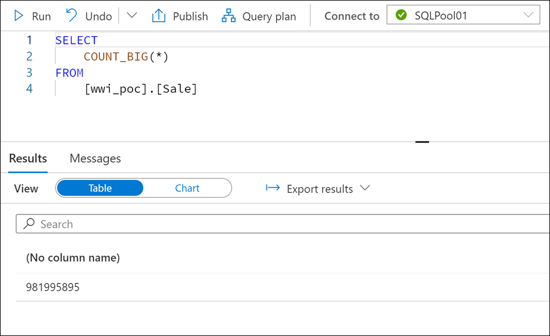

6. In the query window, replace the script with the following (more complex) statement:

    ```sql
    SELECT TOP 1000 * FROM
    (
        SELECT
            S.CustomerId
            ,SUM(S.TotalAmount) as TotalAmount
        FROM
            [wwi_poc].[Sale] S
        GROUP BY
            S.CustomerId
    ) T
    OPTION (LABEL = 'Lab: Heap')
    ```

7. Select **Run** from the toolbar menu to execute the SQL command.

    
  
    The script takes up to **60 seconds** to execute and returns the result. There is clearly something wrong with the `Sale_Heap` table that induces the performance hit.

    > If the script is still running after 90 seconds, click on Cancel.

    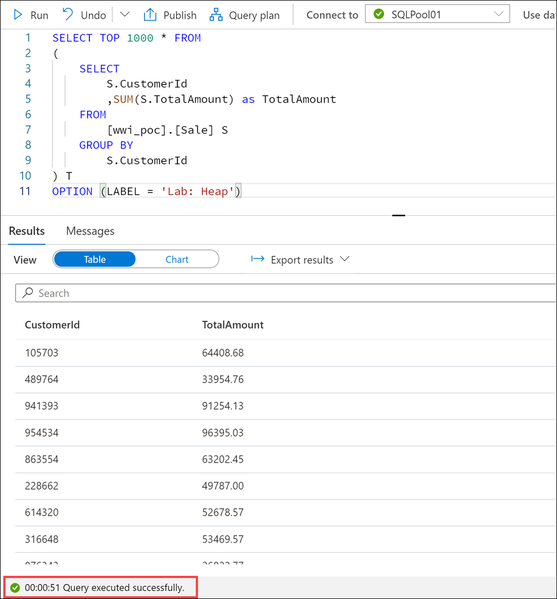

    > Note the OPTION clause used in the statement. This comes in handy when you're looking to identify your query in the [sys.dm_pdw_exec_requests](https://docs.microsoft.com/sql/relational-databases/system-dynamic-management-views/sys-dm-pdw-exec-requests-transact-sql) DMV.
    >
    >```sql
    >SELECT  *
    >FROM    sys.dm_pdw_exec_requests
    >WHERE   [label] = 'Lab: Heap';
    >```

8. Select the **Data** hub.

    

9. Expand the **SQLPool01** database and its list of tables. Right-click **`wwi_poc.Sale` (1)**, select **New SQL script (2)**, then select **CREATE (3)**.

    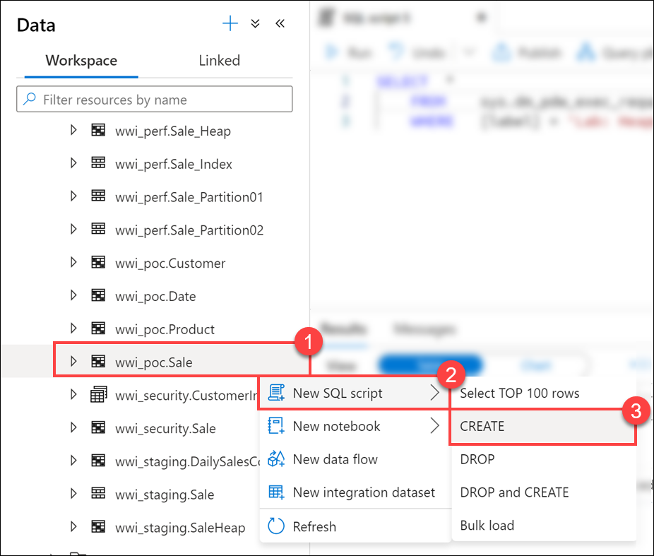

10. Take a look at the script used to create the table:

    ```sql
    CREATE TABLE [wwi_poc].[Sale]
    ( 
        [TransactionId] [uniqueidentifier]  NOT NULL,
        [CustomerId] [int]  NOT NULL,
        [ProductId] [smallint]  NOT NULL,
        [Quantity] [tinyint]  NOT NULL,
        [Price] [decimal](9,2)  NOT NULL,
        [TotalAmount] [decimal](9,2)  NOT NULL,
        [TransactionDateId] [int]  NOT NULL,
        [ProfitAmount] [decimal](9,2)  NOT NULL,
        [Hour] [tinyint]  NOT NULL,
        [Minute] [tinyint]  NOT NULL,
        [StoreId] [smallint]  NOT NULL
    )
    WITH
    (
        DISTRIBUTION = ROUND_ROBIN,
        HEAP
    )
    ```

    > **Note**: *Do not* run this script! It is just for demonstration purposes to review the schema.

    You can immediately spot at least two reasons for the performance hit:

    - The `ROUND_ROBIN` distribution
    - The `HEAP` structure of the table

    > **NOTE**
    >
    > In this case, when we are looking for fast query response times, the heap structure is not a good choice as we will see in a moment. Still, there are cases where using a heap table can help performance rather than hurting it. One such example is when we're looking to ingest large amounts of data into the SQL database associated with the dedicated SQL pool.

    If we were to review the query plan in detail, we would clearly see the root cause of the performance problem: inter-distribution data movements.

11. Run the same script as the one you've run at step 2, but this time with the `EXPLAIN WITH_RECOMMENDATIONS` line before it:

    ```sql
    EXPLAIN WITH_RECOMMENDATIONS
    SELECT TOP 1000 * FROM
    (
        SELECT
            S.CustomerId
            ,SUM(S.TotalAmount) as TotalAmount
        FROM
            [wwi_poc].[Sale] S
        GROUP BY
            S.CustomerId
    ) T
    ```

    The `EXPLAIN WITH_RECOMMENDATIONS` clause returns the query plan for an Azure Synapse Analytics SQL statement without running the statement. Use EXPLAIN to preview which operations will require data movement and to view the estimated costs of the query operations. By default, you will get the execution plan in XML format, which you can export to other formats like CSV or JSON. **Do not** select `Query Plan` from the toolbar as it will try do download the query plan and open it in SQL Server Management Studio.

    Your query should return something similar to:

    ```xml
    <data><row><explain><?xml version="1.0" encoding="utf-8"?>
    <dsql_query number_nodes="4" number_distributions="60" number_distributions_per_node="15">
    <sql>SELECT TOP 1000 * FROM
    (
        SELECT
            S.CustomerId
            ,SUM(S.TotalAmount) as TotalAmount
        FROM
            [wwi_poc].[Sale] S
        GROUP BY
            S.CustomerId
    ) T</sql>
    <materialized_view_candidates>
        <materialized_view_candidates with_constants="False">CREATE MATERIALIZED VIEW View1 WITH (DISTRIBUTION = HASH([Expr0])) AS
    SELECT [S].[CustomerId] AS [Expr0],
        SUM([S].[TotalAmount]) AS [Expr1]
    FROM [wwi_poc].[Sale] [S]
    GROUP BY [S].[CustomerId]</materialized_view_candidates>
    </materialized_view_candidates>
    <dsql_operations total_cost="4.0656044" total_number_operations="5">
        <dsql_operation operation_type="RND_ID">
        <identifier>TEMP_ID_56</identifier>
        </dsql_operation>
        <dsql_operation operation_type="ON">
        <location permanent="false" distribution="AllDistributions" />
        <sql_operations>
            <sql_operation type="statement">CREATE TABLE [qtabledb].[dbo].[TEMP_ID_56] ([CustomerId] INT NOT NULL, [col] DECIMAL(38, 2) NOT NULL ) WITH(DISTRIBUTED_MOVE_FILE='');</sql_operation>
        </sql_operations>
        </dsql_operation>
        <dsql_operation operation_type="SHUFFLE_MOVE">
        <operation_cost cost="4.0656044" accumulative_cost="4.0656044" average_rowsize="13" output_rows="78184.7" GroupNumber="11" />
        <source_statement>SELECT [T1_1].[CustomerId] AS [CustomerId], [T1_1].[col] AS [col] FROM (SELECT SUM([T2_1].[TotalAmount]) AS [col], [T2_1].[CustomerId] AS [CustomerId] FROM [SQLPool01].[wwi_poc].[Sale] AS T2_1 GROUP BY [T2_1].[CustomerId]) AS T1_1
    OPTION (MAXDOP 4, MIN_GRANT_PERCENT = [MIN_GRANT], DISTRIBUTED_MOVE(N''))</source_statement>
        <destination_table>[TEMP_ID_56]</destination_table>
        <shuffle_columns>CustomerId;</shuffle_columns>
        </dsql_operation>
        <dsql_operation operation_type="RETURN">
        <location distribution="AllDistributions" />
        <select>SELECT [T1_1].[CustomerId] AS [CustomerId], [T1_1].[col] AS [col] FROM (SELECT TOP (CAST ((1000) AS BIGINT)) SUM([T2_1].[col]) AS [col], [T2_1].[CustomerId] AS [CustomerId] FROM [qtabledb].[dbo].[TEMP_ID_56] AS T2_1 GROUP BY [T2_1].[CustomerId]) AS T1_1
    OPTION (MAXDOP 4, MIN_GRANT_PERCENT = [MIN_GRANT])</select>
        </dsql_operation>
        <dsql_operation operation_type="ON">
        <location permanent="false" distribution="AllDistributions" />
        <sql_operations>
            <sql_operation type="statement">DROP TABLE [qtabledb].[dbo].[TEMP_ID_56]</sql_operation>
        </sql_operations>
        </dsql_operation>
    </dsql_operations>
    </dsql_query></explain></row></data>
    ```

    Notice the details of the internal layout of the MPP system:

    `<dsql_query number_nodes="4" number_distributions="60" number_distributions_per_node="15">`

    This layout is given by the current Date Warehouse Units (DWU) setting. In the setup used for the example above, we were running at `DW2000c` which means that there are 4 physical nodes to service the 60 distributions, giving a number of 15 distributions per physical node. Depending on your own DWU settings, these numbers will vary.

    The query plan indicates data movement is required. This is indicated by the `SHUFFLE_MOVE` distributed SQL operation.

    Data movement is an operation where parts of the distributed tables are moved to different nodes during query execution. This operation is required where the data is not available on the target node, most commonly when the tables do not share the distribution key. The most common data movement operation is shuffle. During shuffle, for each input row, Synapse computes a hash value using the join columns and then sends that row to the node that owns that hash value. Either one or both sides of join can participate in the shuffle. The diagram below displays shuffle to implement join between tables T1 and T2 where neither of the tables is distributed on the join column col2.

    

    Let's dive now into the details provided by the query plan to understand some of the problems our current approach has. The following table contains the description of every operation mentioned in the query plan:

    Operation | Operation Type | Description
    ---|---|---
    1 | RND_ID | Identifies an object that will be created. In our case, it's the `TEMP_ID_76` internal table.
    2 | ON | Specifies the location (nodes or distributions) where the operation will occur. `AllDistributions` means here the operation will be performed on each of the 60 distributions of the SQL pool. The operation will be a SQL operation (specified via `<sql_operations>`) that will create the  `TEMP_ID_76` table.
    3 | SHUFFLE_MOVE | The list of shuffle columns contains only one column which is `CustomerId` (specified via `<shuffle_columns>`). The values will be distributed to the hash owning distributions and saved locally in the `TEMP_ID_76` tables. The operation will output an estimated number of 41265.25 rows (specified via `<operation_cost>`). According to the same section, the average resulting row size is 13 bytes.
    4 | RETURN | Data resulting from the shuffle operation will be collected from all distributions (see `<location>`) by querying the internal temporary table `TEMP_ID_76`.
    5 | ON | The `TEMP_ID_76` will be deleted from all distributions.

    It becomes clear now what is the root cause of the performance problem: the inter-distribution data movements. This is actually one of the simplest examples given the small size of the data that needs to be shuffled. You can imagine how much worse things become when the shuffled row size becomes larger.

    You can learn more about the structure of the query plan generated by the EXPLAIN statement [here](https://docs.microsoft.com/en-us/sql/t-sql/queries/explain-transact-sql?view=azure-sqldw-latest).

12. Besides the `EXPLAIN` statement, you can also understand the plan details using the `sys.dm_pdw_request_steps` DMV.

    Query the `sys.dm_pdw_exec_requests` DMW to find your query id (this is for the query you executed previously at step 6):

    ```sql
    SELECT  
        *
    FROM    
        sys.dm_pdw_exec_requests
    WHERE   
        [label] = 'Lab: Heap'
    ```

    The result contains, among other things, the query id (`Request_id`), the label, and the original SQL statement:

    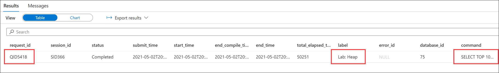

13. With the query id (`QID5418` in this case, **substitute with your id**) you can now investigate the individual steps of the query:

    ```sql
    SELECT
       *
    FROM
        sys.dm_pdw_request_steps
    WHERE
        request_id = 'QID5418'
    ORDER BY
       step_index
    ```

    The steps (indexed 0 to 4) are matching operations 2 to 6 from the query plan. Again, the culprit stands out: the step with index 2 describes the inter-partition data movement operation. By looking at the `TOTAL_ELAPSED_TIME` column one can clearly tell the largest part of the query time is generated by this step. **Take note of the step index** for the next query.

    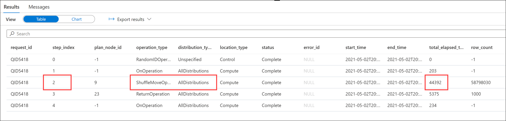

14. Get more details on the problematic step using the following SQL statement (substitute the `request_id` and `step_index` with your values):

    ```sql
    SELECT
    *
    FROM
        sys.dm_pdw_sql_requests
    WHERE
        request_id = 'QID5418'
        AND step_index = 2
    ```

    The results of the statement provide details about what happens on each distribution within the SQL pool.

    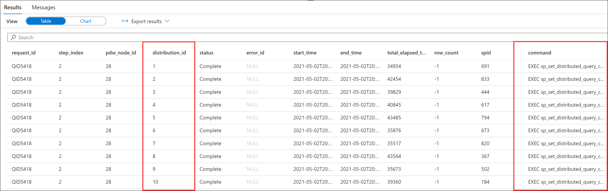

15. Finally, you can use the following SQL statement to investigate data movement on the distributed databases (substitute the `request_id` and `step_index` with your values):

    ```sql
    SELECT
        *
    FROM
        sys.dm_pdw_dms_workers
    WHERE
        request_id = 'QID5418'
        AND step_index = 2
    ORDER BY
        distribution_id
    ```

    The results of the statement provide details about data being moved at each distribution. The `ROWS_PROCESSED` column is especially useful here to get an estimate of the magnitude of the data movement happening when the query is executed.

    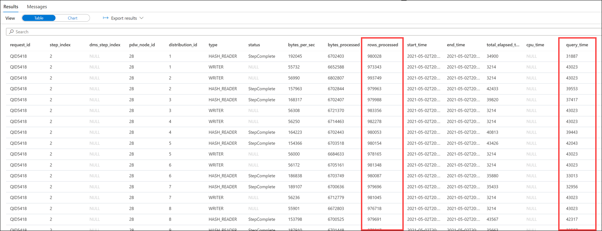

### Task 2: Improve table structure with hash distribution and columnstore index

1. Select the **Develop** hub.

    

2. From the **Develop** menu, select the **+** button **(1)** and choose **SQL Script (2)** from the context menu.

    

3. In the toolbar menu, connect to the **SQLPool01** database to execute the query.

    

4. In the query window, replace the script with the following to create an improved version of the table using CTAS (Create Table As Select):

     ```sql
    CREATE TABLE [wwi_perf].[Sale_Hash]
    WITH
    (
        DISTRIBUTION = HASH ( [CustomerId] ),
        CLUSTERED COLUMNSTORE INDEX
    )
    AS
    SELECT
        *
    FROM
        [wwi_poc].[Sale]
    ```

5. Select **Run** from the toolbar menu to execute the SQL command.

    

    The query will take around **10 minutes** to complete. While this is running, read the rest of the lab instructions to familiarize yourself with the content.

    > **NOTE**
    >
    > CTAS is a more customizable version of the SELECT...INTO statement.
    > SELECT...INTO doesn't allow you to change either the distribution method or the index type as part of the operation. You create the new table by using the default distribution type of ROUND_ROBIN, and the default table structure of CLUSTERED COLUMNSTORE INDEX.
    >
    > With CTAS, on the other hand, you can specify both the distribution of the table data as well as the table structure type.

6. In the query window, replace the script with the following to see performance improvements:

    ```sql
    SELECT TOP 1000 * FROM
    (
        SELECT
            S.CustomerId
            ,SUM(S.TotalAmount) as TotalAmount
        FROM
            [wwi_perf].[Sale_Hash] S
        GROUP BY
            S.CustomerId
    ) T
    ```

7. Select **Run** from the toolbar menu to execute the SQL command.

    

    You should see a performance improvement executing against the new Hash table compared to the first time we ran the script against the Heap table. In our case, the query executed in about 8 seconds.

    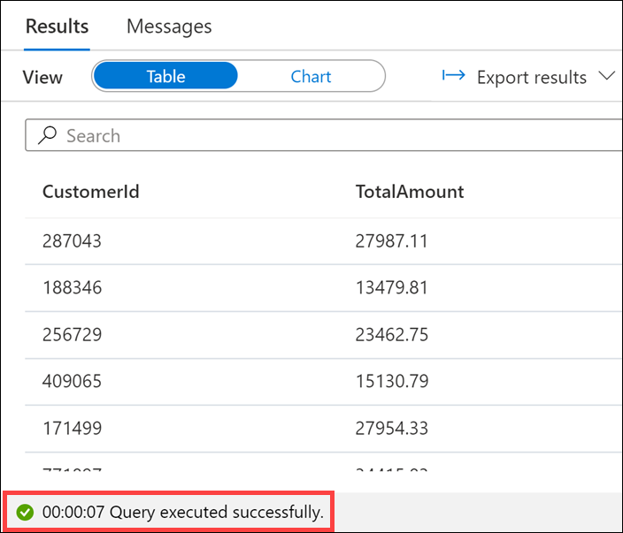

8. Run the following EXPLAIN statement again to get the query plan (do not select `Query Plan` from the toolbar as it will try do download the query plan and open it in SQL Server Management Studio):

    ```sql
    EXPLAIN
    SELECT TOP 1000 * FROM
    (
        SELECT
            S.CustomerId
            ,SUM(S.TotalAmount) as TotalAmount
        FROM
            [wwi_perf].[Sale_Hash] S
        GROUP BY
            S.CustomerId
    ) T
    ```

    The resulting query plan is clearly much better than the previous one, as there is no more inter-distribution data movement involved.

    ```xml
    <data><row><explain><?xml version="1.0" encoding="utf-8"?>
    <dsql_query number_nodes="5" number_distributions="60" number_distributions_per_node="12">
    <sql>SELECT TOP 1000 * FROM
    (
        SELECT
            S.CustomerId
            ,SUM(S.TotalAmount) as TotalAmount
        FROM
            [wwi_perf].[Sale_Hash] S
        GROUP BY
            S.CustomerId
    ) T</sql>
    <dsql_operations total_cost="0" total_number_operations="1">
        <dsql_operation operation_type="RETURN">
        <location distribution="AllDistributions" />
        <select>SELECT [T1_1].[CustomerId] AS [CustomerId], [T1_1].[col] AS [col] FROM (SELECT TOP (CAST ((1000) AS BIGINT)) SUM([T2_1].[TotalAmount]) AS [col], [T2_1].[CustomerId] AS [CustomerId] FROM [SQLPool01].[wwi_perf].[Sale_Hash] AS T2_1 GROUP BY [T2_1].[CustomerId]) AS T1_1
    OPTION (MAXDOP 4)</select>
        </dsql_operation>
    </dsql_operations>
    </dsql_query></explain></row></data>
    ```

9. Try running a more complex query and investigate the execution plan and execution steps. Here is an example of a more complex query you can use:

    ```sql
    SELECT
        AVG(TotalProfit) as AvgMonthlyCustomerProfit
    FROM
    (
        SELECT
            S.CustomerId
            ,D.Year
            ,D.Month
            ,SUM(S.TotalAmount) as TotalAmount
            ,AVG(S.TotalAmount) as AvgAmount
            ,SUM(S.ProfitAmount) as TotalProfit
            ,AVG(S.ProfitAmount) as AvgProfit
        FROM
            [wwi_perf].[Sale_Partition01] S
            join [wwi].[Date] D on
                D.DateId = S.TransactionDateId
        GROUP BY
            S.CustomerId
            ,D.Year
            ,D.Month
    ) T
    ```

### Task 4: Improve further the table structure with partitioning

Table partitions enable you to divide your data into smaller groups of data. Partitioning can benefit data maintenance and query performance. Whether it benefits both or just one is dependent on how data is loaded and whether the same column can be used for both purposes, since partitioning can only be done on one column.

Date columns are usually good candidates for partitioning tables at the distributions level. In the case of Tailwind Trader's sales data, partitioning based on the `TransactionDateId` column seems to be a good choice.

The dedicated SQL pool already contains two versions of the `Sale` table that have been partitioned using `TransactionDateId`. These tables are `[wwi_perf].[Sale_Partition01]` and `[wwi_perf].[Sale_Partition02]`. Below are the CTAS queries that have been used to create these tables.

1. In the query window, replace the script with the following CTAS queries that create the partition tables (**do not** execute):

    ```sql
    CREATE TABLE [wwi_perf].[Sale_Partition01]
    WITH
    (
      DISTRIBUTION = HASH ( [CustomerId] ),
      CLUSTERED COLUMNSTORE INDEX,
      PARTITION
      (
        [TransactionDateId] RANGE RIGHT FOR VALUES (
                20190101, 20190201, 20190301, 20190401, 20190501, 20190601, 20190701, 20190801, 20190901, 20191001, 20191101, 20191201)
      )
    )
    AS
    SELECT
      *
    FROM	
      [wwi_perf].[Sale_Heap]
    OPTION  (LABEL  = 'CTAS : Sale_Partition01')

    CREATE TABLE [wwi_perf].[Sale_Partition02]
    WITH
    (
      DISTRIBUTION = HASH ( [CustomerId] ),
      CLUSTERED COLUMNSTORE INDEX,
      PARTITION
      (
        [TransactionDateId] RANGE RIGHT FOR VALUES (
                20190101, 20190401, 20190701, 20191001)
      )
    )
    AS
    SELECT *
    FROM
        [wwi_perf].[Sale_Heap]
    OPTION  (LABEL  = 'CTAS : Sale_Partition02')
    ```

    > **Note**
    >
    > These queries have already been run on the dedicated SQL pool. **Do not** execute the script.

Notice the two partitioning strategies we've used here. The first partitioning scheme is month-based and the second is quarter-based **(3)**.

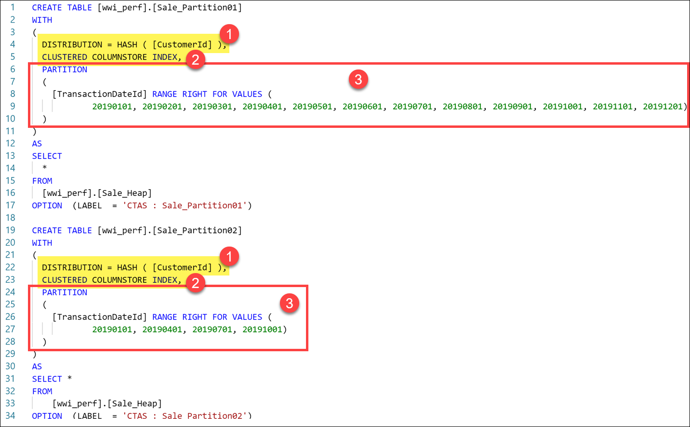

#### Task 4.1: Table distributions

As you can see, the two partitioned tables are hash-distributed **(1)**. A distributed table appears as a single table, but the rows are actually stored across 60 distributions. The rows are distributed with a hash or round-robin algorithm.

The types of distributions are:

- **Round-robin distributed**: Distributes table rows evenly across all distributions at random.
- **Hash distributed**: Distributes table rows across the Compute nodes by using a deterministic hash function to assign each row to one distribution.
- **Replicated**: Full copy of table accessible on each Compute node.

A hash-distributed table distributes table rows across the Compute nodes by using a deterministic hash function to assign each row to one distribution.

Since identical values always hash to the same distribution, the data warehouse has built-in knowledge of the row locations.

Dedicated SQL pool uses this knowledge to minimize data movement during queries, which improves query performance. Hash-distributed tables work well for large fact tables in a star schema. They can have very large numbers of rows and still achieve high performance. There are, of course, some design considerations that help you to get the performance the distributed system is designed to provide.

*Consider using a hash-distributed table when:*

- The table size on disk is more than 2 GB.
- The table has frequent insert, update, and delete operations.

#### Task 4.2: Indexes

Looking at the query, also notice that both partitioned tables are configured with a **clustered columnstore index (2)**. There are different types of indexes you can use in dedicated SQL pool:

- **Clustered Columnstore index (Default Primary)**: Offers the highest level of data compression and best overall query performance.
- **Clustered index (Primary)**: Is performant for looking up a single to few rows.
- **Heap (Primary)**: Benefits from faster loading and landing temporary data. It is best for small lookup tables.
- **Nonclustered indexes (Secondary)**: Enable ordering of multiple columns in a table and allows multiple nonclustered on a single table. These can be created on any of the above primary indexes and offer more performant lookup queries.

By default, dedicated SQL pool creates a clustered columnstore index when no index options are specified on a table. Clustered columnstore tables offer both the highest level of data compression as well as the best overall query performance. They will generally outperform clustered index or heap tables and are usually the best choice for large tables. For these reasons, clustered columnstore is the best place to start when you are unsure of how to index your table.

There are a few scenarios where clustered columnstore may not be a good option:

- Columnstore tables do not support `varchar(max)`, `nvarchar(max)`, and `varbinary(max)`. Consider heap or clustered index instead.
- Columnstore tables may be less efficient for transient data. Consider heap and perhaps even temporary tables.
- Small tables with less than 100 million rows. Consider heap tables.

#### Task 4.3: Partitioning

Again, with this query, we partition the two tables differently **(3)** so we can evaluate the performance difference and decide which partitioning strategy is best long-term. The one we ultimately go with depends on various factors with Tailwind Trader's data. You may decide to keep both to optimize query performance, but then you double the data storage and maintenance requirements for managing the data.

Partitioning is supported on all table types.

The **RANGE RIGHT** option that we use in the query **(3)** is used for time partitions. RANGE LEFT is used for number partitions.

The primary benefits to partitioning is that it:

- Improves efficiency and performance of loading and querying by limiting the scope to a subset of data.
- Offers significant query performance enhancements where filtering on the partition key can eliminate unnecessary scans and eliminate I/O (input/output operations).

The reason we have created two tables with different partition strategies **(3)** is to experiment with proper sizing.

While partitioning can be used to improve performance, creating a table with too many partitions can hurt performance under some circumstances. These concerns are especially true for clustered columnstore tables, like we created here. For partitioning to be helpful, it is important to understand when to use partitioning and the number of partitions to create. There is no hard and fast rule as to how many partitions are too many, it depends on your data and how many partitions you are loading simultaneously. A successful partitioning scheme usually has tens to hundreds of partitions, not thousands.

*Supplemental information*:

When creating partitions on clustered columnstore tables, it is important to consider how many rows belong to each partition. For optimal compression and performance of clustered columnstore tables, a minimum of 1 million rows per distribution and partition is needed. Before partitions are created, dedicated SQL pools already divides each table into 60 distributed databases. Any partitioning added to a table is in addition to the distributions created behind the scenes. Using this example, if the sales fact table contained 36 monthly partitions, and given that dedicated SQL pool has 60 distributions, then the sales fact table should contain 60 million rows per month, or 2.1 billion rows when all months are populated. If a table contains fewer than the recommended minimum number of rows per partition, consider using fewer partitions in order to increase the number of rows per partition.

## Exercise 4: Improve query performance

### Task 1: Use materialized views

As opposed to a standard view, a materialized view pre-computes, stores, and maintains its data in a dedicated SQL pool just like a table. Here is a basic comparison between standard and materialized views:

| Comparison                     | View                                         | Materialized View
|:-------------------------------|:---------------------------------------------|:-------------------------------------------------------------|
|View definition                 | Stored in Synapse Analytics.              | Stored in Synapse Analytics.
|View content                    | Generated each time when the view is used.   | Pre-processed and stored in Synapse Analytics during view creation. Updated as data is added to the underlying tables.
|Data refresh                    | Always updated                               | Always updated
|Speed to retrieve view data from complex queries     | Slow                                         | Fast  
|Extra storage                   | No                                           | Yes
|Syntax                          | CREATE VIEW                                  | CREATE MATERIALIZED VIEW AS SELECT

1. Execute the following query to get an approximation of its execution time:

    ```sql
    SELECT TOP 1000 * FROM
    (
        SELECT
            S.CustomerId
            ,D.Year
            ,D.Quarter
            ,SUM(S.TotalAmount) as TotalAmount
        FROM
            [wwi_perf].[Sale_Partition02] S
            join [wwi].[Date] D on
                S.TransactionDateId = D.DateId
        GROUP BY
            S.CustomerId
            ,D.Year
            ,D.Quarter
    ) T
    ```

2. Execute this query as well (notice the slight difference):

    ```sql
    SELECT TOP 1000 * FROM
    (
        SELECT
            S.CustomerId
            ,D.Year
            ,D.Month
            ,SUM(S.ProfitAmount) as TotalProfit
        FROM
            [wwi_perf].[Sale_Partition02] S
            join [wwi].[Date] D on
                S.TransactionDateId = D.DateId
        GROUP BY
            S.CustomerId
            ,D.Year
            ,D.Month
    ) T
    ```

3. Create a materialized view that can support both queries above:

    ```sql
    CREATE MATERIALIZED VIEW
        wwi_perf.mvCustomerSales
    WITH
    (
        DISTRIBUTION = HASH( CustomerId )
    )
    AS
    SELECT
        S.CustomerId
        ,D.Year
        ,D.Quarter
        ,D.Month
        ,SUM(S.TotalAmount) as TotalAmount
        ,SUM(S.ProfitAmount) as TotalProfit
    FROM
        [wwi_perf].[Sale_Partition02] S
        join [wwi].[Date] D on
            S.TransactionDateId = D.DateId
    GROUP BY
        S.CustomerId
        ,D.Year
        ,D.Quarter
        ,D.Month
    ```

4. Run the following query to get an estimated execution plan (do not select `Query Plan` from the toolbar as it will try do download the query plan and open it in SQL Server Management Studio):

    ```sql
    EXPLAIN
    SELECT TOP 1000 * FROM
    (
        SELECT
            S.CustomerId
            ,D.Year
            ,D.Quarter
            ,SUM(S.TotalAmount) as TotalAmount
        FROM
            [wwi_perf].[Sale_Partition02] S
            join [wwi].[Date] D on
                S.TransactionDateId = D.DateId
        GROUP BY
            S.CustomerId
            ,D.Year
            ,D.Quarter
    ) T
    ```

    The resulting execution plan shows how the newly created materialized view is used to optimize the execution. Note the `FROM [SQLPool01].[wwi_perf].[mvCustomerSales]` in the `<dsql_operations>` element.

    ```xml
    <?xml version="1.0" encoding="utf-8"?>
    <dsql_query number_nodes="5" number_distributions="60" number_distributions_per_node="12">
    <sql>SELECT TOP 1000 * FROM
    (
        SELECT
            S.CustomerId
            ,D.Year
            ,D.Quarter
            ,SUM(S.TotalAmount) as TotalAmount
        FROM
            [wwi_perf].[Sale_Partition02] S
            join [wwi].[Date] D on
                S.TransactionDateId = D.DateId
        GROUP BY
            S.CustomerId
            ,D.Year
            ,D.Quarter
    ) T</sql>
    <dsql_operations total_cost="0" total_number_operations="1">
        <dsql_operation operation_type="RETURN">
        <location distribution="AllDistributions" />
        <select>SELECT [T1_1].[CustomerId] AS [CustomerId], [T1_1].[Year] AS [Year], [T1_1].[Quarter] AS [Quarter], [T1_1].[col] AS [col] FROM (SELECT TOP (CAST ((1000) AS BIGINT)) [T2_1].[CustomerId] AS [CustomerId], [T2_1].[Year] AS [Year], [T2_1].[Quarter] AS [Quarter], [T2_1].[col1] AS [col] FROM (SELECT ISNULL([T3_1].[col1], CONVERT (BIGINT, 0, 0)) AS [col], [T3_1].[CustomerId] AS [CustomerId], [T3_1].[Year] AS [Year], [T3_1].[Quarter] AS [Quarter], [T3_1].[col] AS [col1] FROM (SELECT SUM([T4_1].[TotalAmount]) AS [col], SUM([T4_1].[cb]) AS [col1], [T4_1].[CustomerId] AS [CustomerId], [T4_1].[Year] AS [Year], [T4_1].[Quarter] AS [Quarter] FROM (SELECT [T5_1].[CustomerId] AS [CustomerId], [T5_1].[TotalAmount] AS [TotalAmount], [T5_1].[cb] AS [cb], [T5_1].[Quarter] AS [Quarter], [T5_1].[Year] AS [Year] FROM [SQLPool01].[wwi_perf].[mvCustomerSales] AS T5_1) AS T4_1 GROUP BY [T4_1].[CustomerId], [T4_1].[Year], [T4_1].[Quarter]) AS T3_1) AS T2_1 WHERE ([T2_1].[col] != CAST ((0) AS BIGINT))) AS T1_1
    OPTION (MAXDOP 6)</select>
        </dsql_operation>
    </dsql_operations>
    </dsql_query>
    ```

5. The same materialized view is also used to optimize the second query. Get its execution plan:

    ```sql
    EXPLAIN
    SELECT TOP 1000 * FROM
    (
        SELECT
            S.CustomerId
            ,D.Year
            ,D.Month
            ,SUM(S.ProfitAmount) as TotalProfit
        FROM
            [wwi_perf].[Sale_Partition02] S
            join [wwi].[Date] D on
                S.TransactionDateId = D.DateId
        GROUP BY
            S.CustomerId
            ,D.Year
            ,D.Month
    ) T
    ```

    The resulting execution plan shows the use of the same materialized view to optimize execution:

    ```xml
    <?xml version="1.0" encoding="utf-8"?>
    <dsql_query number_nodes="5" number_distributions="60" number_distributions_per_node="12">
    <sql>SELECT TOP 1000 * FROM
    (
        SELECT
            S.CustomerId
            ,D.Year
            ,D.Month
            ,SUM(S.ProfitAmount) as TotalProfit
        FROM
            [wwi_perf].[Sale_Partition02] S
            join [wwi].[Date] D on
                S.TransactionDateId = D.DateId
        GROUP BY
            S.CustomerId
            ,D.Year
            ,D.Month
    ) T</sql>
    <dsql_operations total_cost="0" total_number_operations="1">
        <dsql_operation operation_type="RETURN">
        <location distribution="AllDistributions" />
        <select>SELECT [T1_1].[CustomerId] AS [CustomerId], [T1_1].[Year] AS [Year], [T1_1].[Month] AS [Month], [T1_1].[col] AS [col] FROM (SELECT TOP (CAST ((1000) AS BIGINT)) [T2_1].[CustomerId] AS [CustomerId], [T2_1].[Year] AS [Year], [T2_1].[Month] AS [Month], [T2_1].[col1] AS [col] FROM (SELECT ISNULL([T3_1].[col1], CONVERT (BIGINT, 0, 0)) AS [col], [T3_1].[CustomerId] AS [CustomerId], [T3_1].[Year] AS [Year], [T3_1].[Month] AS [Month], [T3_1].[col] AS [col1] FROM (SELECT SUM([T4_1].[TotalProfit]) AS [col], SUM([T4_1].[cb]) AS [col1], [T4_1].[CustomerId] AS [CustomerId], [T4_1].[Year] AS [Year], [T4_1].[Month] AS [Month] FROM (SELECT [T5_1].[CustomerId] AS [CustomerId], [T5_1].[TotalProfit] AS [TotalProfit], [T5_1].[cb] AS [cb], [T5_1].[Month] AS [Month], [T5_1].[Year] AS [Year] FROM [SQLPool01].[wwi_perf].[mvCustomerSales] AS T5_1) AS T4_1 GROUP BY [T4_1].[CustomerId], [T4_1].[Year], [T4_1].[Month]) AS T3_1) AS T2_1 WHERE ([T2_1].[col] != CAST ((0) AS BIGINT))) AS T1_1
    OPTION (MAXDOP 6)</select>
        </dsql_operation>
    </dsql_operations>
    </dsql_query>
    ```

    >**Note**
    >
    >Even if the two queries have different aggregation levels, the query optimizer is able to infer the use of the materialized view. This happens because the materialized view covers both aggregation levels (`Quarter` and `Month`) as well as both aggregation measures (`TotalAmount` and `ProfitAmount`).

6. Check the materialized view overhead:

    ```sql
    DBCC PDW_SHOWMATERIALIZEDVIEWOVERHEAD ( 'wwi_perf.mvCustomerSales' )
    ```

    The results show that `BASE_VIEW_ROWS` are equal to `TOTAL_ROWS` (and hence `OVERHEAD_RATIO` is 1). The materialized view is perfectly aligned with the base view. This situation is expected to change once the underlying data starts to change.

7. Update the original data the materialized view was built on:

    ```sql
    UPDATE
        [wwi_perf].[Sale_Partition02]
    SET
        TotalAmount = TotalAmount * 1.01
        ,ProfitAmount = ProfitAmount * 1.01
    WHERE
        CustomerId BETWEEN 100 and 200
    ```

8. Check the materialized view overhead again:

    ```sql
    DBCC PDW_SHOWMATERIALIZEDVIEWOVERHEAD ( 'wwi_perf.mvCustomerSales' )
    ```

    

    There is now a delta stored by the materialized view which results in `TOTAL_ROWS` being greater than `BASE_VIEW_ROWS` and `OVERHEAD_RATIO` being greater than 1.

9. Rebuild the materialized view and check that the overhead ration went back to 1:

    ```sql
    ALTER MATERIALIZED VIEW [wwi_perf].[mvCustomerSales] REBUILD

    DBCC PDW_SHOWMATERIALIZEDVIEWOVERHEAD ( 'wwi_perf.mvCustomerSales' )
    ```

    

### Task 2: Use result set caching

Tailwind Trader's downstream reports are used by many users, which often means the same query is being executed repeatedly against data that does not change often. What can they do to improve the performance of these types of queries? How does this approach work when the underlying data changes?

They should consider result-set caching.

Cache the results of a query in the dedicated Azure Synapse SQL pool storage. This enables interactive response times for repetitive queries against tables with infrequent data changes.

> The result-set cache persists even if dedicated SQL pool is paused and resumed later.

Query cache is invalidated and refreshed when the underlying table data or query code changes.

Result cache is evicted regularly based on a time-aware least recently used algorithm (TLRU).

1. In the query window, replace the script with the following to check if result set caching is on in the current dedicated SQL pool:

    ```sql
    SELECT
        name
        ,is_result_set_caching_on
    FROM
        sys.databases
    ```

2. Select **Run** from the toolbar menu to execute the SQL command.

    

    Look at the output of the query. What is the `is_result_set_caching_on` value for **SQLPool01**? In our case, it is set to `False`, meaning result set caching is currently disabled.

    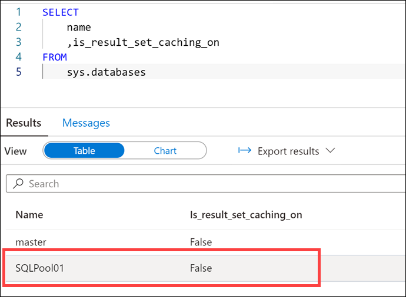

3. In the query window, change the database to **master (1)**, then replace the script **(2)** with the following to activate result set caching:

    ```sql
    ALTER DATABASE SQLPool01
    SET RESULT_SET_CACHING ON
    ```

    

4. Select **Run** from the toolbar menu to execute the SQL command.

    

    > **Important**
    >
    > The operations to create a result set cache and retrieve data from the cache happen on the control node of a dedicated SQL pool instance. When result set caching is turned ON, running queries that return a large result set (for example, >1GB) can cause high throttling on the control node and slow down the overall query response on the instance. Those queries are commonly used during data exploration or ETL operations. To avoid stressing the control node and cause performance issue, users should turn OFF result set caching on the database before running those types of queries.

5. In the toolbar menu, connect to the **SQLPool01** database for the next query.

    

6. In the query window, replace the script with the following query and immediately check if it hit the cache:

    ```sql
    SELECT
        D.Year
        ,D.Quarter
        ,D.Month
        ,SUM(S.TotalAmount) as TotalAmount
        ,SUM(S.ProfitAmount) as TotalProfit
    FROM
        [wwi_perf].[Sale_Partition02] S
        join [wwi].[Date] D on
            S.TransactionDateId = D.DateId
    GROUP BY
        D.Year
        ,D.Quarter
        ,D.Month
    OPTION (LABEL = 'Lab: Result set caching')

    SELECT
        result_cache_hit
    FROM
        sys.dm_pdw_exec_requests
    WHERE
        request_id =
        (
            SELECT TOP 1
                request_id
            FROM
                sys.dm_pdw_exec_requests
            WHERE
                [label] = 'Lab: Result set caching'
            ORDER BY
                start_time desc
        )
    ```

7. Select **Run** from the toolbar menu to execute the SQL command.

    

    As expected, the result is **`False` (0)**.

    

    Still, you can identify that, while running the query, dedicated SQL pool has also cached the result set.

8. In the query window, replace the script with the following to get the execution steps:

    ```sql
    SELECT
        step_index
        ,operation_type
        ,location_type
        ,status
        ,total_elapsed_time
        ,command
    FROM
        sys.dm_pdw_request_steps
    WHERE
        request_id =
        (
            SELECT TOP 1
                request_id
            FROM
                sys.dm_pdw_exec_requests
            WHERE
                [label] = 'Lab: Result set caching'
            ORDER BY
                start_time desc
        )
    ```

9. Select **Run** from the toolbar menu to execute the SQL command.

    

    The execution plan reveals the building of the result set cache:

    

    You can control at the user session level the use of the result set cache.

10. In the query window, replace the script with the following to deactivate and activate the result cache:

    ```sql  
    SET RESULT_SET_CACHING OFF

    SELECT
        D.Year
        ,D.Quarter
        ,D.Month
        ,SUM(S.TotalAmount) as TotalAmount
        ,SUM(S.ProfitAmount) as TotalProfit
    FROM
        [wwi_perf].[Sale_Partition02] S
        join [wwi].[Date] D on
            S.TransactionDateId = D.DateId
    GROUP BY
        D.Year
        ,D.Quarter
        ,D.Month
    OPTION (LABEL = 'Lab: Result set caching off')

    SET RESULT_SET_CACHING ON

    SELECT
        D.Year
        ,D.Quarter
        ,D.Month
        ,SUM(S.TotalAmount) as TotalAmount
        ,SUM(S.ProfitAmount) as TotalProfit
    FROM
        [wwi_perf].[Sale_Partition02] S
        join [wwi].[Date] D on
            S.TransactionDateId = D.DateId
    GROUP BY
        D.Year
        ,D.Quarter
        ,D.Month
    OPTION (LABEL = 'Lab: Result set caching on')

    SELECT TOP 2
        request_id
        ,[label]
        ,result_cache_hit
    FROM
        sys.dm_pdw_exec_requests
    WHERE
        [label] in ('Lab: Result set caching off', 'Lab: Result set caching on')
    ORDER BY
        start_time desc
    ```

11. Select **Run** from the toolbar menu to execute the SQL command.

    

    The result of **`SET RESULT_SET_CACHING OFF`** in the script above is visible in the cache hit test results (The `result_cache_hit` column returns `1` for cache hit, `0` for cache miss, and *negative values* for reasons why result set caching was not used.):

    

12. In the query window, replace the script with the following to check the space used by the result cache:

    ```sql
    DBCC SHOWRESULTCACHESPACEUSED
    ```

13. Select **Run** from the toolbar menu to execute the SQL command.

    

    We can see the amount of space reserved, how much is used by data, the amount used for the index, and how much unused space there is for the result cache in the query results.

    

14. In the query window, replace the script with the following to clear the result set cache:

    ```sql
    DBCC DROPRESULTSETCACHE
    ```

15. Select **Run** from the toolbar menu to execute the SQL command.

    

16. In the query window, change the database to **master (1)**, then replace the script **(2)** with the following to disable result set caching:

    ```sql
    ALTER DATABASE SQLPool01
    SET RESULT_SET_CACHING OFF
    ```

    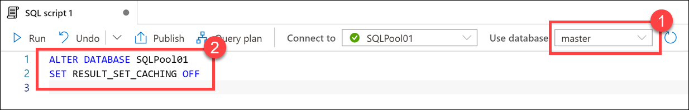

17. Select **Run** from the toolbar menu to execute the SQL command.

    

    > **Note**
    >
    > Make sure you disable result set caching on the dedicated SQL pool. Failing to do so will have a negative impact on the remainder of the demos, as it will skew execution times and defeat the purpose of several upcoming exercises.

    The maximum size of result set cache is 1 TB per database. The cached results are automatically invalidated when the underlying query data change.

    The cache eviction is managed by dedicated SQL pool automatically following this schedule:

    - Every 48 hours if the result set hasn't been used or has been invalidated.
    - When the result set cache approaches the maximum size.

    Users can manually empty the entire result set cache by using one of these options:

    - Turn OFF the result set cache feature for the database
    - Run DBCC DROPRESULTSETCACHE while connected to the database

    Pausing a database won't empty the cached result set.

### Task 3: Create and update statistics

The more the dedicated SQL pool resource knows about your data, the faster it can execute queries. After loading data into the dedicated SQL pool, collecting statistics on your data is one of the most important things you can do for query optimization.

The dedicated SQL pool query optimizer is a cost-based optimizer. It compares the cost of various query plans, and then chooses the plan with the lowest cost. In most cases, it chooses the plan that will execute the fastest.

For example, if the optimizer estimates that the date your query is filtering on will return one row it will choose one plan. If it estimates that the selected date will return 1 million rows, it will return a different plan.

1. Check if statistics are set to be automatically created in the database:

    ```sql
    SELECT name, is_auto_create_stats_on
    FROM sys.databases
    ```

2. See statistics that have been automatically created (change the database back to your dedicated SQL Pool):

    ```sql
    SELECT
        *
    FROM
        sys.dm_pdw_exec_requests
    WHERE
        Command like 'CREATE STATISTICS%'
    ```

    Notice the special name pattern used for automatically created statistics:

    

3. Check if there are any statistics created for `CustomerId` from the `wwi_perf.Sale_Has` table:

    ```sql
    DBCC SHOW_STATISTICS ('wwi_perf.Sale_Hash', CustomerId) WITH HISTOGRAM
    ```

    You should get an error stating that statistics for `CustomerId` does not exist.

4. Create statistics for `CustomerId`:

    ```sql
    CREATE STATISTICS Sale_Hash_CustomerId ON wwi_perf.Sale_Hash (CustomerId)
    ```

    Display the newly created statistics:

    ```sql
    DBCC SHOW_STATISTICS([wwi_perf.Sale_Hash], 'Sale_Hash_CustomerId')
    ```

    In the results pane, switch to `Chart` display and configure the properties as follows:

    - **Chart type**: Area
    - **Category column**: RANGE_HI_KEY
    - **Legend (series) columns**: RANGE_ROWS

    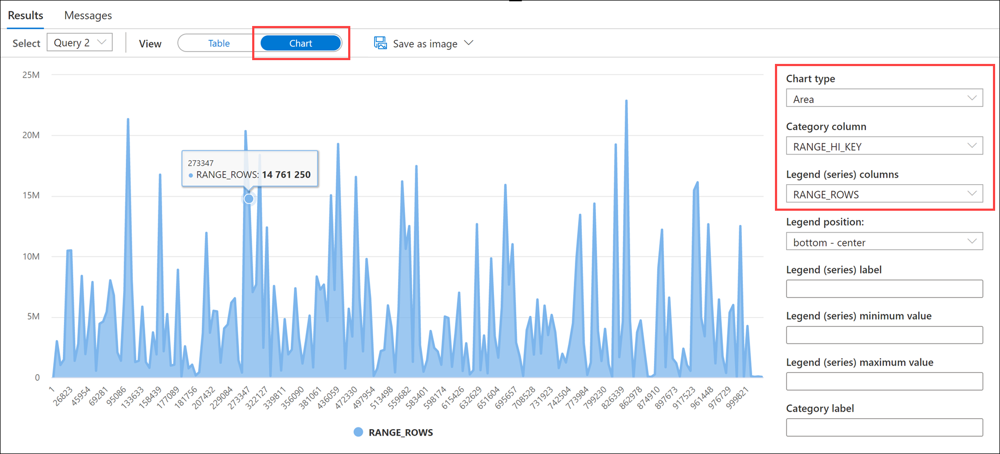

    You now have a visual on the statistics created for the `CustomerId` column.

    >**Important**
    >
    >The more SQL pool knows about your data, the faster it can execute queries against it. After loading data into SQL pool, collecting statistics on your data is one of the most important things you can do to optimize your queries.
    >
    >The SQL pool query optimizer is a cost-based optimizer. It compares the cost of various query plans, and then chooses the plan with the lowest cost. In most cases, it chooses the plan that will execute the fastest.
    >
    >For example, if the optimizer estimates that the date your query is filtering on will return one row it will choose one plan. If it estimates that the selected date will return 1 million rows, it will return a different plan.

### Task 4: Create and update indexes

Clustered Columnstore Index vs. Heap vs. Clustered and Nonclustered

Clustered indexes may outperform clustered columnstore indexes when a single row needs to be quickly retrieved. For queries where a single or very few row lookup is required to perform with extreme speed, consider a cluster index or nonclustered secondary index. The disadvantage to using a clustered index is that only queries that benefit are the ones that use a highly selective filter on the clustered index column. To improve filter on other columns a nonclustered index can be added to other columns. However, each index which is added to a table adds both space and processing time to loads.

1. Retrieve information about a single customer from the table with CCI:

    ```sql
    SELECT
        *
    FROM
        [wwi_perf].[Sale_Hash]
    WHERE
        CustomerId = 500000
    ```

    Take a note of the execution time.

2. Retrieve information about a single customer from the table with a clustered index:

    ```sql
    SELECT
        *
    FROM
        [wwi_perf].[Sale_Index]
    WHERE
        CustomerId = 500000
    ```

    The execution time is similar to the one for the query above. Clustered columnstore indexes have no significant advantage over clustered indexes in the specific scenario of highly selective queries.

3. Retrieve information about multiple customers from the table with CCI:

    ```sql
    SELECT
        *
    FROM
        [wwi_perf].[Sale_Hash]
    WHERE
        CustomerId between 400000 and 400100
    ```

    and then retrieve the same information from the table with a clustered index:

    ```sql
    SELECT
        *
    FROM
        [wwi_perf].[Sale_Index]
    WHERE
        CustomerId between 400000 and 400100
    ```

    Run both queries several times to get a stable execution time. Under normal conditions, you should see that even with a relatively small number of customers, the CCI table starts yielding better results than the clustered index table.

4. Now add an extra condition on the query, one that refers to the `StoreId` column:

    ```sql
    SELECT
        *
    FROM
        [wwi_perf].[Sale_Index]
    WHERE
        CustomerId between 400000 and 400100
        and StoreId between 2000 and 4000
    ```

    Take a note of the execution time.

5. Create a non-clustered index on the `StoreId` column:

    ```sql
    CREATE INDEX Store_Index on wwi_perf.Sale_Index (StoreId)
    ```

    The creation of the index should complete in a few minutes. Once the index is created, run the previous query again. Notice the improvement in execution time resulting from the newly created non-clustered index.

    >**Note**
    >
    >Creating a non-clustered index on the `wwi_perf.Sale_Index` is based on the already existing clustered index. As a bonus exercise, try to create the same type of index on the `wwi_perf.Sale_Hash` table. Can you explain the difference in index creation time?

### Task 5: Ordered Clustered Columnstore Indexes

By default, for each table created without an index option, an internal component (index builder) creates a non-ordered clustered columnstore index (CCI) on it. Data in each column is compressed into a separate CCI rowgroup segment. There's metadata on each segment's value range, so segments that are outside the bounds of the query predicate aren't read from disk during query execution. CCI offers the highest level of data compression and reduces the size of segments to read so queries can run faster. However, because the index builder doesn't sort data before compressing them into segments, segments with overlapping value ranges could occur, causing queries to read more segments from disk and take longer to finish.

When creating an ordered CCI, the Synapse SQL engine sorts the existing data in memory by the order key(s) before the index builder compresses them into index segments. With sorted data, segment overlapping is reduced allowing queries to have a more efficient segment elimination and thus faster performance because the number of segments to read from disk is smaller. If all data can be sorted in memory at once, then segment overlapping can be avoided. Due to large tables in data warehouses, this scenario doesn't happen often.

Queries with the following patterns typically run faster with ordered CCI:

- The queries have equality, inequality, or range predicates
- The predicate columns and the ordered CCI columns are the same.
- The predicate columns are used in the same order as the column ordinal of ordered CCI columns.

1. Run the following query to show the segment overlaps for the `Sale_Hash` table:

    ```sql
    select
        OBJ.name as table_name
        ,COL.name as column_name
        ,NT.distribution_id
        ,NP.partition_id
        ,NP.rows as partition_rows
        ,NP.data_compression_desc
        ,NCSS.segment_id
        ,NCSS.version
        ,NCSS.min_data_id
        ,NCSS.max_data_id
        ,NCSS.row_count
    from
        sys.objects OBJ
        JOIN sys.columns as COL ON
            OBJ.object_id = COL.object_id
        JOIN sys.pdw_table_mappings TM ON
            OBJ.object_id = TM.object_id
        JOIN sys.pdw_nodes_tables as NT on
            TM.physical_name = NT.name
        JOIN sys.pdw_nodes_partitions NP on
            NT.object_id = NP.object_id
            and NT.pdw_node_id = NP.pdw_node_id
            and substring(TM.physical_name, 40, 10) = NP.distribution_id
        JOIN sys.pdw_nodes_column_store_segments NCSS on
            NP.partition_id = NCSS.partition_id
            and NP.distribution_id = NCSS.distribution_id
            and COL.column_id = NCSS.column_id
    where
        OBJ.name = 'Sale_Hash'
        and COL.name = 'CustomerId'
        and TM.physical_name  not like '%HdTable%'
    order by
        NT.distribution_id
    ```

    Here is a short description of the tables involved in the query:

    Table Name | Description
    ---|---
    sys.objects | All objects in the database. Filtered to match only the `Sale_Hash` table.
    sys.columns | All columns in the database. Filtered to match only the `CustomerId` column of the `Sale_Hash` table.
    sys.pdw_table_mappings | Maps each table to local tables on physical nodes and distributions.
    sys.pdw_nodes_tables | Contains information on each local table in each distribution.
    sys.pdw_nodes_partitions | Contains information on each local partition of each local table in each distribution.
    sys.pdw_nodes_column_store_segments | Contains information on each CCI segment for each partition and distribution column of each local table in each distribution. Filtered to match only the `CustomerId` column of the `Sale_Hash` table.

    With this information on hand, take a look at the result:

    

    Browse through the result set and notice the significant overlap between segments. There is literally overlap in customer ids between every single pair of segments (`CustomerId` values in the data range from 1 to 1,000,000). The segment structure of this CCI is clearly inefficient and will result in a lot of unnecessary reads from storage.

2. Run the following query to show the segment overlaps for the `Sale_Hash_Ordered` table:

    ```sql
    select
        OBJ.name as table_name
        ,COL.name as column_name
        ,NT.distribution_id
        ,NP.partition_id
        ,NP.rows as partition_rows
        ,NP.data_compression_desc
        ,NCSS.segment_id
        ,NCSS.version
        ,NCSS.min_data_id
        ,NCSS.max_data_id
        ,NCSS.row_count
    from
        sys.objects OBJ
        JOIN sys.columns as COL ON
            OBJ.object_id = COL.object_id
        JOIN sys.pdw_table_mappings TM ON
            OBJ.object_id = TM.object_id
        JOIN sys.pdw_nodes_tables as NT on
            TM.physical_name = NT.name
        JOIN sys.pdw_nodes_partitions NP on
            NT.object_id = NP.object_id
            and NT.pdw_node_id = NP.pdw_node_id
            and substring(TM.physical_name, 40, 10) = NP.distribution_id
        JOIN sys.pdw_nodes_column_store_segments NCSS on
            NP.partition_id = NCSS.partition_id
            and NP.distribution_id = NCSS.distribution_id
            and COL.column_id = NCSS.column_id
    where
        OBJ.name = 'Sale_Hash_Ordered'
        and COL.name = 'CustomerId'
        and TM.physical_name  not like '%HdTable%'
    order by
        NT.distribution_id
    ```

    The CTAS used to create the `wwi_perf.Sale_Hash_Ordered` table was the following (**Do not execute**):

    ```sql
    CREATE TABLE [wwi_perf].[Sale_Hash_Ordered]
    WITH
    (
        DISTRIBUTION = HASH ( [CustomerId] ),
        CLUSTERED COLUMNSTORE INDEX ORDER( [CustomerId] )
    )
    AS
    SELECT
        *
    FROM
        [wwi_perf].[Sale_Heap]
    OPTION  (LABEL  = 'CTAS : Sale_Hash', MAXDOP 1)
    ```

    Notice the creation of the ordered CCI with MAXDOP = 1. Each thread used for ordered CCI creation works on a subset of data and sorts it locally. There's no global sorting across data sorted by different threads. Using parallel threads can reduce the time to create an ordered CCI but will generate more overlapping segments than using a single thread. Currently, the MAXDOP option is only supported in creating an ordered CCI table using CREATE TABLE AS SELECT command. Creating an ordered CCI via CREATE INDEX or CREATE TABLE commands does not support the MAXDOP option.

    The results show significantly less overlap between segments:

    

## Exercise 5: Cleanup

Complete these steps to free up resources you no longer need.

### Task 1: Pause the dedicated SQL pool

1. Open Synapse Studio (<https://web.azuresynapse.net/>).

2. Select the **Manage** hub.

    

3. Select **SQL pools** in the left-hand menu **(1)**. Hover over the name of the dedicated SQL pool and select **Pause (2)**.

    

4. When prompted, select **Pause**.

    
