# Module 12 - Support Hybrid Transactional Analytical Processing (HTAP) with Azure Synapse Link

In this module, students will learn how Azure Synapse Link enables seamless connectivity of an Azure Cosmos DB account to a Synapse workspace. The student will understand how to enable and configure Synapse link, then how to query the Azure Cosmos DB analytical store using Apache Spark and SQL Serverless.

In this module, the student will be able to:

- Configure Azure Synapse Link with Azure Cosmos DB
- Query Azure Cosmos DB with Apache Spark for Synapse Analytics
- Query Azure Cosmos DB with serverless SQL pool for Azure Synapse Analytics

## Lab details

- [Module 12 - Support Hybrid Transactional Analytical Processing (HTAP) with Azure Synapse Link](#module-12---support-hybrid-transactional-analytical-processing-htap-with-azure-synapse-link)
  - [Lab details](#lab-details)
  - [Lab setup and pre-requisites](#lab-setup-and-pre-requisites)
  - [Exercise 1: Lab setup](#exercise-1-lab-setup)
    - [Task 1: Create linked service](#task-1-create-linked-service)
    - [Task 2: Create dataset](#task-2-create-dataset)
  - [Exercise 2: Configuring Azure Synapse Link with Azure Cosmos DB](#exercise-2-configuring-azure-synapse-link-with-azure-cosmos-db)
    - [Task 1: Enable Azure Synapse Link](#task-1-enable-azure-synapse-link)
    - [Task 2: Create a new Azure Cosmos DB container](#task-2-create-a-new-azure-cosmos-db-container)
    - [Task 3: Create and run a copy pipeline](#task-3-create-and-run-a-copy-pipeline)
  - [Exercise 3: Querying Azure Cosmos DB with Apache Spark for Synapse Analytics](#exercise-3-querying-azure-cosmos-db-with-apache-spark-for-synapse-analytics)
    - [Task 1: Create a notebook](#task-1-create-a-notebook)
  - [Exercise 4: Querying Azure Cosmos DB with serverless SQL pool for Azure Synapse Analytics](#exercise-4-querying-azure-cosmos-db-with-serverless-sql-pool-for-azure-synapse-analytics)
    - [Task 1: Create a new SQL script](#task-1-create-a-new-sql-script)

## Lab setup and pre-requisites

> **Note:** Only complete the `Lab setup and pre-requisites` steps if you are **not** using a hosted lab environment, and are instead using your own Azure subscription. Otherwise, skip ahead to Exercise 1.

**Complete the [lab setup instructions](https://github.com/solliancenet/microsoft-data-engineering-ilt-deploy/blob/main/setup/04/README.md)** for this module.

Note, the following modules share this same environment:

- [Module 4](labs/04/README.md)
- [Module 5](labs/05/README.md)
- [Module 7](labs/07/README.md)
- [Module 8](labs/08/README.md)
- [Module 9](labs/09/README.md)
- [Module 10](labs/10/README.md)
- [Module 11](labs/11/README.md)
- [Module 12](labs/12/README.md)
- [Module 13](labs/13/README.md)
- [Module 16](labs/16/README.md)

## Exercise 1: Lab setup

### Task 1: Create linked service

Complete the steps below to create an Azure Cosmos DB linked service.

> **Note**: Skip this section if you have already created the following within this environment in a previous module:
> 
> Linked service:
> - `asacosmosdb01` (Cosmos DB)
> 
> Integration dataset:
> - `asal400_customerprofile_cosmosdb`

1. Open Synapse Studio (<https://web.azuresynapse.net/>), and then navigate to the **Manage** hub.

    

2. Open **Linked services** and select **+ New** to create a new linked service. Select **Azure Cosmos DB (SQL API)** in the list of options, then select **Continue**.

    

3. Name the linked service `asacosmosdb01` **(1)**, select the **Cosmos DB account name** (`asacosmosdbSUFFIX`) and set the **Database name** value to `CustomerProfile` **(2)**. Select **Test connection** to ensure success **(3)**, then select **Create (4)**.

    

### Task 2: Create dataset

Complete the steps below to create the `asal400_customerprofile_cosmosdb` dataset.

> **Note to presenter**: Skip this section if you have already completed Module 4.

1. Navigate to the **Data** hub.

    

2. Select **+** in the toolbar **(1)**, then select **Integration dataset (2)** to create a new dataset.

    

3. Select **Azure Cosmos DB (SQL API)** from the list **(1)**, then select **Continue (2)**.

    

4. Configure the dataset with the following characteristics, then select **OK (4)**:

    - **Name**: Enter `asal400_customerprofile_cosmosdb` **(1)**.
    - **Linked service**: Select the Azure Cosmos DB linked service **(2)**.
    - **Collection**: Select `OnlineUserProfile01` **(3)**.

    

5. After creating the dataset, select **Preview data** under its **Connection** tab.

    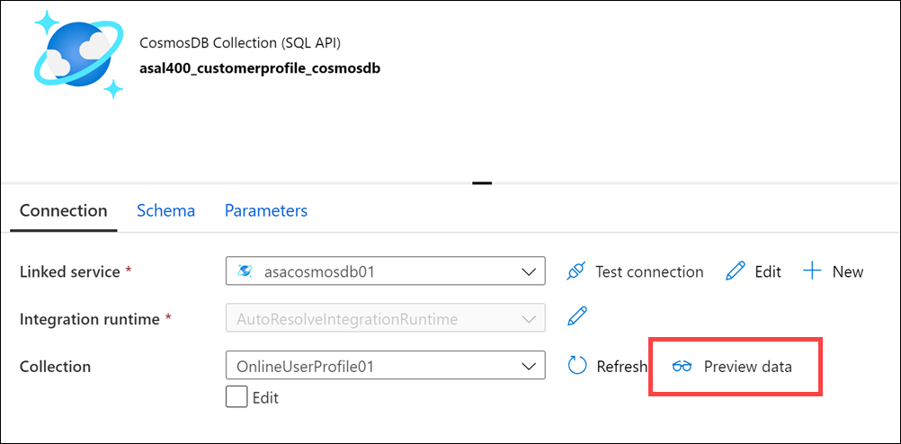

6. Preview data queries the selected Azure Cosmos DB collection and returns a sample of the documents within. The documents are stored in JSON format and include a `userId` field, `cartId`, `preferredProducts` (an array of product IDs that may be empty), and `productReviews` (an array of written product reviews that may be empty).

    

7. Select **Publish all** then **Publish** to save your new resources.

    

## Exercise 2: Configuring Azure Synapse Link with Azure Cosmos DB

Tailwind Traders uses Azure Cosmos DB to store user profile data from their eCommerce site. The NoSQL document store provided by the Azure Cosmos DB SQL API provides the familiarity of managing their data using SQL syntax, while being able to read and write the files at a massive, global scale.

While Tailwind Traders is happy with the capabilities and performance of Azure Cosmos DB, they are concerned about the cost of executing a large volume of analytical queries over multiple partitions (cross-partition queries) from their data warehouse. They want to efficiently access all the data without needing to increase the Azure Cosmos DB request units (RUs). They have looked at options for extracting data from their containers to the data lake as it changes, through the Azure Cosmos DB change feed mechanism. The problem with this approach is the extra service and code dependencies and long-term maintenance of the solution. They could perform bulk exports from a Synapse Pipeline, but then they won't have the most up-to-date information at any given moment.

You decide to enable Azure Synapse Link for Cosmos DB and enable the analytical store on their Azure Cosmos DB containers. With this configuration, all transactional data is automatically stored in a fully isolated column store. This store enables large-scale analytics against the operational data in Azure Cosmos DB, without impacting the transactional workloads or incurring resource unit (RU) costs. Azure Synapse Link for Cosmos DB creates a tight integration between Azure Cosmos DB and Azure Synapse Analytics, which enables Tailwind Traders to run near real-time analytics over their operational data with no-ETL and full performance isolation from their transactional workloads.

By combining the distributed scale of Cosmos DB's transactional processing with the built-in analytical store and the computing power of Azure Synapse Analytics, Azure Synapse Link enables a Hybrid Transactional/Analytical Processing (HTAP) architecture for optimizing Tailwind Trader's business processes. This integration eliminates ETL processes, enabling business analysts, data engineers & data scientists to self-serve and run near real-time BI, analytics, and Machine Learning pipelines over operational data.

### Task 1: Enable Azure Synapse Link

1. Navigate to the Azure portal (<https://portal.azure.com>) and open the resource group for your lab environment.

2. Select the **Azure Cosmos DB account**.

    

3. Select **Features** in the left-hand menu **(1)**, then select **Azure Synapse Link (2)**.

    

4. Select **Enable**.

    

    Before we can create an Azure Cosmos DB container with an analytical store, we must first enable Azure Synapse Link.

5. You must wait for this operation to complete before continuing, which should take about a minute. Check the status by selecting the Azure **Notifications** icon.

    

    You will see a green checkmark next to "Enabling Synapse Link" when it successfully completes.

    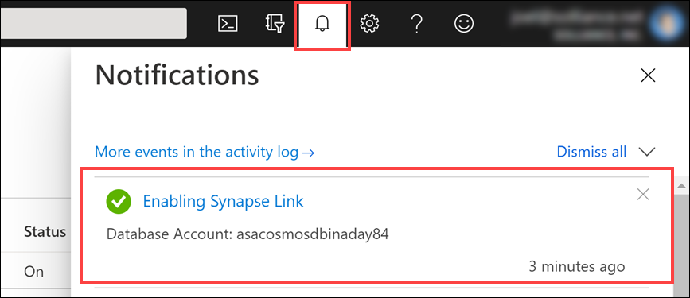

### Task 2: Create a new Azure Cosmos DB container

Tailwind Traders has an Azure Cosmos DB container named `OnlineUserProfile01`. Since we enabled the Azure Synapse Link feature _after_ the container was already created, we cannot enable the analytical store on the container. We will create a new container that has the same partition key and enable the analytical store.

After creating the container, we will create a new Synapse Pipeline to copy data from the `OnlineUserProfile01` container to the new one.

1. Select **Data Explorer** on the left-hand menu.

    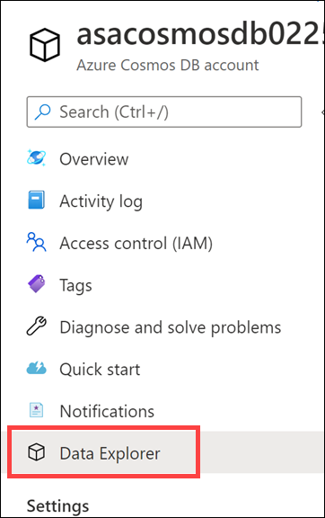

2. Select **New Container**.

    

3. For **Database id**, select **Use existing**, then select **`CustomerProfile` (1)**. Enter **`UserProfileHTAP`** for the **Container id (2)**, then enter **`/userId`** for the **Partition key (3)**. For **Throughput**, select **Autoscale (4)**, then enter **`4000`** for the **Max RU/s** value **(5)**. Finally, expand Advanced and set **Analytical store** to **On (6)**, then select **OK**.

    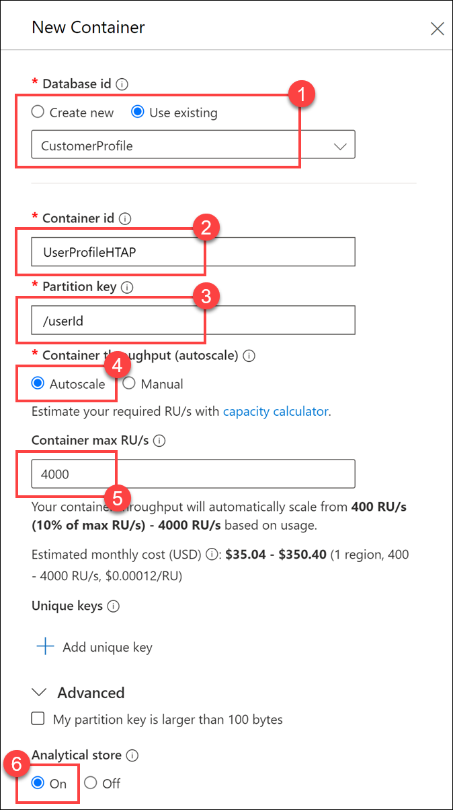

    Here we set the `partition key` value to `customerId`, because it is a field we use most often in queries and contains a relatively high cardinality (number of unique values) for good partitioning performance. We set the throughput to Autoscale with a maximum value of 4,000 request units (RUs). This means that the container will have a minimum of 400 RUs allocated (10% of the maximum number), and will scale up to a maximum of 4,000 when the scale engine detects a high enough demand to warrant increasing the throughput. Finally, we enable the **analytical store** on the container, which allows us to take full advantage of the Hybrid Transactional/Analytical Processing (HTAP) architecture from within Synapse Analytics.

    Let's take a quick look at the data we will copy over to the new container.

4. Expand the `OnlineUserProfile01` container underneath the **CustomerProfile** database, then select **Items (1)**. Select one of the documents **(2)** and view its contents **(3)**. The documents are stored in JSON format.

    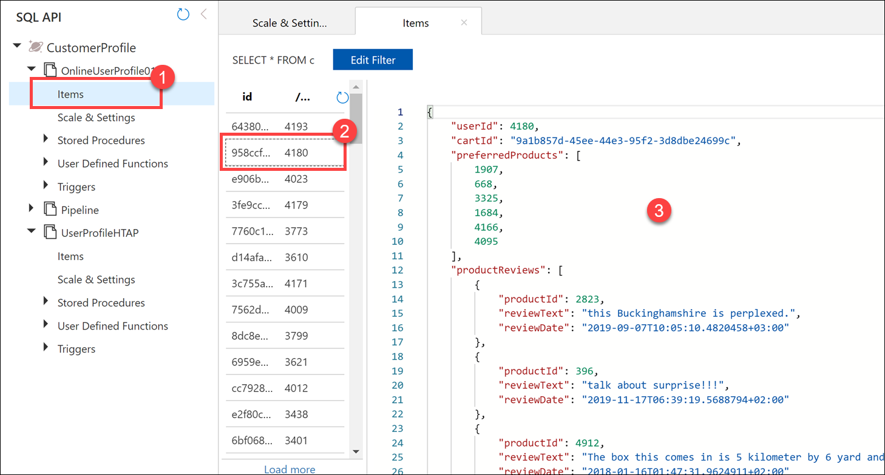

5. Select **Keys** in the left-hand menu **(1)**, then copy the **Primary Key** value **(2)** and save it to Notepad or similar for later reference. Copy the Azure Cosmos DB **account name** in the upper-left corner **(3)** and also save it to Notepad or similar text editor for later.

    

    > **Note**: Take note of these values. You will need this information when creating the SQL view toward the end of the demo.

### Task 3: Create and run a copy pipeline

Now that we have the new Azure Cosmos DB container with the analytical store enabled, we need to copy the contents of the existing container by using a Synapse Pipeline.

1. Open Synapse Studio (<https://web.azuresynapse.net/>), and then navigate to the **Integrate** hub.

    

2. Select **+ (1)**, then **Pipeline (2)**.

    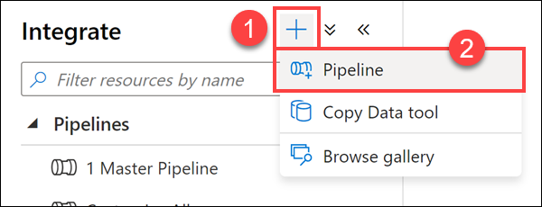

3. Under Activities, expand the `Move & transform` group, then drag the **Copy data** activity onto the canvas **(1)**. Set the **Name** to **`Copy Cosmos DB Container`** in the Properties blade **(2)**.

    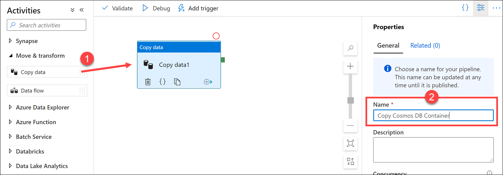

4. Select the new Copy activity that you added to the canvas, then select the **Source** tab **(1)**. Select the **`asal400_customerprofile_cosmosdb`** source dataset from the list **(2)**.

    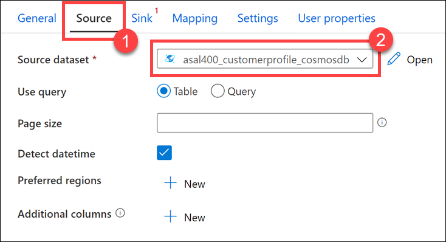

5. Select the **Sink** tab **(1)**, then select **+ New (2)**.

    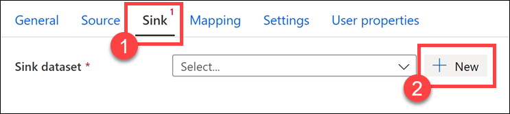

6. Select the **Azure Cosmos DB (SQL API)** dataset type **(1)**, then select **Continue (2)**.

    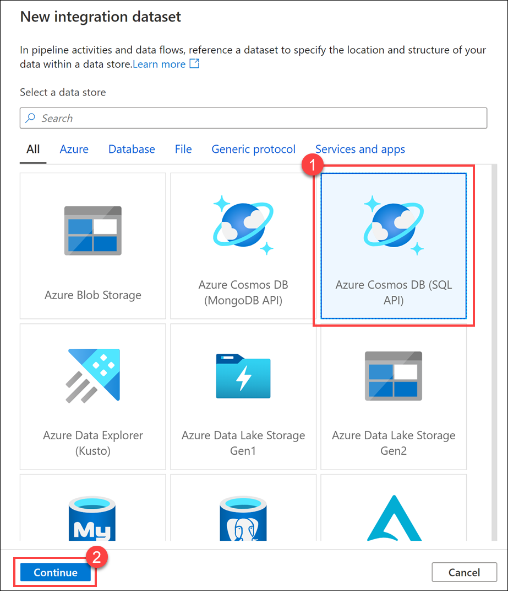

7. For **Name**, enter **`cosmos_db_htap` (1)**. Select the **`asacosmosdb01` (2)** **Linked service**. Select the **`UserProfileHTAP` (3)** **Collection**. Select **From connection/store** under **Import schema (4)**, then select **OK (5)**.

    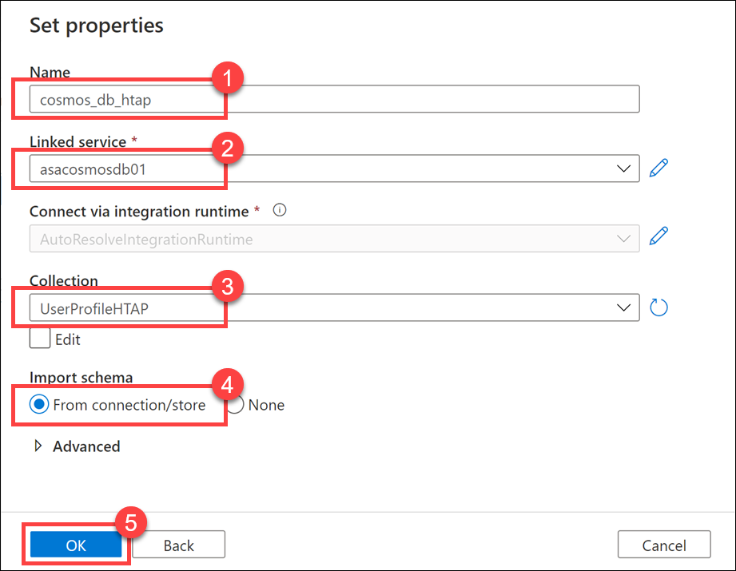

8. Underneath the new sink dataset you just added, select the **Insert** write behavior.

    

9. Select **Publish all**, then **Publish** to save the new pipeline.

    

10. Above the pipeline canvas, select **Add trigger (1)**, then **Trigger now (2)**. Select **OK** to trigger the run.

    

11. Navigate to the **Monitor** hub.

    

12. Select **Pipeline runs (1)** and wait until the pipeline run has successfully completed **(2)**. You may have to select **Refresh (3)** a few times.

    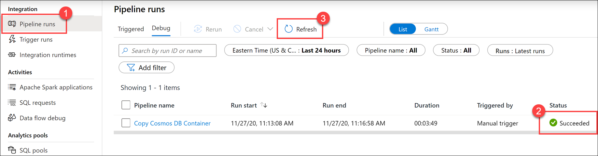

    > This may take **around 4 minutes** to complete. While this is running, read the rest of the lab instructions to familiarize yourself with the content.

## Exercise 3: Querying Azure Cosmos DB with Apache Spark for Synapse Analytics

Tailwind Traders wants to use Apache Spark to run analytical queries against the new Azure Cosmos DB container. In this segment, we will use built-in gestures in Synapse Studio to quickly create a Synapse Notebook that loads data from the analytical store of the HTAP-enabled container, without impacting the transactional store.

Tailwind Traders is trying to solve how they can use the list of preferred products identified with each user, coupled with any matching product IDs in their review history, to show a list of all preferred product reviews.

### Task 1: Create a notebook

1. Navigate to the **Data** hub.

    

2. Select the **Linked** tab **(1)** and expand the **Azure Cosmos DB** section, then the **asacosmosdb01 (CustomerProfile)** linked service **(2)**. Right-click on the **UserProfileHTAP** container **(3)**, select the **New notebook** gesture **(4)**, then select **Load to DataFrame (5)**.

    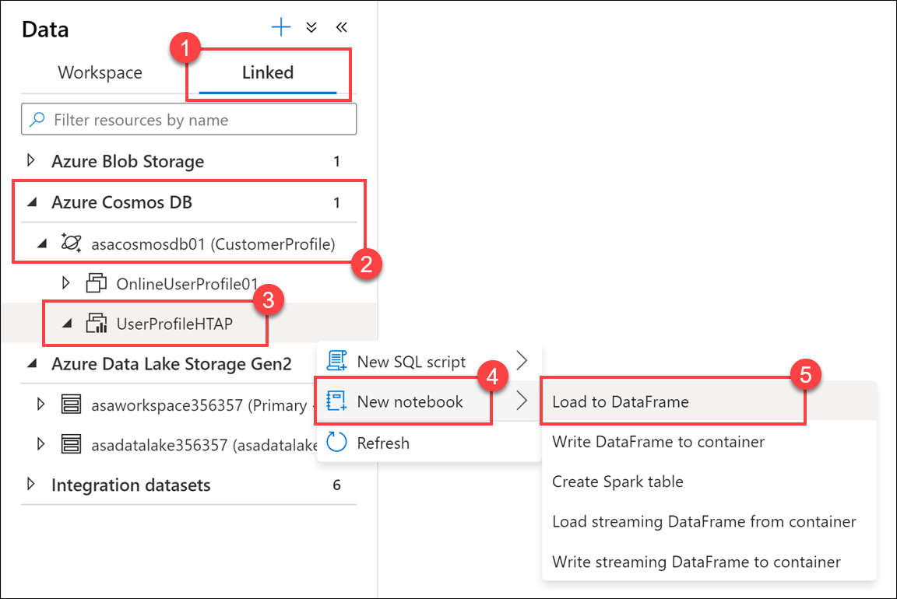

    Notice that the `UserProfileHTAP` container that we created has a slightly different icon than the other container. This indicates that the analytical store is enabled.

3. In the new notebook, select your Spark pool in the **Attach to** dropdown list.

    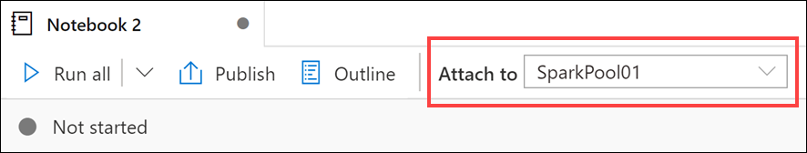

4. Select **Run all (1)**.

    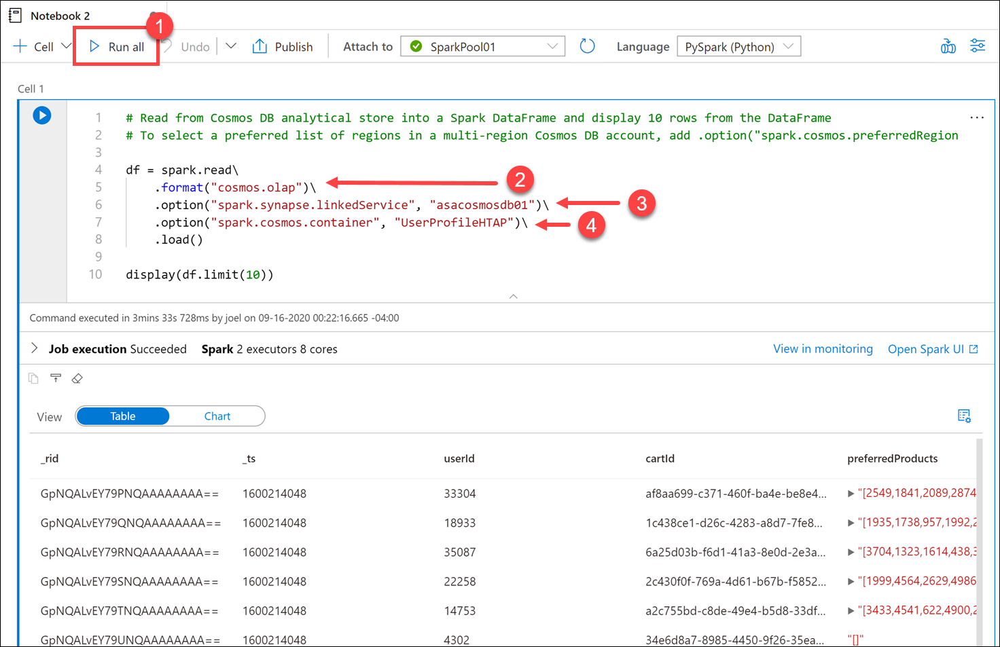

    > It will take a few minutes to start the Spark session the first time.

    In the generated code within Cell 1, notice that the `spark.read` format is set to **`cosmos.olap` (2)**. This instructs Synapse Link to use the container's analytical store. If we wanted to connect to the transactional store instead, like to read from the change feed or write to the container, we'd use `cosmos.oltp` instead.

    > **Note:** You cannot write to the analytical store, only read from it. If you want to load data into the container, you need to connect to the transactional store.

    The first `option` configures the name of the Azure Cosmos DB linked service **(3)**. The second `option` defines the Azure Cosmos DB container from which we want to read **(4)**.

5. Select the **+** button underneath the cell you executed, then select **</> Code cell**. This adds a new code cell beneath the first one.

    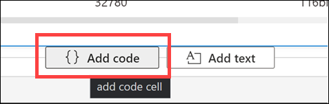

6. The DataFrame contains extra columns that we don't need. Let's remove the unwanted columns and create a clean version of the DataFrame. To do this, enter the following in the new cell and **run** it:

    ```python
    unwanted_cols = {'_attachments','_etag','_rid','_self','_ts','collectionType','id'}

    # Remove unwanted columns from the columns collection
    cols = list(set(df.columns) - unwanted_cols)

    profiles = df.select(cols)

    display(profiles.limit(10))
    ```

    The output now only contains the columns that we want. Notice that the `preferredProducts` **(1)** and `productReviews` **2** columns contain child elements. Expand the values on a row to view them. You may recall seeing the raw JSON format in the `UserProfiles01` container within the Azure Cosmos DB Data Explorer.

    

7. We should know how many records we're dealing with. To do this, enter the following in a new cell and **run** it:

    ```python
    profiles.count()
    ```

    You should see a count result of 100,000.

8. We want to use the `preferredProducts` column array and `productReviews` column array for each user and create a graph of products that are from their preferred list that match with products that they have reviewed. To do this, we need to create two new DataFrames that contain flattened values from those two columns so we can join them in a later step. Enter the following in a new cell and **run** it:

    ```python
    from pyspark.sql.functions import udf, explode

    preferredProductsFlat=profiles.select('userId',explode('preferredProducts').alias('productId'))
    productReviewsFlat=profiles.select('userId',explode('productReviews').alias('productReviews'))
    display(productReviewsFlat.limit(10))
    ```

    In this cell, we imported the special PySpark [`explode` function](https://spark.apache.org/docs/latest/api/python/pyspark.sql.html?highlight=explode#pyspark.sql.functions.explode), which returns a new row for each element of the array. This function helps flatten the `preferredProducts` and `productReviews` columns for better readability or for easier querying.

    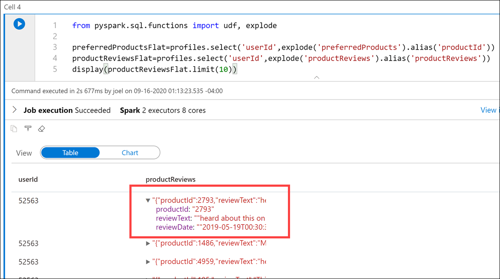

    Observe the cell output where we display the `productReviewFlat` DataFrame contents. We see a new `productReviews` column that contains the `productId` we want to match to the preferred products list for the user, as well as the `reviewText` that we want to display or save.

9. Let's look at the `preferredProductsFlat` DataFrame contents. To do this, enter the following in a new cell and **run** it:

    ```python
    display(preferredProductsFlat.limit(20))
    ```

    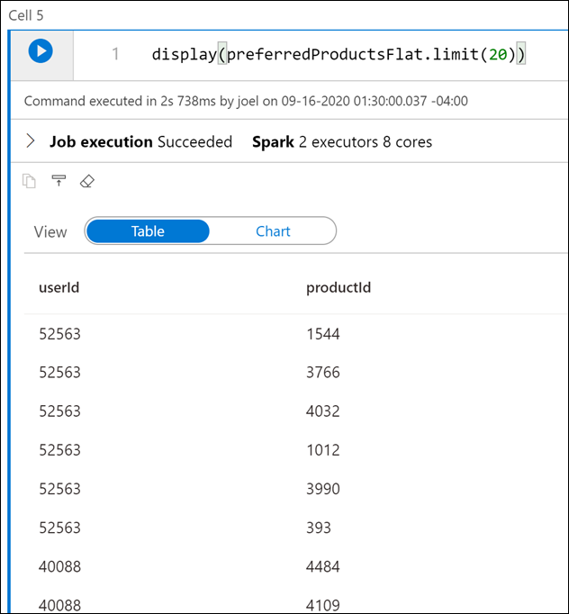

    Since we used the `explode` function on the preferred products array, we have flattened the column values to `userId` and `productId` rows, ordered by user.

10. Now we need to further flatten the `productReviewFlat` DataFrame contents to extract the `productReviews.productId` and `productReviews.reviewText` fields and create new rows for each data combination. To do this, enter the following in a new cell and **run** it:

    ```python
    productReviews = (productReviewsFlat.select('userId','productReviews.productId','productReviews.reviewText')
        .orderBy('userId'))

    display(productReviews.limit(10))
    ```

    In the output, notice that we now have multiple rows for each `userId`.

    

11. The final step is to join the `preferredProductsFlat` and `productReviews` DataFrames on the `userId` and `productId` values to build our graph of preferred product reviews. To do this, enter the following in a new cell and **run** it:

    ```python
    preferredProductReviews = (preferredProductsFlat.join(productReviews,
        (preferredProductsFlat.userId == productReviews.userId) &
        (preferredProductsFlat.productId == productReviews.productId))
    )

    display(preferredProductReviews.limit(100))
    ```

    > **Note**: Feel free to click on the column headers in the Table view to sort the result set.

    

## Exercise 4: Querying Azure Cosmos DB with serverless SQL pool for Azure Synapse Analytics

Tailwind Traders wants to explore the Azure Cosmos DB analytical store with T-SQL. Ideally, they can create views that can then be used for joins with other analytical store containers, files from the data lake, or accessed by external tools, like Power BI.

### Task 1: Create a new SQL script

1. Navigate to the **Develop** hub.

    

2. Select **+ (1)**, then **SQL script (2)**.

    

3. When the script opens, you will see the **Properties** pane to the right **(1)**. Enter **`User Profile HTAP`** for the **Name (2)**, then select the **Properties** button to close the pane **(1)**.

    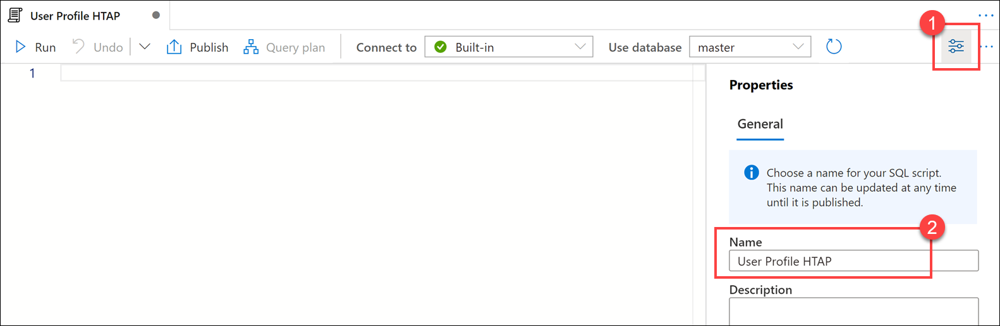

4. Verify that the serverless SQL pool (**Built-in**) is selected.

    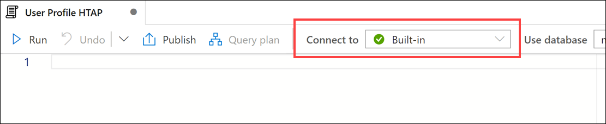

5. Paste the following SQL query. In the OPENROWSET statement, replace **`YOUR_ACCOUNT_NAME`** with the Azure Cosmos DB account name and **`YOUR_ACCOUNT_KEY`** with the Azure Cosmos DB Primary Key value you copied in step 5 above after you created the container.

    ```sql
    USE master
    GO

    IF DB_ID (N'Profiles') IS NULL
    BEGIN
        CREATE DATABASE Profiles;
    END
    GO

    USE Profiles
    GO

    DROP VIEW IF EXISTS UserProfileHTAP;
    GO

    CREATE VIEW UserProfileHTAP
    AS
    SELECT
        *
    FROM OPENROWSET(
        'CosmosDB',
        N'account=YOUR_ACCOUNT_NAME;database=CustomerProfile;key=YOUR_ACCOUNT_KEY',
        UserProfileHTAP
    )
    WITH (
        userId bigint,
        cartId varchar(50),
        preferredProducts varchar(max),
        productReviews varchar(max)
    ) AS profiles
    CROSS APPLY OPENJSON (productReviews)
    WITH (
        productId bigint,
        reviewText varchar(1000)
    ) AS reviews
    GO
    ```

    Your completed query should look similar to the following:

    

    The query starts out by creating a new serverless SQL pool database named `Profiles` if it does not exist, then executes `USE Profiles` to run the rest of the script contents against the `Profiles` database. Next, it drops the `UserProfileHTAP` view if it exists. Finally, it performs the following:

    - **1.** Creates a SQL view named `UserProfileHTAP`.
    - **2.** Uses the `OPENROWSET` statement to set the data source type to `CosmosDB`, sets the account details, and specifies that we want to create the view over the Azure Cosmos DB analytical store container named `UserProfileHTAP`.
    - **3.** The `WITH` clause matches the property names in the JSON documents and applies the appropriate SQL data types. Notice that we set the `preferredProducts` and `productReviews` fields to `varchar(max)`. This is because both of these properties contain JSON-formatted data within.
    - **4.** Since the `productReviews` property in the JSON documents contain nested subarrays, we want to "join" the properties from the document with all elements of the array. Synapse SQL enables us to flatten the nested structure by applying the `OPENJSON` function on the nested array. We flatten the values within `productReviews` like we did using the Python `explode` function earlier in the Synapse Notebook.
    - **5.** The output shows that the statements successfully executed.

6. Navigate to the **Data** hub.

    

7. Select the **Workspace** tab **(1)** and expand the Databases group. Expand the **Profiles** SQL on-demand database **(2)**. If you do not see this on the list, refresh the Databases list. Expand Views, then right-click on the **`UserProfileHTAP`** view **(3)**. Select **New SQL script (4)**, then **Select TOP 100 rows (5)**.

    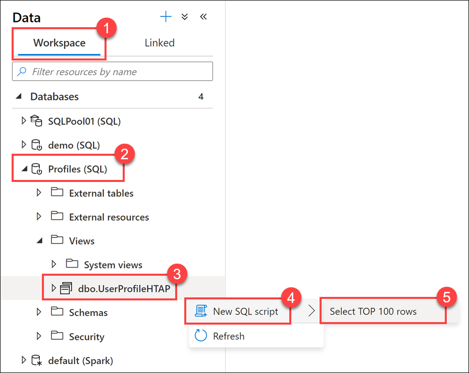

8. **Run** the query and take note of the results.

    

    The `preferredProducts` **(1)** and `productReviews` **(2)** fields are included in the query, which both contain JSON-formatted values. Notice how the CROSS APPLY OPENJSON statement in the view successfully flattened the nested subarray values in the `productReviews` **(2)** field by extracting the `productId` and `reviewText` values into new fields.
