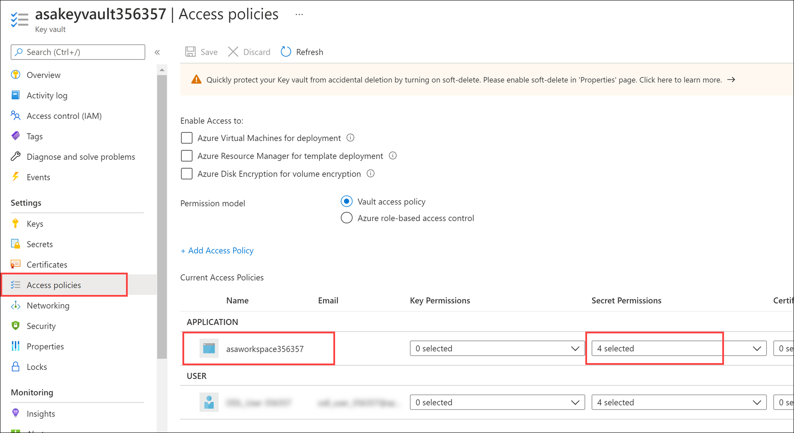
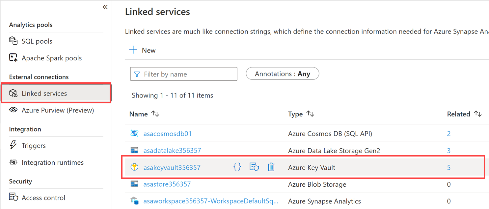
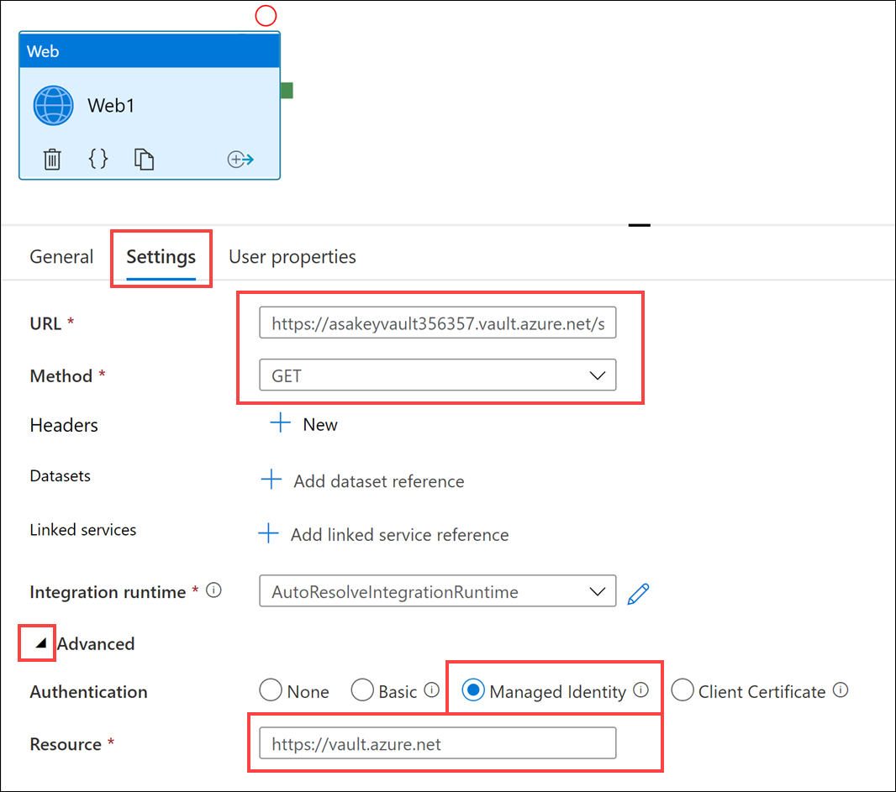
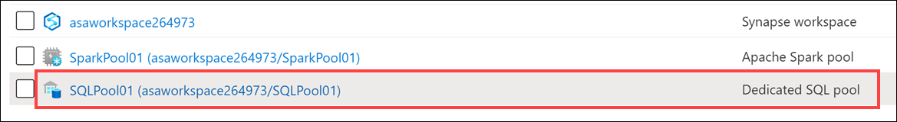
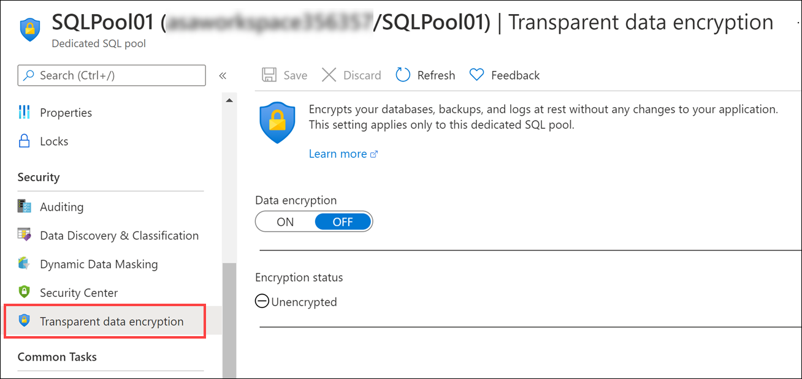
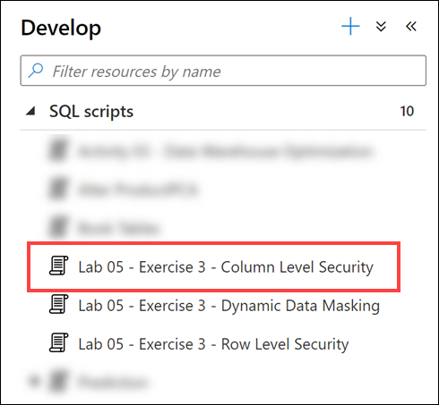
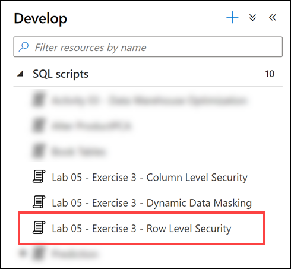

# Module 13 - End-to-end security with Azure Synapse Analytics

In this module, students will learn how to secure a Synapse Analytics workspace and its supporting infrastructure. The student will observe the SQL Active Directory Admin, manage IP firewall rules, manage secrets with Azure Key Vault and access those secrets through a Key Vault linked service and pipeline activities. The student will understand how to implement column-level security, row-level security, and dynamic data masking when using dedicated SQL pools.

In this module, the student will be able to:

- Secure Azure Synapse Analytics supporting infrastructure
- Secure the Azure Synapse Analytics workspace and managed services
- Secure Azure Synapse Analytics workspace data

## Lab details

- [Module 13 - End-to-end security with Azure Synapse Analytics](#module-13---end-to-end-security-with-azure-synapse-analytics)
  - [Lab details](#lab-details)
  - [Resource naming throughout this lab](#resource-naming-throughout-this-lab)
  - [Lab setup and pre-requisites](#lab-setup-and-pre-requisites)
  - [Exercise 0: Start the dedicated SQL pool](#exercise-0-start-the-dedicated-sql-pool)
  - [Exercise 1 - Securing Azure Synapse Analytics supporting infrastructure](#exercise-1---securing-azure-synapse-analytics-supporting-infrastructure)
    - [Task 1 - Observing the SQL Active Directory admin](#task-1---observing-the-sql-active-directory-admin)
    - [Task 2 - Manage IP firewall rules](#task-2---manage-ip-firewall-rules)
  - [Exercise 2 - Securing the Azure Synapse Analytics workspace and managed services](#exercise-2---securing-the-azure-synapse-analytics-workspace-and-managed-services)
    - [Task 1 - Managing secrets with Azure Key Vault](#task-1---managing-secrets-with-azure-key-vault)
    - [Task 2 - Use Azure Key Vault for secrets when creating Linked Services](#task-2---use-azure-key-vault-for-secrets-when-creating-linked-services)
    - [Task 3 - Secure workspace pipeline runs](#task-3---secure-workspace-pipeline-runs)
    - [Task 4 - Secure Azure Synapse Analytics dedicated SQL pools](#task-4---secure-azure-synapse-analytics-dedicated-sql-pools)
  - [Exercise 3 - Securing Azure Synapse Analytics workspace data](#exercise-3---securing-azure-synapse-analytics-workspace-data)
    - [Task 1 - Column Level Security](#task-1---column-level-security)
    - [Task 2 - Row level security](#task-2---row-level-security)
    - [Task 3 - Dynamic data masking](#task-3---dynamic-data-masking)
  - [Exercise 4: Cleanup](#exercise-4-cleanup)
    - [Task 1: Pause the dedicated SQL pool](#task-1-pause-the-dedicated-sql-pool)
  - [Reference](#reference)
  - [Other Resources](#other-resources)

This lab will guide you through several  security-related steps that cover an end-to-end security story for Azure Synapse Analytics. Some key take-aways from this lab are:

1. Leverage Azure Key Vault to store sensitive connection information, such as access keys and passwords for linked services as well as in pipelines.

2. Introspect the data that is contained within the SQL Pools in the context of potential sensitive/confidential data disclosure. Identify the columns representing sensitive data, then secure them by adding column-level security. Determine at the table level what data should be hidden from specific groups of users then define security predicates to apply row level security (filters) on the table. If desired, you also have the option of applying Dynamic Data Masking to mask sensitive data returned in queries on a column by column basis.

## Resource naming throughout this lab

For the remainder of this guide, the following terms will be used for various ASA-related resources (make sure you replace them with actual names and values):

| Azure Synapse Analytics Resource  | To be referred to                                                                  |
|-----------------------------------|------------------------------------------------------------------------------------|
| Workspace resource group          | `WorkspaceResourceGroup`                                                           |
| Workspace / workspace name        | `Workspace`                                                                        |
| Primary Storage Account           | `PrimaryStorage`                                                                   |
| Default file system container     | `DefaultFileSystem`                                                                |
| SQL Pool                          | `SqlPool01`                                                                        |
| SQL Serverless Endpoint           | `SqlServerless01`                                                                  |
| Active Directory Principal of  New User         | `user@domain.com`                                                    |
| SQL username of New User          | `newuser`                                                                          |
| Azure Key Vault                   | `KeyVault01`                                                                       |
| Azure Key Vault Private Endpoint Name  | `KeyVaultPrivateEndpointName`                                                 |
| Azure Subscription                | `WorkspaceSubscription`                                                            |
| Azure Region                      | `WorkspaceRegion`                                                                  |

## Lab setup and pre-requisites

> **Note:** Only complete the `Lab setup and pre-requisites` steps if you are **not** using a hosted lab environment, and are instead using your own Azure subscription. Otherwise, skip ahead to Exercise 0.

**Complete the [lab setup instructions](https://github.com/solliancenet/microsoft-data-engineering-ilt-deploy/blob/main/setup/04/README.md)** for this module.

Note, the following modules share this same environment:

- [Module 4](labs/04/README.md)
- [Module 5](labs/05/README.md)
- [Module 7](labs/07/README.md)
- [Module 8](labs/08/README.md)
- [Module 9](labs/09/README.md)
- [Module 10](labs/10/README.md)
- [Module 11](labs/11/README.md)
- [Module 12](labs/12/README.md)
- [Module 13](labs/13/README.md)
- [Module 16](labs/16/README.md)

## Exercise 0: Start the dedicated SQL pool

This lab uses the dedicated SQL pool. As a first step, make sure it is not paused. If so, start it by following these instructions:

1. Open Synapse Studio (<https://web.azuresynapse.net/>).

2. Select the **Manage** hub.

    

3. Select **SQL pools** in the left-hand menu **(1)**. If the dedicated SQL pool is paused, hover over the name of the pool and select **Resume (2)**.

    

4. When prompted, select **Resume**. It will take a minute or two to resume the pool.

    

> **Continue to the next exercise** while the dedicated SQL pool resumes.

## Exercise 1 - Securing Azure Synapse Analytics supporting infrastructure

Azure Synapse Analytics (ASA) is a powerful solution that handles security for many of the resources that it creates and manages. In order to run ASA, however, some foundational security measures need to be put in place to ensure the infrastructure that it relies upon is secure. In this exercise, we will walk through securing the supporting infrastructure of ASA.

### Task 1 - Observing the SQL Active Directory admin

 The SQL Active Directory Admin can be a user (the default) or group (best practice so that more than one user can be provided these permissions) security principal. The principal assigned to this will have administrative permissions to the SQL Pools contained in the workspace.

1. In the **Azure Portal** (<https://portal.azure.com>), browse to your lab resource group, and from the list of resources open your Synapse workspace (do not launch Synapse Studio).

2. From the left menu, select **SQL Active Directory admin** and observe who is listed as a SQL Active Directory Admin. Is it a user or group?

    

### Task 2 - Manage IP firewall rules

Having robust Internet security is a must for every technology system. One way to mitigate internet threat vectors is by reducing the number of public IP addresses that can access the Azure Synapse Analytics Workspace through the use of IP firewall rules. The Azure Synapse Analytics workspace will then delegate those same rules to all managed public endpoints of the workspace, including those for SQL pools and SQL Serverless endpoints.

1. In the **Azure Portal**,  open the Synapse workspace (do not launch Studio).

2. From the left menu of the **Azure Synapse Analytics** page, select **Firewalls**.

   

3. Notice that an IP Firewall rule of `Allow All` has already been created for you in the lab environment. If you wanted to add your specific IP address you would instead select **+ Add Client IP** from the taskbar menu (you do not need to do this now).

    

> **Note**: When connecting to Synapse from your local network, certain ports need to be open. To support the functions of Synapse Studio, ensure outgoing TCP ports 80, 443, and 1143, and UDP port 53 are open.

## Exercise 2 - Securing the Azure Synapse Analytics workspace and managed services

### Task 1 - Managing secrets with Azure Key Vault

When dealing with connectivity to external data sources and services, sensitive connection information such as passwords and access keys should be properly handled. It is recommended that this type of information be stored in an Azure Key Vault. Leveraging Azure Key Vault not only protects against secrets being compromised, it also serves as a central source of truth; meaning that if a secret value needs to be updated (such as when cycling access keys on a storage account), it can be changed in one place and all services consuming this key will start pulling the new value immediately. Azure Key Vault encrypts and decrypts information transparently using 256-bit AES encryption, which is FIPS 140-2 compliant.

1. In the **Azure Portal**, open the resource group for this lab, and from the list of resources, select the **Key vault** resource.

    

2. From the left menu, under Settings, select **Access Policies**.

3. Observe that Managed Service Identity (MSI) representing your Synapse workspace (it has a name similar to `asaworkspaceNNNNNN`) has already been listed under Application and it has 4 selected Secret Permissions.

    

4. Select the drop-down that reads `4 selected` under `Secret Permissions`, observe that Get (which allows your workspace to retrieve the values of secrets from Key Vault) and List (which allows your workspace to enumerate secrets) are set.

### Task 2 - Use Azure Key Vault for secrets when creating Linked Services

Linked Services are synonymous with connection strings in Azure Synapse Analytics. Azure Synapse Analytics linked services provides the ability to connect to nearly 100 different types of external services ranging from Azure Storage Accounts to Amazon S3 and more. When connecting to external services, having secrets related to connection information is almost guaranteed. The best place to store these secrets is the Azure Key Vault. Azure Synapse Analytics provides the ability to configure all linked service connections with values from Azure Key Vault.

In order to leverage Azure Key Vault in linked services, you must first add `asakeyvaultXX` as a linked service in Azure Synapse Analytics.

1. Navigate to **Azure Synapse Studio** (<https://web.azuresynapse.net/>) and sign in with the same user account you did in the Azure portal.

2. Select the **Manage** hub from the left menu.

    

3. Beneath **External Connections**, select **Linked Services**, observe that a Linked Service pointing to your Key Vault has been provided in the environment.

    

Since we have the Azure Key Vault set up as a linked service, we can leverage it when defining new linked services. Every New linked service provides the option to retrieve secrets from Azure Key Vault. The form requests the selection of the Azure Key Vault linked service, the secret name, and (optional) specific version of the secret.

### Task 3 - Secure workspace pipeline runs

It is recommended to store any secrets that are part of your pipeline in Azure Key Vault. In this task you will retrieve these values using a Web activity, just to show the mechanics. The second part of this task demonstrates using a Web activity in the pipeline to retrieve a secret from the Key Vault.

1. Return to the Azure portal.

2. Open the `asakeyvaultXX` Azure Key Vault resource, and select **Secrets** from the left menu. From the top toolbar, select **+ Generate/Import**.

   

3. Create a secret, with the name **PipelineSecret** and assign it a value of **IsNotASecret**, and select the **Create** button.

   

4. Open the secret that you just created, drill into the current version, and copy the value in the Secret Identifier field. Save this value in a text editor, or retain it in your clipboard for a future step.

    

5. Switch back to Synapse Studio, then select the **Integrate** hub from the left menu.

    

6. From the **Integrate** blade, select the **+** button and add a new **Pipeline**.

    

7. On the **Pipeline** tab, in the **Activities** pane search for **Web** and then drag an instance of a **Web** activity to the design area.

    

8. Select the **Web1** web activity, and select the **Settings** tab. Fill out the form as follows:

    1. **URL**: Paste the Key Vault Secret Identifier value you copied in step 4 above, then **append** `?api-version=7.1` to to the end of this value. For example, it should look something like: `https://asakeyvaultNNNNN.vault.azure.net/secrets/PipelineSecret/f808d4fa99d84861872010f6c8d25c68?api-version=7.1`.
  
    2. **Method**: Select **Get**.

    3. Expand the **Advanced** section, and for **Authentication** select **MSI**. We have already established an Access Policy for the Managed Service Identity of our Synapse workspace, this means that the pipeline activity has permissions to access the key vault via an HTTP call.
  
    4. **Resource**: Enter **<https://vault.azure.net>**

    

9. From the Activities pane, add a **Set variable** activity to the design surface of the pipeline.

    

10. On the design surface of the pipeline, select the **Web1** activity and drag a **Success** activity pipeline connection (green box) to the **Set variable1** activity.

11. With the pipeline selected in the designer (e.g., neither of the activities are selected), select the **Variables** tab and add a new **String** parameter named **SecretValue**.

      

12. Select the **Set variable1** activity and select the **Variables** tab. Fill out the form as follows:

    1. **Name**: Select `SecretValue` (the variable that we just created on our pipeline).

    2. **Value**: Enter `@activity('Web1').output.value`

    

13. Debug the pipeline by selecting **Debug** from the toolbar menu. When it runs observe the inputs and outputs of both activities from the **Output** tab of the pipeline.

    

    

    > **Note**: On the **Web1** activity, on the **General** tab there is a **Secure Output** checkbox that when checked will prevent the secret value from being logged in plain text, for instance in the pipeline run, you would see a masked value ***** instead of the actual value retrieved from the Key vault. Any activity that consumes this value should also have their **Secure Input** checkbox checked.

### Task 4 - Secure Azure Synapse Analytics dedicated SQL pools

Transparent Data Encryption (TDE) is a feature of SQL Server that provides encryption and decryption of data at rest, this includes: databases, log files, and back ups. When using this feature with Synapse Analytics dedicated SQL pools, it will use a built-in symmetric Database Encryption Key (DEK) that is provided by the pool itself. With TDE, all stored data is encrypted on disk, when the data is requested, TDE will decrypt this data at the page level as it's read into memory, and vice-versa encrypting in-memory data before it gets written back to disk. As with the name, this happens transparently without affecting any application code. When creating a dedicated SQL pool through Synapse Analytics, Transparent Data Encryption is not enabled. The first part of this task will show you how to enable this feature.

1. In the **Azure Portal**, open your resource group, then locate and open the `SqlPool01` dedicated SQL pool resource.

    

2. On the **SQL pool** resource screen, select **Transparent data encryption** from the left-hand menu. **DO NOT** turn on data encryption.

   

    By default, this option is turned off. When you enable data encryption on this dedicated SQL pool, the pool is taken offline for a few minutes while TDE is applied.

## Exercise 3 - Securing Azure Synapse Analytics workspace data

### Task 1 - Column Level Security

It is important to identify data columns of that hold sensitive information. Types of sensitive could be social security numbers, email addresses, credit card numbers, financial totals, and more. Azure Synapse Analytics allows you define permissions that prevent users or roles select privileges on specific columns.

1. In **Azure Synapse Studio**, select **Develop** from the left menu.

   

2. From the **Develop** menu, expand the **SQL scripts** section, and select **Lab 05 - Exercise 3 - Column Level Security**.

   

3. In the toolbar menu, connect to the database on which you want to execute the query, `SQLPool01`.

    

4. In the query window, **run each step individually** by highlighting the statement(s) in the step in the query window, and selecting the **Run** button from the toolbar (or enter `F5`).

   

5. You may now close the script tab, when prompted choose to **Discard all changes**.

### Task 2 - Row level security

1. In **Azure Synapse Studio**, select **Develop** from the left menu.

   

2. From the **Develop** menu, expand the **SQL scripts** section, and select **Lab05 - Exercise 3 - Row Level Security**.

    

3. In the toolbar menu, connect to the database on which you want to execute the query, `SQLPool01`.

    

4. In the query window, **run each step individually** by highlighting the statement(s) for the step in the query window, and selecting the **Run** button from the toolbar (or enter `F5`).

   

5. You may now close the script tab, when prompted choose to **Discard all changes**.

### Task 3 - Dynamic data masking

1. In **Azure Synapse Studio**, select **Develop** from the left menu.

   

2. From the **Develop** menu, expand the **SQL scripts** section, and select **Lab05 - Exercise 3 - Dynamic Data Masking**.
  
   

3. In the toolbar menu, connect to the database on which you want to execute the query, `SQLPool01`.

    

4. In the query window, **run each step individually** by highlighting the statement(s) for the step in the query window, and selecting the **Run** button from the toolbar (or enter `F5`).

   

5. You may now close the script tab, when prompted choose to **Discard all changes**.

## Exercise 4: Cleanup

Complete these steps to free up resources you no longer need.

### Task 1: Pause the dedicated SQL pool

1. Open Synapse Studio (<https://web.azuresynapse.net/>).

2. Select the **Manage** hub.

    

3. Select **SQL pools** in the left-hand menu **(1)**. Hover over the name of the dedicated SQL pool and select **Pause (2)**.

    

4. When prompted, select **Pause**.

    

## Reference

- [IP Firewalls](https://docs.microsoft.com/azure/synapse-analytics/security/synapse-workspace-ip-firewall)
- [Synapse Workspace Managed Identity](https://docs.microsoft.com/azure/synapse-analytics/security/synapse-workspace-managed-identity)
- [Synapse Managed VNet](https://docs.microsoft.com/azure/synapse-analytics/security/synapse-workspace-managed-vnet)
- [Synapse Managed Private Endpoints](https://docs.microsoft.com/azure/synapse-analytics/security/synapse-workspace-managed-private-endpoints)
- [Secure your Synapse Workspace](https://docs.microsoft.com/azure/synapse-analytics/security/how-to-set-up-access-control)
- [Connect to your Synapse Workspace using private links](https://docs.microsoft.com/azure/synapse-analytics/security/how-to-connect-to-workspace-with-private-links)
- [Create a Managed private endpoint to your data source](https://docs.microsoft.com/azure/synapse-analytics/security/how-to-create-managed-private-endpoints)
- [Granting Permissions to Workspace Managed Identity](https://docs.microsoft.com/azure/synapse-analytics/security/how-to-grant-workspace-managed-identity-permissions)

## Other Resources

- [Managing access to workspaces, data and pipelines](https://docs.microsoft.com/azure/synapse-analytics/sql/access-control)
- [Analyze with Apache Spark](https://docs.microsoft.com/azure/synapse-analytics/get-started-analyze-spark)
- [Visualize data with Power BI](https://docs.microsoft.com/azure/synapse-analytics/get-started-visualize-power-bi)
- [Control storage account access for SQL on-demand](https://docs.microsoft.com/azure/synapse-analytics/sql/develop-storage-files-storage-access-control)
