# Module 14 - Real-time stream processing with Stream Analytics

In this module, students will learn how to process streaming data with Azure Stream Analytics. The student will ingest vehicle telemetry data into Event Hubs, then process that data in real time, using various windowing functions in Azure Stream Analytics. They will output the data to Azure Synapse Analytics. Finally, the student will learn how to scale the Stream Analytics job to increase throughput.

In this module, the student will be able to:

- Use Stream Analytics to process real-time data from Event Hubs
- Use Stream Analytics windowing functions to build aggregates and output to Synapse Analytics
- Scale the Azure Stream Analytics job to increase throughput through partitioning
- Repartition the stream input to optimize parallelization

## Lab details

- [Module 14 - Real-time stream processing with Stream Analytics](#module-14---real-time-stream-processing-with-stream-analytics)
  - [Lab details](#lab-details)
  - [Technology overview](#technology-overview)
    - [Azure Stream Analytics](#azure-stream-analytics)
    - [Azure Event Hubs](#azure-event-hubs)
    - [Power BI](#power-bi)
  - [Scenario overview](#scenario-overview)
  - [Lab setup and pre-requisites](#lab-setup-and-pre-requisites)
  - [Exercise 0: Start the dedicated SQL pool](#exercise-0-start-the-dedicated-sql-pool)
  - [Exercise 1: Configure services](#exercise-1-configure-services)
    - [Task 1: Configure Event Hubs](#task-1-configure-event-hubs)
    - [Task 2: Configure Synapse Analytics](#task-2-configure-synapse-analytics)
    - [Task 3: Configure Stream Analytics](#task-3-configure-stream-analytics)
  - [Exercise 2: Generate and visualize data](#exercise-2-generate-and-visualize-data)
    - [Task 1: Run data generator](#task-1-run-data-generator)
    - [Task 2: Create Power BI dashboard](#task-2-create-power-bi-dashboard)
    - [Task 3: View aggregate data in Synapse Analytics](#task-3-view-aggregate-data-in-synapse-analytics)
  - [Exercise 3: Cleanup](#exercise-3-cleanup)
    - [Task 1: Stop the data generator](#task-1-stop-the-data-generator)
    - [Task 2: Stop the Stream Analytics job](#task-2-stop-the-stream-analytics-job)
    - [Task 3: Pause the dedicated SQL pool](#task-3-pause-the-dedicated-sql-pool)

## Technology overview

### Azure Stream Analytics

As more and more data is generated from a variety of connected devices and sensors, transforming this data into actionable insights and predictions in near real-time is now an operational necessity. [Azure Stream Analytics](https://docs.microsoft.com/azure/stream-analytics/stream-analytics-introduction) seamlessly integrates with your real-time application architecture to enable powerful, real-time analytics on your data no matter what the volume.

Azure Stream Analytics enables you to develop massively parallel Complex Event Processing (CEP) pipelines with simplicity. It allows you to author powerful, real-time analytics solutions using very simple, declarative [SQL like language](https://docs.microsoft.com/stream-analytics-query/stream-analytics-query-language-reference) with embedded support for temporal logic. Extensive array of [out-of-the-box connectors](https://docs.microsoft.com/azure/stream-analytics/stream-analytics-define-outputs), advanced debugging and job monitoring capabilities help keep costs down by significantly lowering the developer skills required. Additionally, Azure Stream Analytics is highly extensible through support for custom code with [JavaScript User Defined functions](https://docs.microsoft.com/azure/stream-analytics/stream-analytics-javascript-user-defined-functions) further extending the streaming logic written in SQL.

Getting started in seconds is easy with Azure Stream Analytics as there is no infrastructure to worry about, and no servers, virtual machines, or clusters to manage. You can instantly [scale-out the processing power](https://docs.microsoft.com/azure/stream-analytics/stream-analytics-streaming-unit-consumption) from one to hundreds of streaming units for any job. You only pay for the processing used per job.

[Guaranteed event delivery](https://docs.microsoft.com/stream-analytics-query/event-delivery-guarantees-azure-stream-analytics) and an enterprise grade SLA, provide the three 9's of availability, making sure that Azure Stream Analytics is suitable for mission critical workloads. Automated checkpoints enable fault tolerant operation with fast restarts with no data loss.

Azure Stream Analytics can be used to allow you to quickly build real-time dashboards with Power BI for a live command and control view. [Real-time dashboards](https://docs.microsoft.com/azure/stream-analytics/stream-analytics-power-bi-dashboard) help transform live data into actionable and insightful visuals, and help you focus on what matters to you the most.

### Azure Event Hubs

[Azure Event Hubs](https://docs.microsoft.com/azure/event-hubs/event-hubs-about) is a big data pipeline that can ingest millions of events per second. It facilitates the capture, retention, and replay of telemetry and event stream data, using standard protocols such as HTTPS, AMQP, AMQP over websockets, and Kafka. The data can come from many concurrent sources and up to 20 consumer groups can allow applications to read entire event hub independently at their own pace.

### Power BI

[Power BI](https://docs.microsoft.com/power-bi/) is a business analytics service that delivers insights to enable fast, informed decisions. Enabling you to transform data into stunning visuals and share them with colleagues on any device. Power BI provides a rich canvas on which to visually [explore and analyze your data](https://docs.microsoft.com/power-bi/service-basic-concepts). The ability to collaborate on and share customized [dashboards](https://docs.microsoft.com/azure/stream-analytics/stream-analytics-power-bi-dashboard) and interactive reports is part of the experience, enabling you to scale across your organization with built-in governance and security.

## Scenario overview

Contoso Auto is collecting vehicle telemetry and wants to use Event Hubs to rapidly ingest and store the data in its raw form, then do some processing in near real-time. In the end, they want to create a dashboard that automatically updates with new data as it flows in after being processed. What they would like to see on the dashboard are various visualizations of detected anomalies, like engines overheating, abnormal oil pressure, and aggressive driving, using components such as a map to show anomalies related to cities, as well as various charts and graphs depicting this information in a clear way.

In this experience, you will use Azure Event Hubs to ingest streaming vehicle telemetry data as the entry point to a near real-time analytics pipeline built on Event Hubs, Azure Stream Analytics, and Power BI. Azure Stream Analytics extracts the vehicle sensor data from Event Hubs, performs aggregations over windows of time, then sends the aggregated data to Azure Synapse Analytics and Power BI for data visualization and analysis. A vehicle telemetry data generator will be used to send vehicle telemetry data to Event Hubs.

## Lab setup and pre-requisites

> **Note:** Only complete the `Lab setup and pre-requisites` steps if you are **not** using a hosted lab environment, and are instead using your own Azure subscription. Otherwise, skip ahead to Exercise 0.

- Azure subscription
- Power BI account (sign up at <https://powerbi.microsoft.com>)
- [Lab environment setup](https://github.com/solliancenet/microsoft-data-engineering-ilt-deploy/tree/main/setup/14)

## Exercise 0: Start the dedicated SQL pool

This lab uses the dedicated SQL pool. As a first step, make sure it is not paused. If so, start it by following these instructions:

1. Open Synapse Studio (<https://web.azuresynapse.net/>).

2. Select the **Manage** hub.

    

3. Select **SQL pools** in the left-hand menu **(1)**. If the dedicated SQL pool is paused, hover over the name of the pool and select **Resume (2)**.

    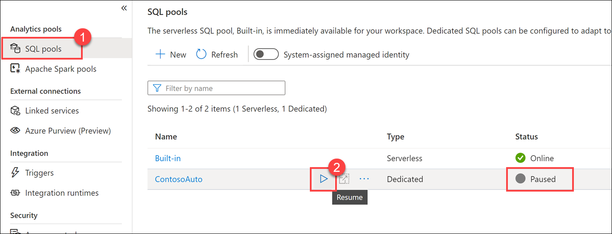

4. When prompted, select **Resume**. It will take a minute or two to resume the pool.

    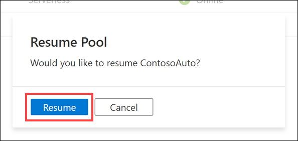

> **Continue to the next exercise** while the dedicated SQL pool resumes.

## Exercise 1: Configure services

### Task 1: Configure Event Hubs

Azure Event Hubs is a Big Data streaming platform and event ingestion service, capable of receiving and processing millions of events per second. We are using it to temporarily store vehicle telemetry data that is processed and ready to be sent to the real-time dashboard. As data flows into Event Hubs, Azure Stream Analytics will query the data, applying aggregates and tagging anomalies, then send it to Azure Synapse Analytics and Power BI.

In this task, you will create and configure a new event hub within the provided Event Hubs namespace. This will be used to capture vehicle telemetry after it has been processed and enriched by the Azure function you will create later on.

1. Navigate to the [Azure portal](https://portal.azure.com).

2. Select **Resource groups** from the left-hand menu. Then select the resource group named **ms-dataengineering-14**.

3. Select the **Event Hubs Namespace** (`eventhubYOUR_UNIQUE_ID`) from the list of resources in your resource group.

    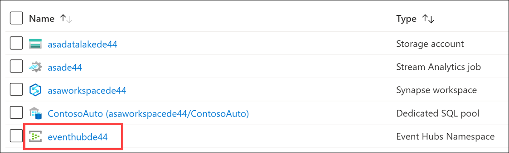

4. Within the Event Hubs Namespace blade, select **Event Hubs** within the left-hand menu.

    

5. Select the **telemetry** event hub from the list.

    

6. Select **Shared access policies** from the left-hand menu.

    

7. Select **+ Add** in the top toolbar to create a new shared access policy.

    

8. In the **Add SAS Policy** blade, configure the following:

    - **Name:** Enter "Read".
    - **Managed:** Unchecked.
    - **Send:** Unchecked.
    - **Listen:** Checked.

    

    > It is a best practice to create separate policies for reading, writing, and managing events. This follows the principle of least privilege to prevent services and applications from performing unauthorized operations.

9. Select **Create** on the bottom of the form when you are finished entering the values.

10. Select **+ Add** in the top toolbar to create a new shared access policy.

    

11. In the **Add SAS Policy** blade, configure the following:

    - **Name:** Enter "Write".
    - **Managed:** Unchecked.
    - **Send:** Checked.
    - **Listen:** Unchecked.

    

12. Select **Create** on the bottom of the form when you are finished entering the values.

13. Select your **Write** policy from the list. Copy the **Connection string - primary key** value by selecting the Copy button to the right of the field. **SAVE THIS VALUE** in Notepad or similar text editor for later.

    

### Task 2: Configure Synapse Analytics

Azure Synapse is an end-to-end analytics platform which combines SQL data warehousing, big data analytics, and data integration into a single integrated environment. It empowers users to gain quick access and insights across all of their data, enabling a whole new level of performance and scale that is simply unmatched in the industry.

In this task, you will create a table in a Synapse dedicated SQL pool to store aggregate vehicle data provided by a Stream Analytics job that processes vehicle telemetry ingested by Event Hubs.

1. Navigate to the [Azure portal](https://portal.azure.com).

2. Select **Resource groups** from the left-hand menu. Then select the resource group named **ms-dataengineering-14**.

3. Select the **Synapse workspace** (`asaworkspaceYOUR_UNIQUE_ID`) from the list of resources in your resource group.

    

4. Select **Open** within the **Open Synapse Studio** box inside the Overview pane.

    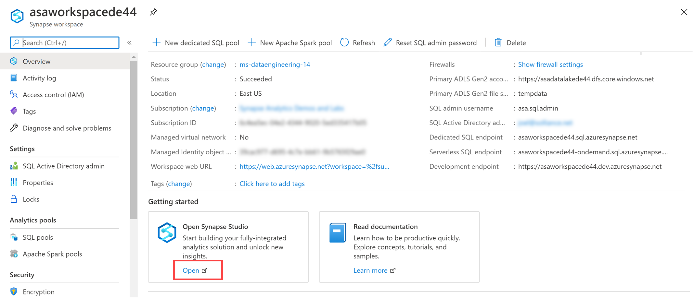

5. Within Synapse Studio, select **Data** in the left-hand menu to navigate to the Data hub.

    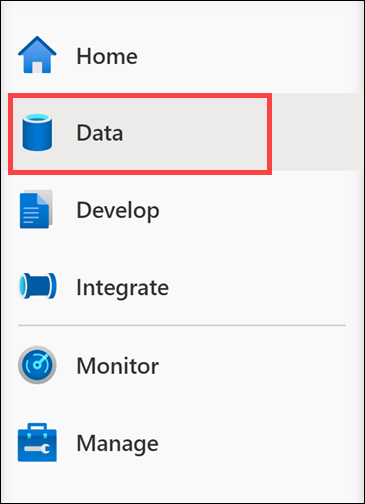

6. Select the **Workspace** tab **(1)**, expand Databases and right-click **ContosoAuto (2)**. Select **New SQL script (3)**, then select **Empty script (4)**.

    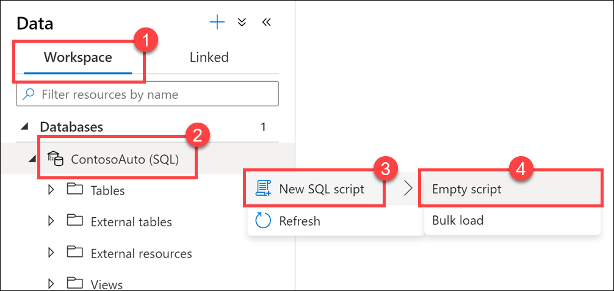

7. Make sure the script is connected to `ContosoAuto`, then replace the script with the following and select **Run** to create a new table:

    ```sql
    CREATE TABLE dbo.VehicleAverages
    ( 
        [AverageEngineTemperature] [float] NOT  NULL,
        [AverageSpeed] [float] NOT  NULL,
        [Snapshot] [datetime] NOT  NULL
    )
    WITH
    (
        DISTRIBUTION = ROUND_ROBIN,
        CLUSTERED COLUMNSTORE INDEX
    )
    GO
    ```

    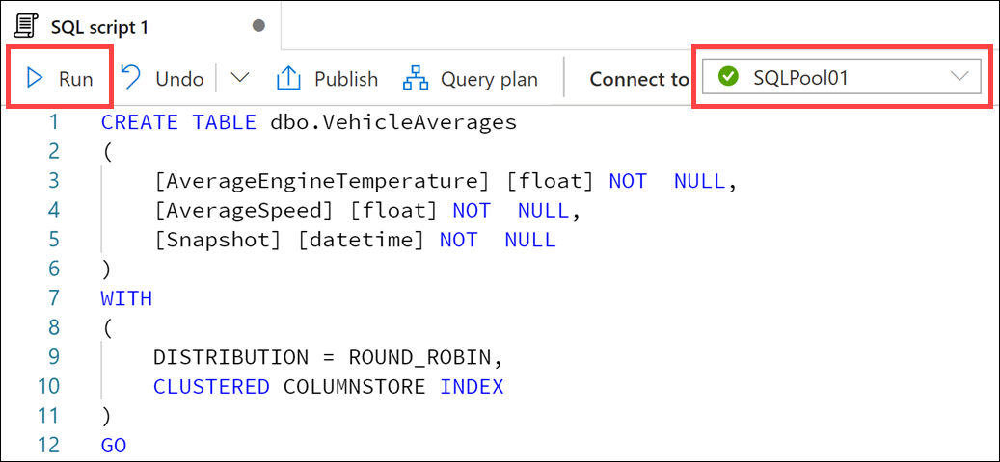

### Task 3: Configure Stream Analytics

Azure Stream Analytics is an event-processing engine that allows you to examine high volumes of data streaming from devices. Incoming data can be from devices, sensors, web sites, social media feeds, applications, and more. It also supports extracting information from data streams, identifying patterns, and relationships. You can then use these patterns to trigger other actions downstream, such as create alerts, feed information to a reporting tool, or store it for later use.

In this task, you will configure Stream Analytics to use the event hub you created as a source, query and analyze that data, then send it to Power BI for reporting and aggregated data to Azure Synapse Analytics.

1. Navigate to the [Azure portal](https://portal.azure.com).

2. Select **Resource groups** from the left-hand menu. Then select the resource group named **ms-dataengineering-14**.

3. Select the **Stream Analytics job** (`asaYOUR_UNIQUE_ID`) from the list of resources in your resource group.

    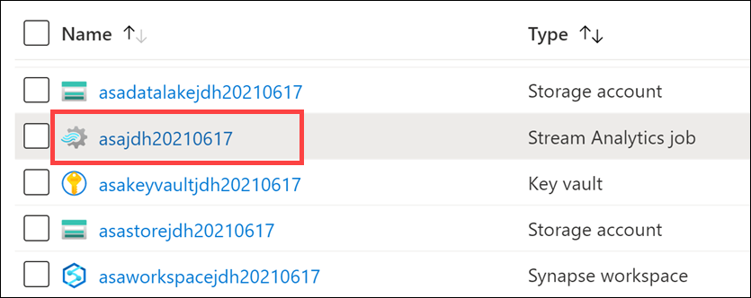

4. Within the Stream Analytics job, select **Storage account settings** in the left-hand menu, then select **Add storage account**. Since we will use Synapse Analytics as one of the outputs, we need to first configure the job storage account.

    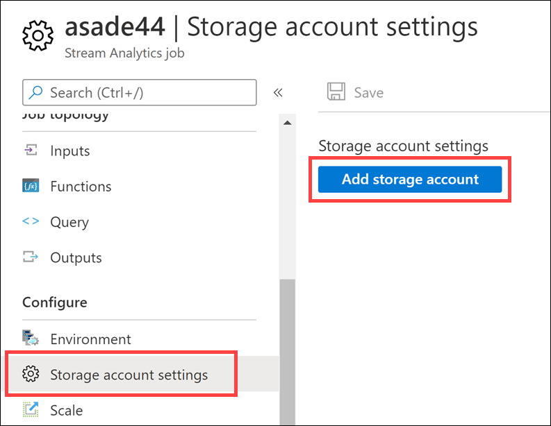

5. In the **Storage account settings** form, configure the following:

   - **Select storage account from your subscriptions:** Selected.
   - **Subscription:** Make sure the subscription you are using for this lab is selected.
   - **Storage account:** Select the storage account named **asadatalakeYOUR_UNIQUE_ID**.
   - **Authentication mode:** Select "Connection string".

   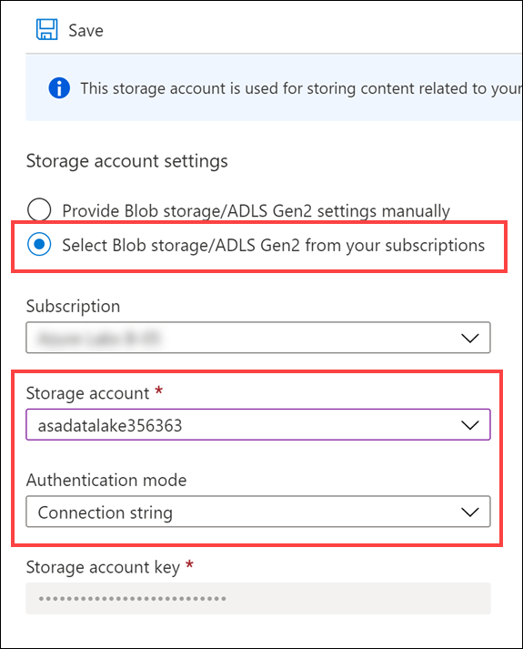

6. Select **Save**, then **Yes** when prompted to save the storage account settings.

7. Within the Stream Analytics job, select **Inputs** within the left-hand menu.

    

8. Select **+ Add stream input** in the top toolbar, then select **Event Hub** to create a new Event Hub input.

    

9. In the **New Input** blade, configure the following:

    - **Name:** Enter "eventhub".
    - **Select Event Hub from your subscriptions:** Selected.
    - **Subscription:** Make sure the subscription you are using for this lab is selected.
    - **Event Hub namespace:** Select the Event Hub namespace you are using for this lab.
    - **Event Hub name:** Select **Use existing**, then select **telemetry**, which you created earlier.
    - **Event Hub consumer group:** Select **Use existing**, then select **$Default**.
    - **Authentication mode:** Select **Connection string**.
    - **Event Hub policy name:** Select **Use existing**, then select **Read**.
    - Leave all other values at their defaults.

    

10. Select **Save** on the bottom of the form when you are finished entering the values.

11. Within the Stream Analytics job blade, select **Outputs** within the left-hand menu.

    

12. Select **+ Add** in the top toolbar, then select **Power BI** to create a new Power BI output.

    

13. In the **New Output** blade, select the **Authorize** button to authorize a connection from Stream Analytics to your Power BI account.

    

14. When prompted, sign in to your Power BI account, which is the same username and password you were provided with and used to login to the Azure Portal.

    

15. After successfully signing in to your Power BI account, the New Output blade will update to show you are currently authorized.

    

16. In the **New Output** blade, configure the following:

    - **Output alias:** Enter `powerBIAlerts`.
    - **Authentication mode:** Select "User token".
    - **Group workspace:** Select "My Workspace" (if you do not see this option, select the "User token" authentication mode first).
    - **Dataset name:** Enter `ContosoAutoVehicleAnomalies`.
    - **Table name:** Enter `Alerts`.

    

17. Select **Save** on the bottom of the form when you are finished entering the values.

18. Select **+ Add** in the top toolbar, then select **Azure Synapse Analytics (formerly SQL DW)** to create a new Synapse Analytics output.

    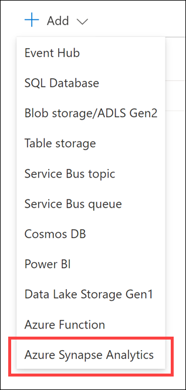

19. In the **New Output** blade, configure the following:

    - **Output alias:** Enter "synapse".
    - **Select Azure Synapse Analytics from your subscriptions:** Selected.
    - **Subscription:** Select the subscription you are using for this lab.
    - **Database:** Select "ContosoAuto". Make sure your correct Synapse workspace name appears under "Server name".
    - **Table:** Enter `dbo.VehicleAverages`
    - **Authentication mode:** Select "Connection string".
    - **Username:** Enter `asa.sql.admin`
    - **Password:** Enter the password of `P4ssw.rd` or the SQL admin password value you entered when deploying the lab environment, or which was provided to you as part of your hosted lab environment. **Note**: This password is most likely not the same as the password you used to sign in to the Azure portal.

    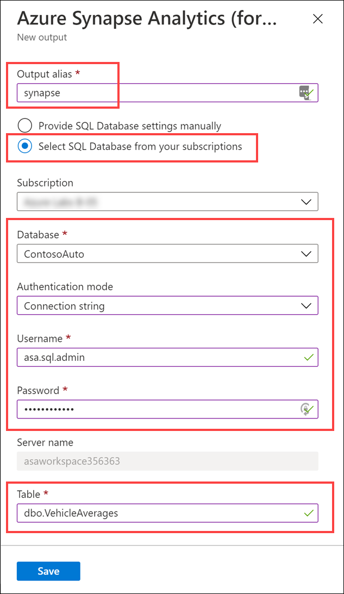

20. Select **Save** on the bottom of the form when you are finished entering the values.

21. Within the Stream Analytics job blade, select **Query** within the left-hand menu.

    

22. Clear the edit **Query** window and paste the following in its place:

    ```sql
    WITH
        Averages AS (
        select
            AVG(engineTemperature) averageEngineTemperature,
            AVG(speed) averageSpeed
        FROM
            eventhub TIMESTAMP BY [timestamp]
        GROUP BY
            TumblingWindow(Duration(second, 2))
    ),
    Anomalies AS (
        select
            t.vin,
            t.[timestamp],
            t.city,
            t.region,
            t.outsideTemperature,
            t.engineTemperature,
            a.averageEngineTemperature,
            t.speed,
            a.averageSpeed,
            t.fuel,
            t.engineoil,
            t.tirepressure,
            t.odometer,
            t.accelerator_pedal_position,
            t.parking_brake_status,
            t.headlamp_status,
            t.brake_pedal_status,
            t.transmission_gear_position,
            t.ignition_status,
            t.windshield_wiper_status,
            t.abs,
            (case when a.averageEngineTemperature >= 405 OR a.averageEngineTemperature <= 15 then 1 else 0 end) as enginetempanomaly,
            (case when t.engineoil <= 1 then 1 else 0 end) as oilanomaly,
            (case when (t.transmission_gear_position = 'first' OR
                t.transmission_gear_position = 'second' OR
                t.transmission_gear_position = 'third') AND
                t.brake_pedal_status = 1 AND
                t.accelerator_pedal_position >= 90 AND
                a.averageSpeed >= 55 then 1 else 0 end) as aggressivedriving
        from eventhub t TIMESTAMP BY [timestamp]
        INNER JOIN Averages a ON DATEDIFF(second, t, a) BETWEEN 0 And 2
    ),
    VehicleAverages AS (
        select
            AVG(engineTemperature) averageEngineTemperature,
            AVG(speed) averageSpeed,
            System.TimeStamp() as snapshot
        FROM
            eventhub TIMESTAMP BY [timestamp]
        GROUP BY
            TumblingWindow(Duration(minute, 2))
    )
    -- INSERT INTO POWER BI
    SELECT
        *
    INTO
        powerBIAlerts
    FROM
        Anomalies
    where aggressivedriving = 1 OR enginetempanomaly = 1 OR oilanomaly = 1
    -- INSERT INTO SYNAPSE ANALYTICS
    SELECT
        *
    INTO
        synapse
    FROM
        VehicleAverages
    ```

    

    The query averages the engine temperature and speed over a two second duration. Then it selects all telemetry data, including the average values from the previous step, and specifies the following anomalies as new fields:

    a. **enginetempanomaly**: When the average engine temperature is \>= 405 or \<= 15.

    b. **oilanomaly**: When the engine oil \<= 1.

    c. **aggressivedriving**: When the transmission gear position is in first, second, or third, and the brake pedal status is 1, the accelerator pedal position \>= 90, and the average speed is \>= 55.

    The query outputs all fields from the anomalies step into the `powerBIAlerts` output where aggressivedriving = 1 or enginetempanomaly = 1 or oilanomaly = 1 for reporting. The query also aggregates the average engine temperature and speed of all vehicles over the past two minutes, using `TumblingWindow(Duration(minute, 2))`, and outputs these fields to the `synapse` output.

23. Select **Save query** in the top toolbar when you are finished updating the query.

24. Within the Stream Analytics job blade, select **Overview** within the left-hand menu. On top of the Overview blade, select **Start**.

    

25. In the Start job blade that appears, select **Now** for the job output start time, then select **Start**. This will start the Stream Analytics job so it will be ready to start processing and sending your events to Power BI later on.

    

## Exercise 2: Generate and visualize data

### Task 1: Run data generator

The data generator console application creates and sends simulated vehicle sensor telemetry for an array of vehicles (denoted by VIN (vehicle identification number)) directly to Event Hubs. For this to happen, you first need to configure it with the Event Hub connection string.

In this task, you will configure and run the data generator. The data generator saves simulated vehicle telemetry data to Event Hubs, prompting your Stream Analytics job to aggregate and analyze the enriched data and send it to Power BI and Synapse Analytics. The final step will be to create the Power BI report in the task that follows.

1. On your lab VM or computer, download the [TransactionGeneratorExecutable.zip](https://solliancepublicdata.blob.core.windows.net/dataengineering/dp-203/TransactionGeneratorExecutable.zip) file.

2. Extract the zip file to your machine, making note of the extraction location.

3. Open the folder containing the extracted files, then open either the `linux-x64`, `osx-x64`, or `win-x64` subfolder, based on your environment.

4. Within the appropriate subfolder, open the **appsettings.json** file. Paste your `telemetry` Event Hub connection string value next to `EVENT_HUB_CONNECTION_STRING`. Make sure you have quotes ("") around the value, as shown. **Save** the file.

    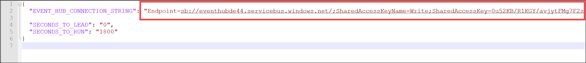

    `SECONDS_TO_LEAD` is the amount of time to wait before sending vehicle telemetry data. Default value is `0`.

    `SECONDS_TO_RUN` is the maximum amount of time to allow the generator to run before stopping transmission of data. The default value is `1800`. Data will also stop transmitting when you enter Ctrl+C while the generator is running, or if you close the window.

5. Execute the data generator using one of the following methods, based on your platform:

   1. Windows:

      * Simply execute **TransactionGenerator.exe** inside the `win-x64` folder.

   2. Linux:

      * Navigate to the `linux-x64` folder.
      * Run `chmod 777 DataGenerator` to provide access to the binary.
      * Run `./DataGenerator`.

   3. MacOS:

      * Open a new terminal.
      * Navigate to the `osx-x64` directory.
      * Run `./DataGenerator`.

6. If you are using Windows and receive a dialog after trying to execute the data generator, select **More info**, then **Run anyway**.

    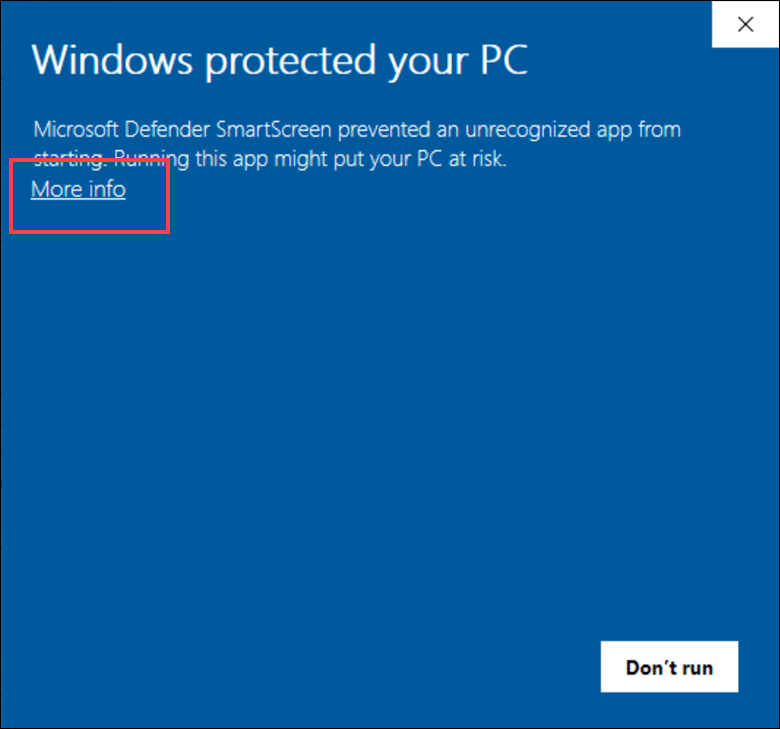

    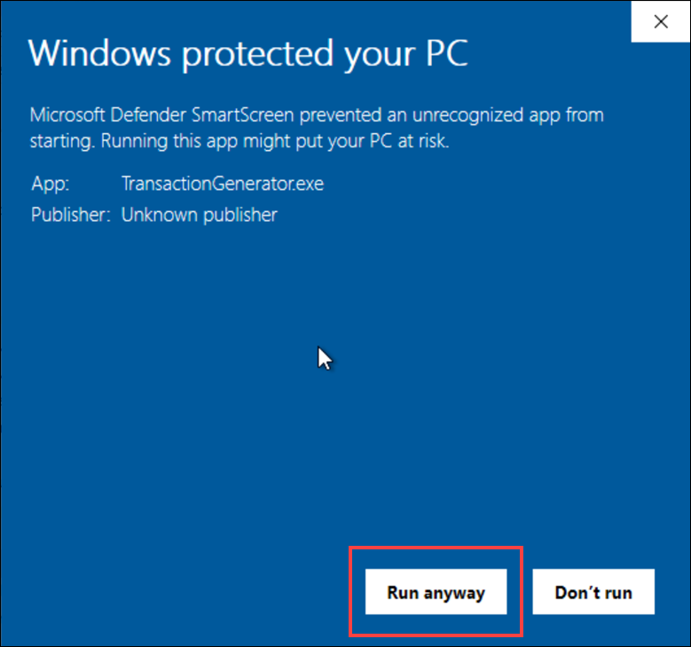

6.  A new console window will open, and you should see it start to send data after a few seconds. Once you see that it is sending data to Event Hubs, _minimize_ the window and keep it running in the background.

    

    After every 500 records are requested to be sent, you will see output statistics.

### Task 2: Create Power BI dashboard

In this task, you will use Power BI to create a report showing captured vehicle anomaly data. Then you will pin that report to a live dashboard for near real-time updates.

1. Open your web browser and navigate to <https://powerbi.microsoft.com/>. Select **Sign in** on the upper-right.

    

2. Enter your Power BI credentials you used when creating the Power BI output for Stream Analytics.

3. After signing in, select **My Workspace** on the left-hand menu.

    

4. Select the **Datasets + dataflows** tab on top of the workspace. Locate the dataset named **ContosoAutoVehicleAnomalies**, then select the **Create Report** action button to the right of the name. If you do not see the dataset, you may need to wait a few minutes and refresh the page.

    

    > **Note:** It can take several minutes for the dataset to appear. You may need to periodically refresh the page before you see the Datasets tab.

5. You should see a new blank report for VehicleAnomalies with the field list on the far right.

    

6. Select the **Map** visualization within the Visualizations section on the right.

    

7. Drag the **city** field to **Location**, and **aggressivedriving** to **Size**. This will place points of different sizes over cities on the map, depending on how many aggressive driving records there are.

    

8. Your map should look similar to the following:

    

9. Select a blank area on the report to deselect the map. Now select the **Treemap** visualization.

    

10. Drag the **enginetemperature** field to **Values**, then drag the **transmission_gear_position** field to **Group**. This will group the engine temperature values by the transmission gear position on the treemap so you can see which gears are associated with the hottest or coolest engine temperatures. The treemap sizes the groups according to the values, with the largest appearing on the upper-left and the lowest on the lower-right.

    

11. Select the down arrow next to the **enginetemperature** field under **Values**. Select **Average** from the menu to aggregate the values by average instead of the sum.

    

12. Your treemap should look similar to the following:

    

13. Select a blank area on the report to deselect the treemap. Now select the **Area chart** visualization.

    

14. Drag the **region** field to **Legend**, the **speed** field to **Values**, and the **timestamp** field to **Axis**. This will display an area chart with different colors indicating the region and the speed at which drivers travel over time within that region.

    

15. Select the down arrow next to the **speed** field under **Values**. Select **Average** from the menu to aggregate the values by average instead of the sum.

    

16. Your area chart should look similar to the following:

    

17. Select a blank area on the report to deselect the area chart. Now select the **Multi-row card** visualization.

    

18. Drag the **aggressivedriving** field, **enginetempanomaly**, and **oilanomaly** fields to **Fields**.

    

19. Select the **Format** tab in the multi-row card settings, then expand **Data labels**. Set the **Text size** to 30. Expand **Category labels** and set the **Text size** to 12.

    

20. Your multi-row card should look similar to the following:

    

21. Select **Save** on the upper-right of the page.

    

22. Enter a name, such as "Contoso Auto Vehicle Anomalies", then select **Save**.

    

23. Now let's add this report to a dashboard. Select **Pin to a dashboard** at the top of the report (you may have to select the ellipses ...).

    

24. Select **New dashboard**, then enter a name, such as "Contoso Auto Vehicle Anomalies Dashboard". Select **Pin live**. When prompted select the option to view the dashboard. Otherwise, you can find the dashboard under My Workspace on the left-hand menu.

    

25. The live dashboard will automatically refresh and update while data is being captured. You can hover over any point on a chart to view information about the item. Select one of the regions in the legend above the average speed chart. All other charts will filter by that region automatically. Click on the region again to clear the filter.

    

### Task 3: View aggregate data in Synapse Analytics

As you recall, when you created the query in Stream Analytics, you aggregated the engine temperature and vehicle speed data over two-minute intervals and saved the data to Synapse Analytics. This capability demonstrates the Stream Analytics query's ability to write data to multiple outputs at varying intervals. Writing to a Synapse Analytics dedicated SQL pool enables us to retain the historic and current aggregate data as part of the data warehouse without requiring an ETL/ELT process.

In this task, you will view the anomaly data within Synapse Analytics.

1. If you have not yet done so, **stop** the **TransactionGenerator**.

2. Navigate to the [Azure portal](https://portal.azure.com).

3. Select **Resource groups** from the left-hand menu. Then select the resource group named **ms-dataengineering-14**.

4. Select the **Synapse workspace** (`asaworkspaceYOUR_UNIQUE_ID`) from the list of resources in your resource group.

    

5. Select **Open** within the **Open Synapse Studio** box inside the Overview pane.

    

6. Within Synapse Studio, select **Data** in the left-hand menu to navigate to the Data hub.

    

7. Select the **Workspace** tab **(1)**, expand the `ContosoAuto` database, expand `Tables`, then right-click on the **dbo.VehicleAverages** table **(2)**. If you do not see the table listed, refresh the tables list. Select **New SQL script (3)**, then **Select TOP 100 rows (4)**.

    

8. View the query results and observe the aggregate data stored in `AverageEngineTemperature` and `AverageSpeed`. The `Snapshot` value changes in two-minute intervals between these records.

   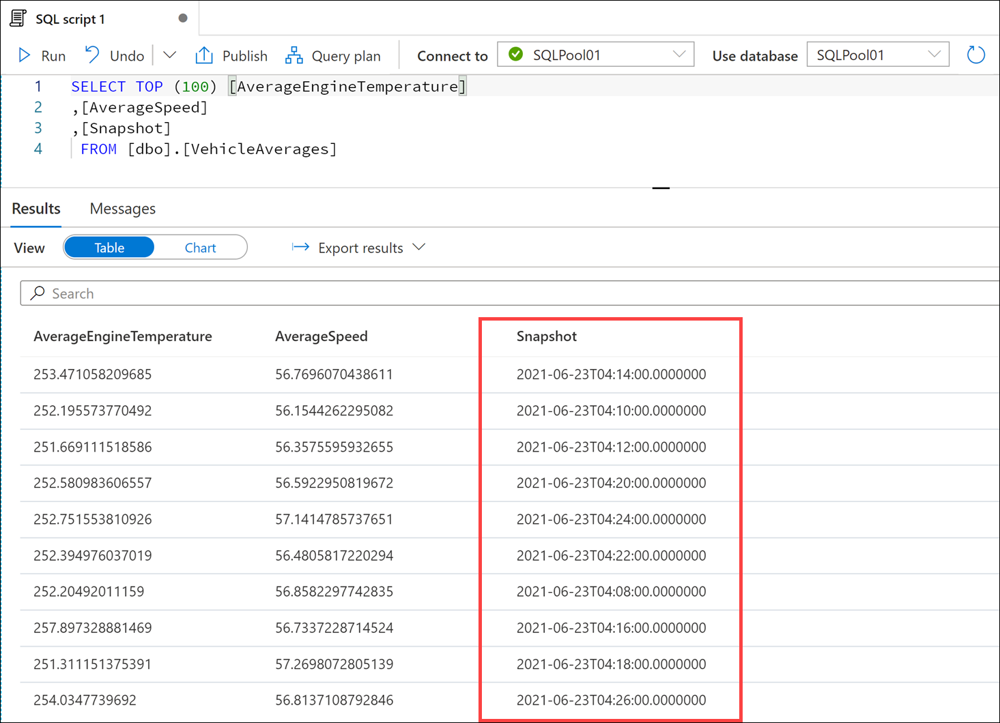

9. Select the **Chart** view in the Results output, then set the chart type to **Area**. This visualization shows the average engine temperature correlated with the average speed over time. Feel free to experiment with the chart settings.

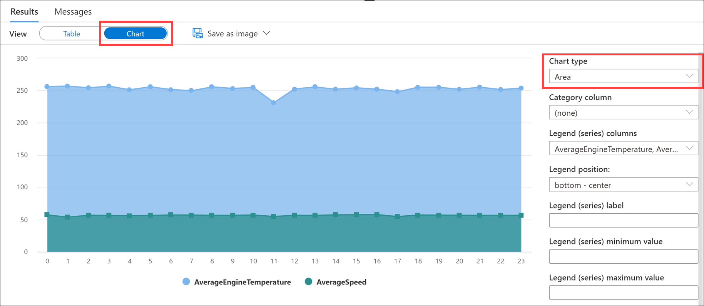

## Exercise 3: Cleanup

Complete these steps to stop the data generator and free up resources you no longer need.

### Task 1: Stop the data generator

1. Go back to the console/terminal window in which your data generator is running. Close the window to stop the generator.

### Task 2: Stop the Stream Analytics job

1. Navigate to the Stream Analytics job in the Azure portal.

2. In the Overview pane, select **Stop**, then select **Yes** when prompted.

    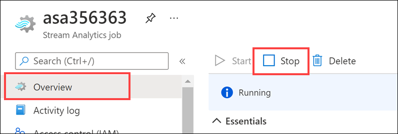

### Task 3: Pause the dedicated SQL pool

1. Open Synapse Studio (<https://web.azuresynapse.net/>).

2. Select the **Manage** hub.

    

3. Select **SQL pools** in the left-hand menu **(1)**. Hover over the name of the dedicated SQL pool and select **Pause (2)**.

    

4. When prompted, select **Pause**.

    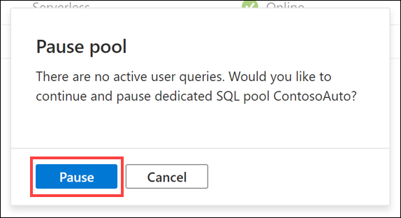
