# Module 16 - Build reports using Power BI integration with Azure Synapse Analytics

In this module, the student will learn how to integrate Power BI with their Synapse workspace to build reports in Power BI. The student will create a new datasource and Power BI report in Synapse Studio. Then the student will learn how to improve query performance with materialized views and result-set caching. Finally, the student will explore the data lake with serverless SQL pools and create visualizations against that data in Power BI.

In this module, the student will be able to:

- Integrate a Synapse workspace and Power BI
- Optimize integration with Power BI
- Improve query performance with materialized views and result-set caching
- Visualize data with SQL serverless and create a Power BI report

## Lab details

- [Module 16 - Build reports using Power BI integration with Azure Synapse Analytics](#module-16---build-reports-using-power-bi-integration-with-azure-synapse-analytics)
  - [Lab details](#lab-details)
  - [Resource naming throughout this lab](#resource-naming-throughout-this-lab)
  - [Lab setup and pre-requisites](#lab-setup-and-pre-requisites)
  - [Exercise 0: Start the dedicated SQL pool](#exercise-0-start-the-dedicated-sql-pool)
  - [Exercise 1: Power BI and Synapse workspace integration](#exercise-1-power-bi-and-synapse-workspace-integration)
    - [Task 1: Login to Power BI](#task-1-login-to-power-bi)
    - [Task 2: Create a Power BI workspace](#task-2-create-a-power-bi-workspace)
    - [Task 3: Connect to Power BI from Synapse](#task-3-connect-to-power-bi-from-synapse)
    - [Task 4: Explore the Power BI linked service in Synapse Studio](#task-4-explore-the-power-bi-linked-service-in-synapse-studio)
    - [Task 5: Create a new datasource to use in Power BI Desktop](#task-5-create-a-new-datasource-to-use-in-power-bi-desktop)
    - [Task 6: Create a new Power BI report in Synapse Studio](#task-6-create-a-new-power-bi-report-in-synapse-studio)
  - [Exercise 2: Optimizing integration with Power BI](#exercise-2-optimizing-integration-with-power-bi)
    - [Task 1: Explore Power BI optimization options](#task-1-explore-power-bi-optimization-options)
    - [Task 2: Improve performance with materialized views](#task-2-improve-performance-with-materialized-views)
    - [Task 3: Improve performance with result-set caching](#task-3-improve-performance-with-result-set-caching)
  - [Exercise 3: Visualize data with SQL Serverless](#exercise-3-visualize-data-with-sql-serverless)
    - [Task 1: Explore the data lake with SQL Serverless](#task-1-explore-the-data-lake-with-sql-serverless)
    - [Task 2: Visualize data with SQL serverless and create a Power BI report](#task-2-visualize-data-with-sql-serverless-and-create-a-power-bi-report)
  - [Exercise 4: Cleanup](#exercise-4-cleanup)
    - [Task 1: Pause the dedicated SQL pool](#task-1-pause-the-dedicated-sql-pool)

## Resource naming throughout this lab

For the remainder of this guide, the following terms will be used for various ASA-related resources (make sure you replace them with actual names and values):

| Azure Synapse Analytics Resource  | To be referred to |
| --- | --- |
| Workspace / workspace name | `Workspace` |
| Power BI workspace name | `Synapse 01` |
| SQL Pool | `SqlPool01` |
| Lab schema name | `pbi` |

## Lab setup and pre-requisites

> **Note:** Only complete the `Lab setup and pre-requisites` steps if you are **not** using a hosted lab environment, and are instead using your own Azure subscription. Otherwise, skip ahead to Exercise 0.

Install [Power BI Desktop](https://www.microsoft.com/download/details.aspx?id=58494) on your lab computer or VM.

**Complete the [lab setup instructions](https://github.com/solliancenet/microsoft-data-engineering-ilt-deploy/blob/main/setup/04/README.md)** for this module.

Note, the following modules share this same environment:

- [Module 4](labs/04/README.md)
- [Module 5](labs/05/README.md)
- [Module 7](labs/07/README.md)
- [Module 8](labs/08/README.md)
- [Module 9](labs/09/README.md)
- [Module 10](labs/10/README.md)
- [Module 11](labs/11/README.md)
- [Module 12](labs/12/README.md)
- [Module 13](labs/13/README.md)
- [Module 16](labs/16/README.md)

## Exercise 0: Start the dedicated SQL pool

This lab uses the dedicated SQL pool. As a first step, make sure it is not paused. If so, start it by following these instructions:

1. Open Synapse Studio (<https://web.azuresynapse.net/>).

2. Select the **Manage** hub.

    

3. Select **SQL pools** in the left-hand menu **(1)**. If the dedicated SQL pool is paused, hover over the name of the pool and select **Resume (2)**.

    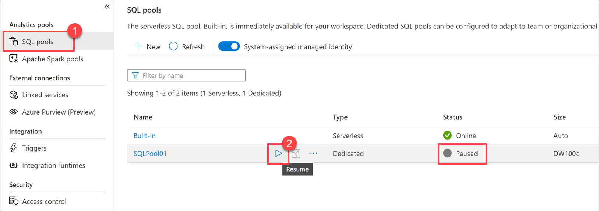

4. When prompted, select **Resume**. It will take a minute or two to resume the pool.

    

> **Continue to the next exercise** while the dedicated SQL pool resumes.

## Exercise 1: Power BI and Synapse workspace integration


### Task 1: Login to Power BI

1. In a new browser tab, navigate to <https://powerbi.microsoft.com/>.

2. Sign in with the same account used to sign in to Azure by selecting the **Sign in** link on the upper-right corner.

3. If this is your first time signing into this account, complete the setup wizard with the default options.

### Task 2: Create a Power BI workspace

1. Select **Workspaces**, then select **Create a workspace**.

    

2. If you are prompted to upgrade to Power BI Pro, select **Try free**.

    

    Select **Got it** to confirm the pro subscription.

    

3. Set the name to **synapse-training**, then select **Save**. If you receive a message that `synapse-training` is not available, append your initials or other characters to make the workspace name unique in your organization.

    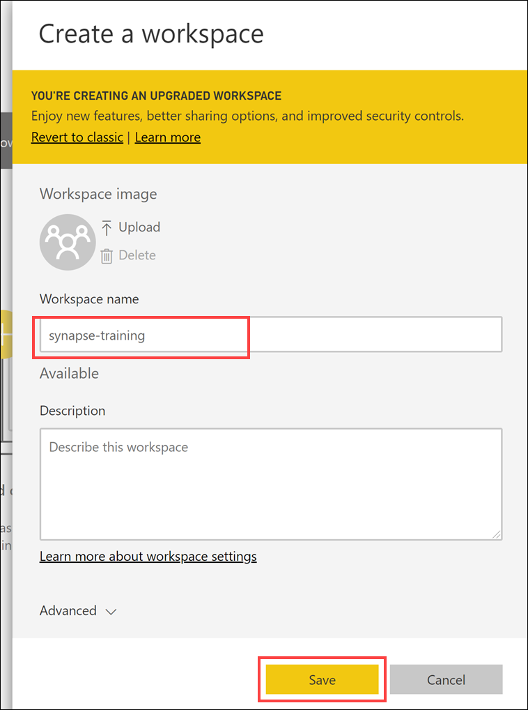

### Task 3: Connect to Power BI from Synapse

1. Open Synapse Studio (<https://web.azuresynapse.net/>), and then navigate to the **Manage hub**.

    

2. Select **Linked services** on the left-hand menu, then select **+ New**.

    

3. Select **Power BI**, then select **Continue**.

    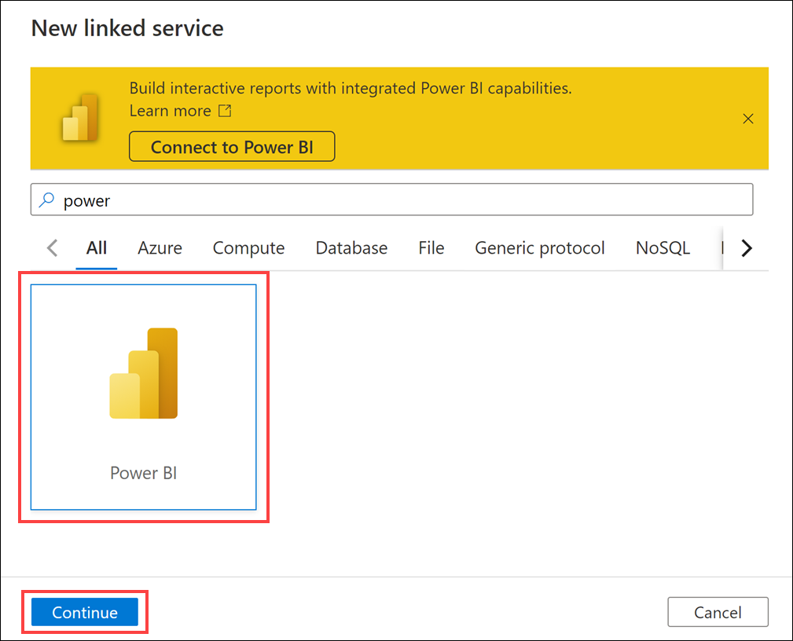

4. In the dataset properties form, complete the following:

    | Field                          | Value                                              |
    | ------------------------------ | ------------------------------------------         |
    | Name | _enter `handson_powerbi`_ |
    | Workspace name | _select `synapse-training`_ |

    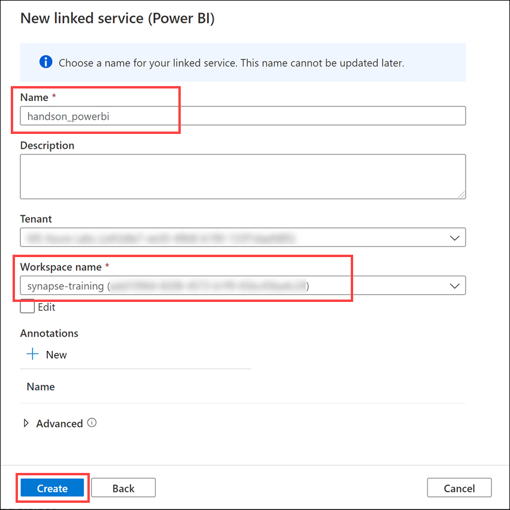

5. Select **Create**.

6. Select **Publish all**, then **Publish**.

    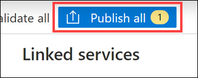

### Task 4: Explore the Power BI linked service in Synapse Studio

1. In  [**Azure Synapse Studio**](<https://web.azuresynapse.net/>) and navigate to the **Develop** hub using the left menu option.

    

2. Expand `Power BI`, expand `handson_powerbi` and observe that you have access to your Power BI datasets and reports, directly from Synapse Studio.

    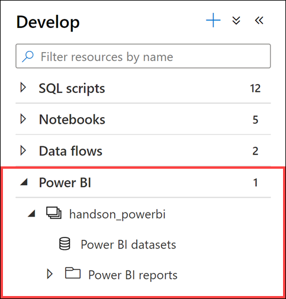

    New reports can be created by selecting **+** at the top of the **Develop** tab. Existing reports can be edited by selecting the report name. Any saved changes will be written back to the Power BI workspace.

### Task 5: Create a new datasource to use in Power BI Desktop

1. Beneath **Power BI**, under the linked Power BI workspace, select **Power BI datasets**.

2. Select **New Power BI dataset** from the top actions menu.

    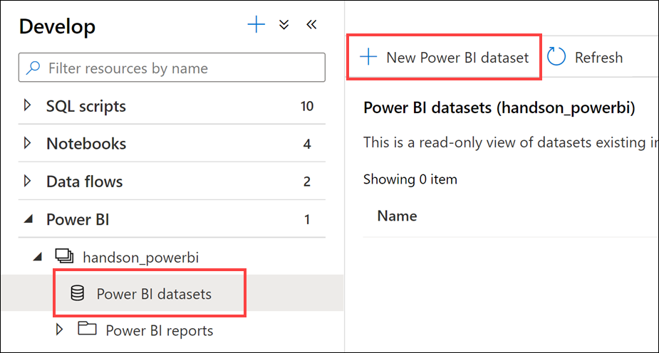

3. Select **Start** and make sure you have Power BI Desktop installed on your environment machine.

    

4. Select **SQLPool01**, then select **Continue**.

    

5. Next, select **Download** to download the `.pbids` file.

    

6. Select **Continue**, then **Close and refresh** to close the publishing dialog.

### Task 6: Create a new Power BI report in Synapse Studio

1. In [**Azure Synapse Studio**](<https://web.azuresynapse.net/>), select **Develop** from the left menu.

    

2. Select **+**, then **SQL script**.

    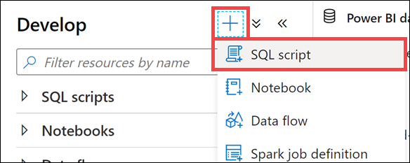

3. Connect to **SQLPool01**, then execute the following query to get an approximation of its execution time (may be around 1 minute). This will be the query we'll use to bring data in the Power BI report you'll build later in this exercise.

    ```sql
    SELECT
        FS.CustomerID
        ,P.Seasonality
        ,D.Year
        ,D.Quarter
        ,D.Month
        ,avg(FS.TotalAmount) as AvgTotalAmount
        ,avg(FS.ProfitAmount) as AvgProfitAmount
        ,sum(FS.TotalAmount) as TotalAmount
        ,sum(FS.ProfitAmount) as ProfitAmount
    FROM
        wwi.SaleSmall FS
        JOIN wwi.Product P ON P.ProductId = FS.ProductId
        JOIN wwi.Date D ON FS.TransactionDateId = D.DateId
    GROUP BY
        FS.CustomerID
        ,P.Seasonality
        ,D.Year
        ,D.Quarter
        ,D.Month
    ```

    You should see a query result of 194683820.

    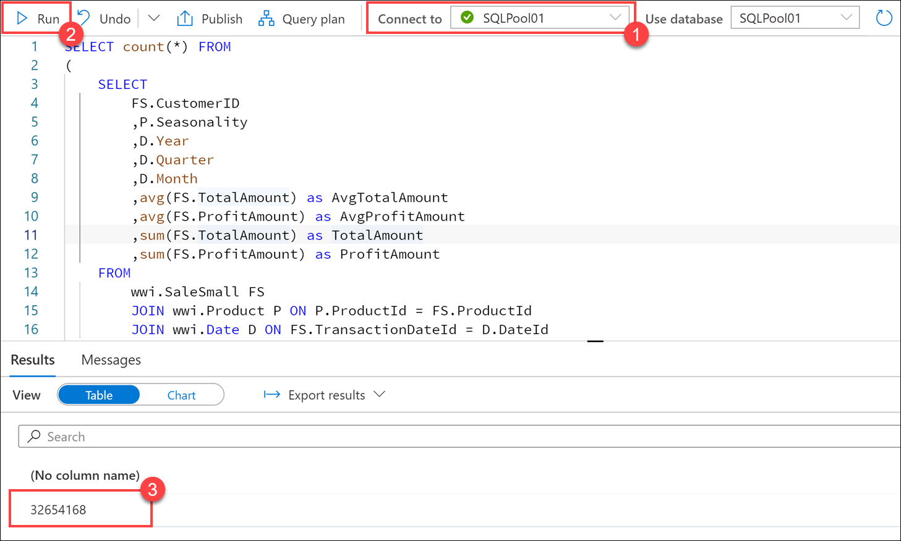

4. To connect to your datasource, open the downloaded .pbids file in Power BI Desktop. Select the **Microsoft account** option on the left, **Sign in** (with the same credentials you use for connecting to the Synapse workspace) and click **Connect**.

    

5. In the Navigator dialog, right-click on the root database node and select **Transform data**.

    

6. Select the **DirectQuery** option in the connection settings dialog, since our intention is not to bring a copy of the data into Power BI, but to be able to query the data source while working with the report visualizations. Click **OK** and wait a few seconds while the connection is configured.

    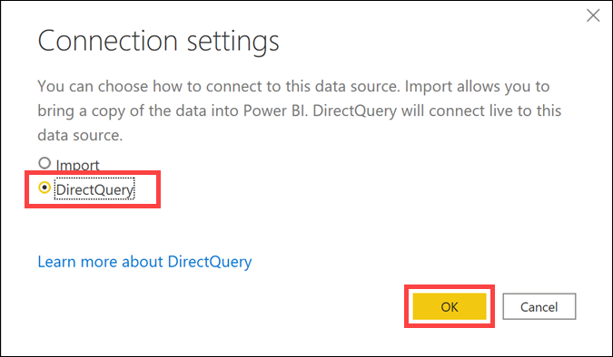

7. In the Power Query editor, open the settings page of the **Source** step in the query. Expand the **Advanced options** section, paste the following query and click **OK**.

    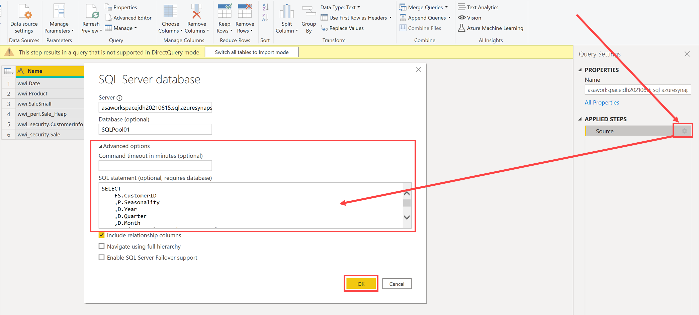

    ```sql
    SELECT * FROM
    (
        SELECT
            FS.CustomerID
            ,P.Seasonality
            ,D.Year
            ,D.Quarter
            ,D.Month
            ,avg(FS.TotalAmount) as AvgTotalAmount
            ,avg(FS.ProfitAmount) as AvgProfitAmount
            ,sum(FS.TotalAmount) as TotalAmount
            ,sum(FS.ProfitAmount) as ProfitAmount
        FROM
            wwi.SaleSmall FS
            JOIN wwi.Product P ON P.ProductId = FS.ProductId
            JOIN wwi.Date D ON FS.TransactionDateId = D.DateId
        GROUP BY
            FS.CustomerID
            ,P.Seasonality
            ,D.Year
            ,D.Quarter
            ,D.Month
    ) T
    ```

    > Note that this step will take at least 40-60 seconds to execute since it submits the query directly on the Synapse SQL Pool connection.

8. Select **Close & Apply** on the topmost left corner of the editor window to apply the query and fetch the initial schema in the Power BI designer window.

    

9. Back to the Power BI report editor, expand the **Visualizations** menu on the right, then select the **Line and stacked column chart** visualization.

    

10. Select the newly created chart to expand its properties pane. Using the expanded **Fields** menu, configure the visualization as follows:

     - **Shared axis**: `Year`, `Quarter`
     - **Column series**: `Seasonality`
     - **Column values**: `TotalAmount`
     - **Line values**: `ProfitAmount`

    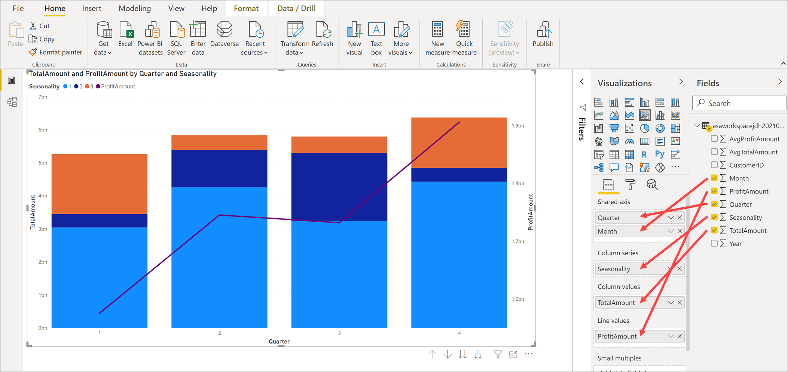

    > It will take around 40-60 seconds for the visualization to render, due to the live query execution on the Synapse dedicated SQL pool.

11. You can check the query executed while configuring the visualization in the Power BI Desktop application. Switch back to Synapse Studio, then select the **Monitor** hub from the left-hand menu.

    

12. Under the **Activities** section, open the **SQL requests** monitor. Make sure you select **SQLPool01** in the Pool filter, as by default Built-In is selected.

    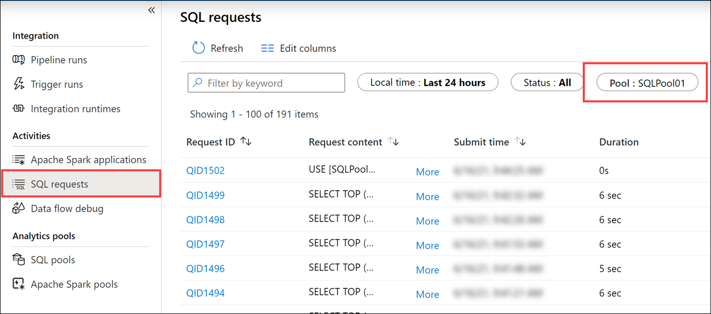

13. Identify the query behind your visualization in the topmost requests you see in the log and observe the duration which is about 20-30 seconds. Select **More** on a request to look into the actual query submitted from Power BI Desktop.

    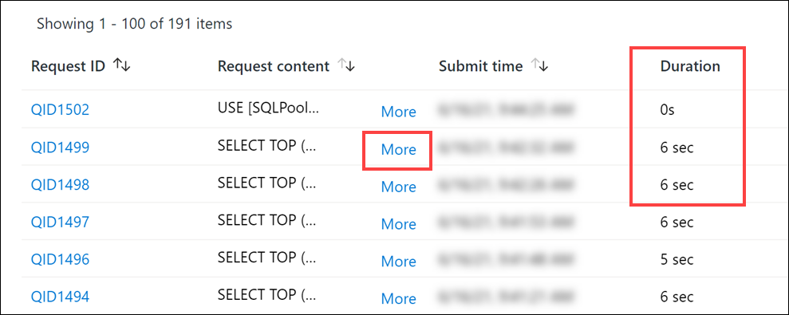

    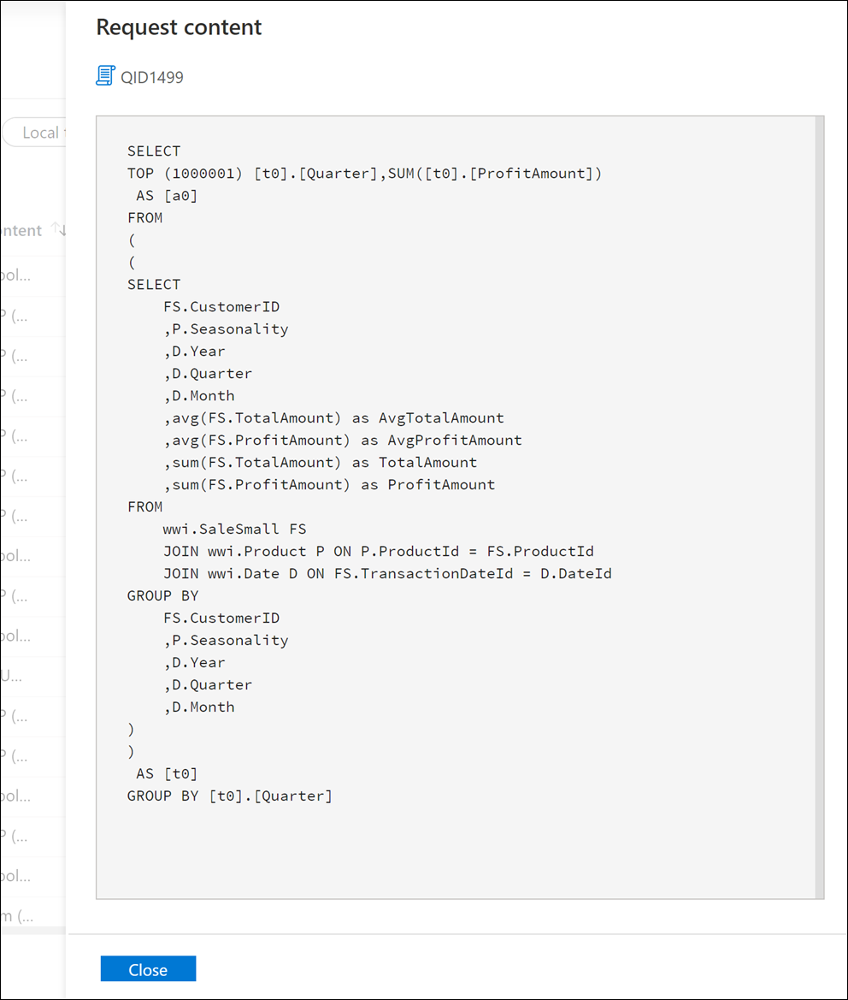

14. Switch back to the Power BI Desktop application, then click **Save** in the top-left corner.

    

15. Specify a file name, such as `synapse-lab`, then click **Save**.

    

16. Click **Publish** above the saved report. Make sure that, in Power BI Desktop, you are signed in with the same account you use in the Power BI portal and in Synapse Studio. You can switch to the proper account from the right topmost corner of the window.

    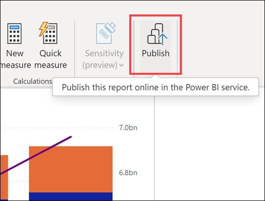

    If you are not currently signed in to Power BI desktop, you will be prompted to enter your email address. Use the account credentials you are using for connecting to the Azure portal and Synapse Studio in this lab.

    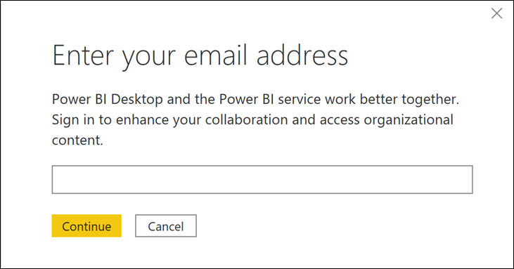

    Follow the prompts to complete signing in to your account.

17. In the **Publish to Power BI** dialog, select the workspace you linked to Synapse (for example, **synapse-training**), then click **Select**.

    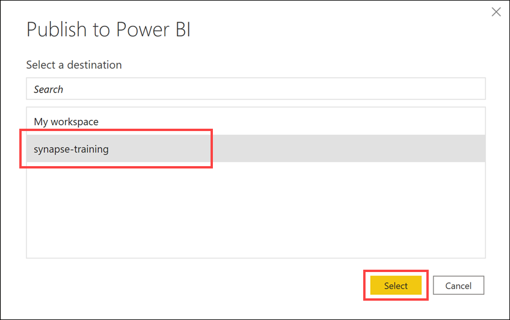

18. Wait until the publish operation successfully completes.

    

19. Switch back to the Power BI service, or navigate to it in a new browser tab if you closed it earlier (<https://powerbi.microsoft.com/>).

20. Select the **synapse-training** workspace you created earlier. If you already had it open, refresh the page to see the new report and dataset.

    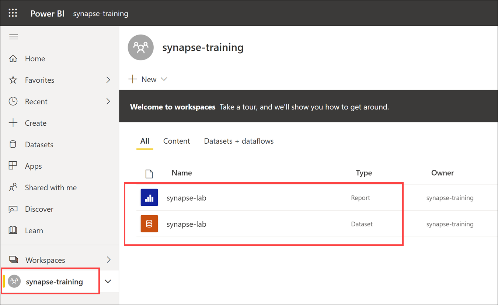

21. Select the **Settings** gear icon on the upper-right of the page, then select **Settings**. If you do not see the gear icon,you will need to select the ellipses (...) to view the menu item.

    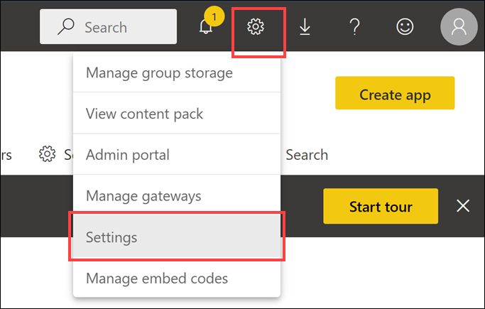

22. Select the **Datasets** tab. If you see an error message under `Data source credentials` that your data source can't be refreshed because the credentials are invalid, select **Edit credentials**. It may take a few seconds for this section to appear.

    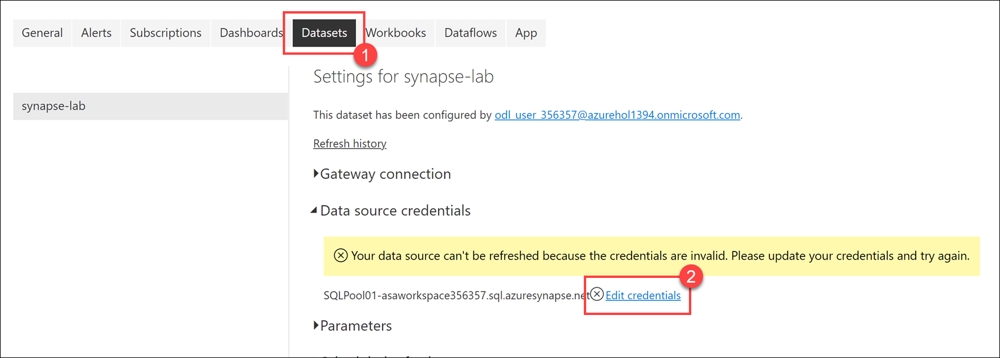

23. In the dialog that appears, select the **OAuth2** authentication method, then select **Sign in**. Enter your credentials if prompted.

    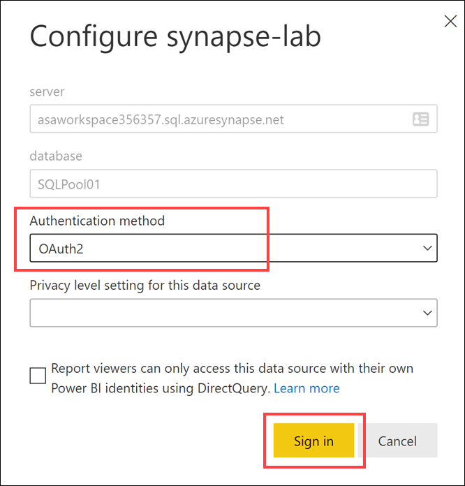

24. Now you should be able to see this report published in Synapse Studio. Switch back to Synapse Studio, select the **Develop** hub and refresh the Power BI reports node.

    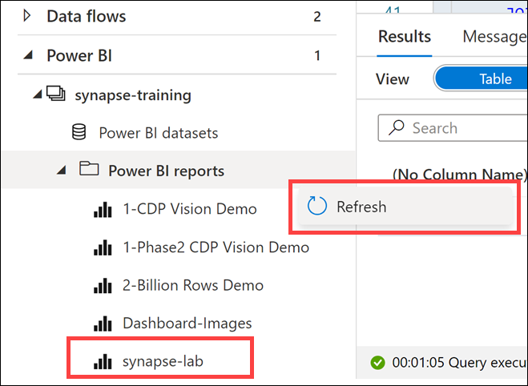

## Exercise 2: Optimizing integration with Power BI

### Task 1: Explore Power BI optimization options

Let's recall the performance optimization options we have when integrating Power BI reports in Azure Synapse Analytics, among which we'll demonstrate the use of Result-set caching and materialized views options later in this exercise.


### Task 2: Improve performance with materialized views

1. In [**Azure Synapse Studio**](<https://web.azuresynapse.net/>), select **Develop** from the left-hand menu.

    

2. Select **+**, then **SQL script**.

    

3. Connect to **SQLPool01**, then execute the following query to get an estimated execution plan and observe the total cost and number of operations:

    ```sql
    EXPLAIN
    SELECT * FROM
    (
        SELECT
        FS.CustomerID
        ,P.Seasonality
        ,D.Year
        ,D.Quarter
        ,D.Month
        ,avg(FS.TotalAmount) as AvgTotalAmount
        ,avg(FS.ProfitAmount) as AvgProfitAmount
        ,sum(FS.TotalAmount) as TotalAmount
        ,sum(FS.ProfitAmount) as ProfitAmount
    FROM
        wwi.SaleSmall FS
        JOIN wwi.Product P ON P.ProductId = FS.ProductId
        JOIN wwi.Date D ON FS.TransactionDateId = D.DateId
    GROUP BY
        FS.CustomerID
        ,P.Seasonality
        ,D.Year
        ,D.Quarter
        ,D.Month
    ) T
    ```

4. The results should look similar to this:

    ```xml
    <?xml version="1.0" encoding="utf-8"?>
    <dsql_query number_nodes="1" number_distributions="60" number_distributions_per_node="60">
        <sql>SELECT count(*) FROM
    (
        SELECT
        FS.CustomerID
        ,P.Seasonality
        ,D.Year
        ,D.Quarter
        ,D.Month
        ,avg(FS.TotalAmount) as AvgTotalAmount
        ,avg(FS.ProfitAmount) as AvgProfitAmount
        ,sum(FS.TotalAmount) as TotalAmount
        ,sum(FS.ProfitAmount) as ProfitAmount
    FROM
        wwi.SaleSmall FS
        JOIN wwi.Product P ON P.ProductId = FS.ProductId
        JOIN wwi.Date D ON FS.TransactionDateId = D.DateId
    GROUP BY
        FS.CustomerID
        ,P.Seasonality
        ,D.Year
        ,D.Quarter
        ,D.Month
    ) T</sql>
        <dsql_operations total_cost="10.61376" total_number_operations="12">
    ```

5. Replace the query with the following to create a materialized view that can support the above query:

    ```sql
    IF EXISTS(select * FROM sys.views where name = 'mvCustomerSales')
        DROP VIEW wwi_perf.mvCustomerSales
        GO

    CREATE MATERIALIZED VIEW
        wwi_perf.mvCustomerSales
    WITH
    (
        DISTRIBUTION = HASH( CustomerId )
    )
    AS
    SELECT
        FS.CustomerID
        ,P.Seasonality
        ,D.Year
        ,D.Quarter
        ,D.Month
        ,avg(FS.TotalAmount) as AvgTotalAmount
        ,avg(FS.ProfitAmount) as AvgProfitAmount
        ,sum(FS.TotalAmount) as TotalAmount
        ,sum(FS.ProfitAmount) as ProfitAmount
    FROM
        wwi.SaleSmall FS
        JOIN wwi.Product P ON P.ProductId = FS.ProductId
        JOIN wwi.Date D ON FS.TransactionDateId = D.DateId
    GROUP BY
        FS.CustomerID
        ,P.Seasonality
        ,D.Year
        ,D.Quarter
        ,D.Month
    GO
    ```

    > This query will take between 60 and 150 seconds to complete.
    >
    > We first drop the view if it exists, in case it already exists from an earlier lab.

6. Run the following query to check that it actually hits the created materialized view.

    ```sql
    EXPLAIN
    SELECT * FROM
    (
        SELECT
        FS.CustomerID
        ,P.Seasonality
        ,D.Year
        ,D.Quarter
        ,D.Month
        ,avg(FS.TotalAmount) as AvgTotalAmount
        ,avg(FS.ProfitAmount) as AvgProfitAmount
        ,sum(FS.TotalAmount) as TotalAmount
        ,sum(FS.ProfitAmount) as ProfitAmount
    FROM
        wwi.SaleSmall FS
        JOIN wwi.Product P ON P.ProductId = FS.ProductId
        JOIN wwi.Date D ON FS.TransactionDateId = D.DateId
    GROUP BY
        FS.CustomerID
        ,P.Seasonality
        ,D.Year
        ,D.Quarter
        ,D.Month
    ) T
    ```

7. Switch back to the Power BI Desktop report, then click on the **Refresh** button above the report to submit the query. The query optimizer should use the new materialized view.

    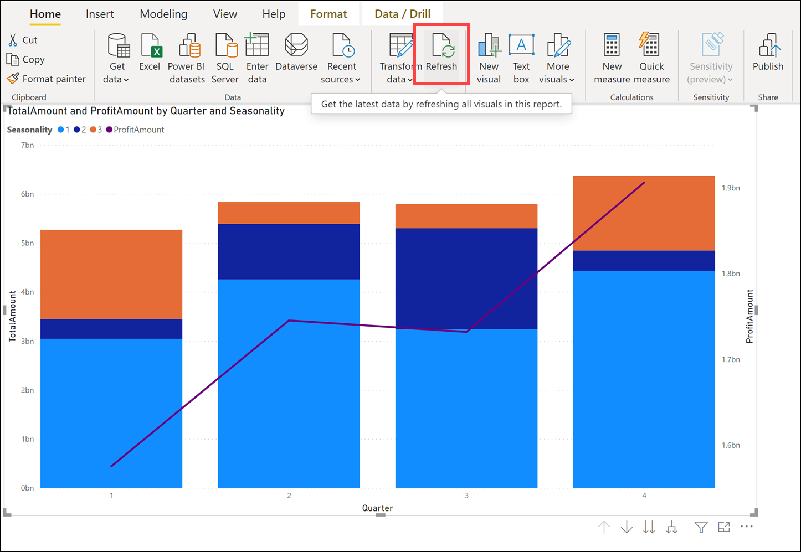

    > Notice that the data refresh only takes a few seconds now, compared to before.

8. Check the duration of the query again in Synapse Studio, in the monitoring hub, under SQL requests. Notice that the Power BI queries using the new materialized view run much faster (Duration ~ 10s).

    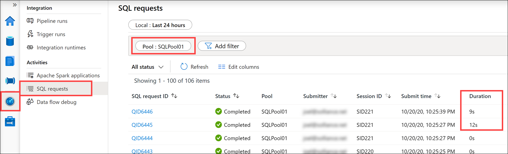

### Task 3: Improve performance with result-set caching

1. In [**Azure Synapse Studio**](<https://web.azuresynapse.net/>), select **Develop** from the left-hand menu.

    

2. Select **+**, then **SQL script**.

    

3. Connect to **SQLPool01**, then execute the following query to check if result set caching is turned on in the current SQL pool:

    ```sql
    SELECT
        name
        ,is_result_set_caching_on
    FROM
        sys.databases
    ```

4. If `False` is returned for `SQLPool01`, execute the following query to activate it (you need to run it on the `master` database):

    ```sql
    ALTER DATABASE [SQLPool01]
    SET RESULT_SET_CACHING ON
    ```

    Connect to **SQLPool01** and use the **master** database:

    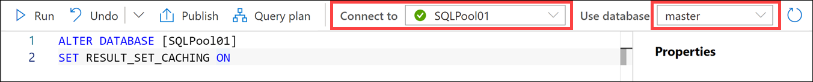

    > This process takes a couple of minutes to complete. While this is running, continue reading to familiarize yourself with the rest of the lab content.
    
    >**Important**
    >
    >The operations to create result set cache and retrieve data from the cache happen on the control node of a Synapse SQL pool instance. When result set caching is turned ON, running queries that return large result set (for example, >1GB) can cause high throttling on the control node and slow down the overall query response on the instance. Those queries are commonly used during data exploration or ETL operations. To avoid stressing the control node and cause performance issue, users should turn OFF result set caching on the database before running those types of queries.

5. Next move back to the Power BI Desktop report and hit the **Refresh** button to submit the query again.

    

6. After the data refreshes, hit **Refresh once more** to ensure we hit the result set cache.

7. Check the duration of the query again in Synapse Studio, in the Monitoring hub - SQL Requests page. Notice that now it runs almost instantly (Duration = 0s).

    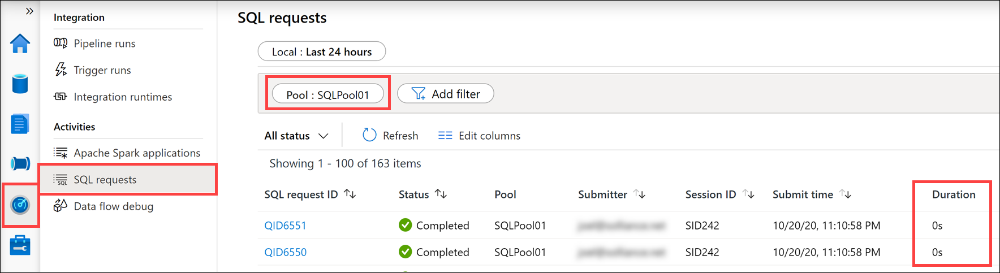

8. Return to the SQL script (or create a new one if you closed it) and run the following on the **master** database while connected to the dedicated SQL pool to turn result set caching back off:

    ```sql
    ALTER DATABASE [SQLPool01]
    SET RESULT_SET_CACHING OFF
    ```

    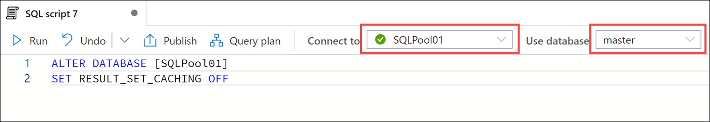

## Exercise 3: Visualize data with SQL Serverless


### Task 1: Explore the data lake with SQL Serverless

First, let's prepare the Power BI report query by exploring the data source we'll use for visualizations. In this exercise, we'll use the SQL-on demand instance from your Synapse workspace.

1. In [Azure Synapse Studio](https://web.azuresynapse.net), navigate to the **Data** hub.

    

2. Select the **Linked** tab **(1)**. Under the **Azure Data Lake Storage Gen2** group, select the Primary Data Lake (first node) **(2)** and select the **wwi-02** container **(3)**. Navigate to **`wwi-02/sale-small/Year=2019/Quarter=Q1/Month=1/Day=20190101` (4)**. Right-click on the Parquet file **(5)**, select **New SQL script (6)**, then **Select TOP 100 rows (7)**.

    

3. Run the generated script to preview data stored in the Parquet file.

    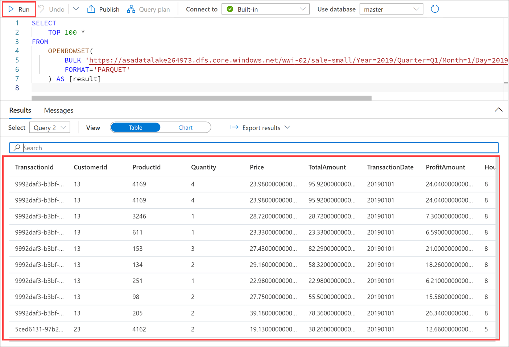

4. **Copy** the name of the primary data lake storage account from the query and save it in Notepad or similar text editor. You need this value for the next step.

    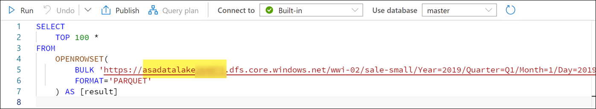

5. Now let's prepare the query we want to use next in the Power BI report. The query will extract the sum of amount and profit by day for a given month. Let's take for example January 2019. Notice the use of wildcards for the filepath that will reference all the files corresponding to one month. Paste and run the following query on the SQL-on demand instance and **replace** **`YOUR_STORAGE_ACCOUNT_NAME`** with the name of the storage account you copied above:

    ```sql
    DROP DATABASE IF EXISTS demo;
    GO

    CREATE DATABASE demo;
    GO

    USE demo;
    GO

    CREATE VIEW [2019Q1Sales] AS
    SELECT
        SUBSTRING(result.filename(), 12, 4) as Year
        ,SUBSTRING(result.filename(), 16, 2) as Month
        ,SUBSTRING(result.filename(), 18, 2) as Day
        ,SUM(TotalAmount) as TotalAmount
        ,SUM(ProfitAmount) as ProfitAmount
        ,COUNT(*) as TransactionsCount
    FROM
        OPENROWSET(
            BULK 'https://YOUR_STORAGE_ACCOUNT_NAME.dfs.core.windows.net/wwi-02/sale-small/Year=2019/Quarter=Q1/Month=1/*/*.parquet',
            FORMAT='PARQUET'
        ) AS [result]
    GROUP BY
        [result].filename()
    GO
    ```

    You should see a query output similar to the following:

    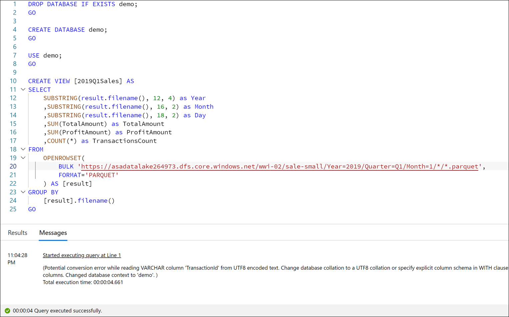

6. Replace the query with the following to select from the new view you created:

    ```sql
    USE demo;

    SELECT TOP (100) [Year]
    ,[Month]
    ,[Day]
    ,[TotalAmount]
    ,[ProfitAmount]
    ,[TransactionsCount]
    FROM [dbo].[2019Q1Sales]
    ```

    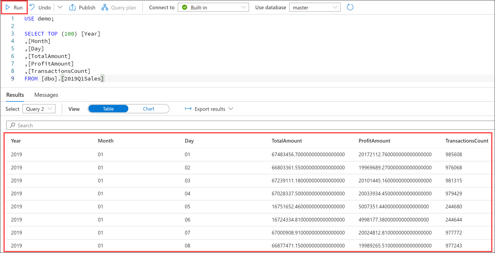

7. Navigate to the **Data** hub in the left-hand menu.

    

8. Select the **Workspace** tab **(1)**, then right-click the **Databases** group and select **Refresh** to update the list of databases. Expand the Databases group and expand the new **demo (SQL on-demand)** database you created **(2)**. You should see the **dbo.2019Q1Sales** view listed within the Views group **(3)**.

    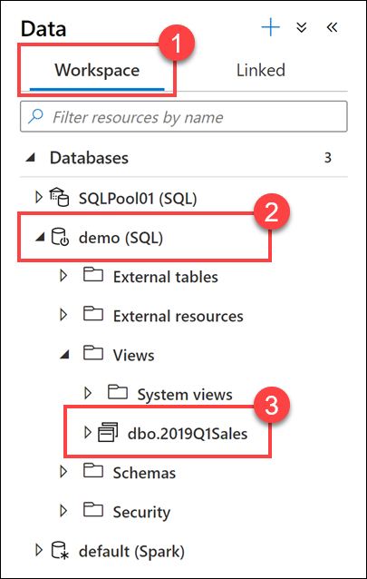

    > **Note**
    >
    > Synapse serverless SQL databases are used only for viewing metadata, not for actual data.

### Task 2: Visualize data with SQL serverless and create a Power BI report

1. In the [Azure Portal](https://portal.azure.com), navigate to your Synapse Workspace. In the **Overview** tab, **copy** the **Serverless SQL endpoint**:

    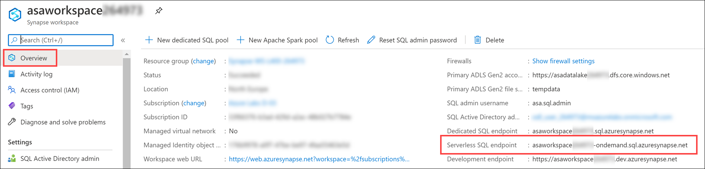

2. Switch back to Power BI Desktop. Create a new report, then click **Get data**.

    

3. Select **Azure** on the left-hand menu, then select **Azure Synapse Analytics (SQL DW)**. Finally, click **Connect**:

    

4. Paste the endpoint to the Serverless SQL endpoint identified on the first step into the **Server** field **(1)**, enter **`demo`** for the **Database (2)**, select **DirectQuery (3)**, then **paste the query below (4)** into the expanded **Advanced options** section of the SQL Server database dialog. Finally, click **OK (5)**.

    ```sql
    SELECT TOP (100) [Year]
    ,[Month]
    ,[Day]
    ,[TotalAmount]
    ,[ProfitAmount]
    ,[TransactionsCount]
    FROM [dbo].[2019Q1Sales]
    ```

    

5. (If prompted) Select the **Microsoft account** option on the left, **Sign in** (with the same credentials you use for connecting to the Synapse workspace) and click **Connect**.

    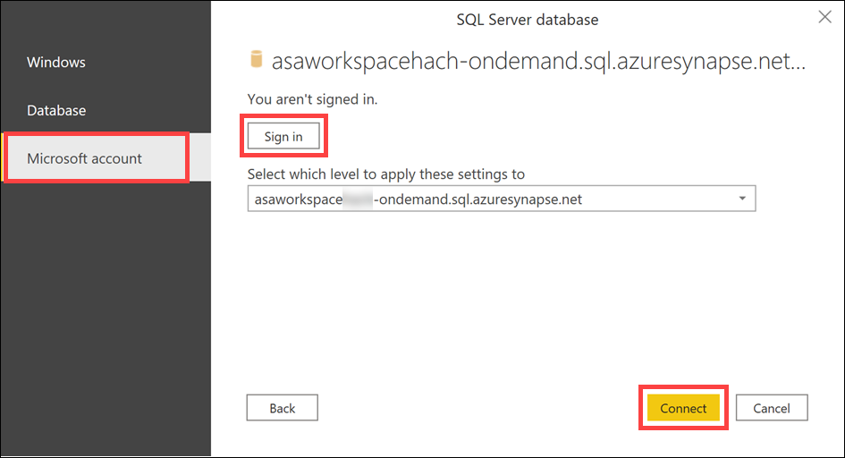

6. Select **Load** in the preview data window and wait for the connection to be configured.

    

7. After the data loads, select **Line chart** from the **Visualizations** menu.

    

8. Select the line chart visualization and configure it as follows to show Profit, Amount, and Transactions count by day:

    - **Axis**: `Day`
    - **Values**: `ProfitAmount`, `TotalAmount`
    - **Secondary values**: `TransactionsCount`

    

9. Select the line chart visualization and configure it to sort in ascending order by the day of transaction. To do this, select **More options** next to the chart visualization.

    

    Select **Sort ascending**.

    

    Select **More options** next to the chart visualization again.

    

    Select **Sort by**, then **Day**.

    

10. Click **Save** in the top-left corner.

    

11. Specify a file name, such as `synapse-sql-serverless`, then click **Save**.

    

12. Click **Publish** above the saved report. Make sure that, in Power BI Desktop, you are signed in with the same account you use in the Power BI portal and in Synapse Studio. You can switch to the proper account from the right topmost corner of the window. In the **Publish to Power BI** dialog, select the workspace you linked to Synapse (for example, **synapse-training**), then click **Select**.

    

13. Wait until the publish operation successfully completes.

    


14. Switch back to the Power BI service, or navigate to it in a new browser tab if you closed it earlier (<https://powerbi.microsoft.com/>).

15. Select the **synapse-training** workspace you created earlier. If you already had it open, refresh the page to see the new report and dataset.

    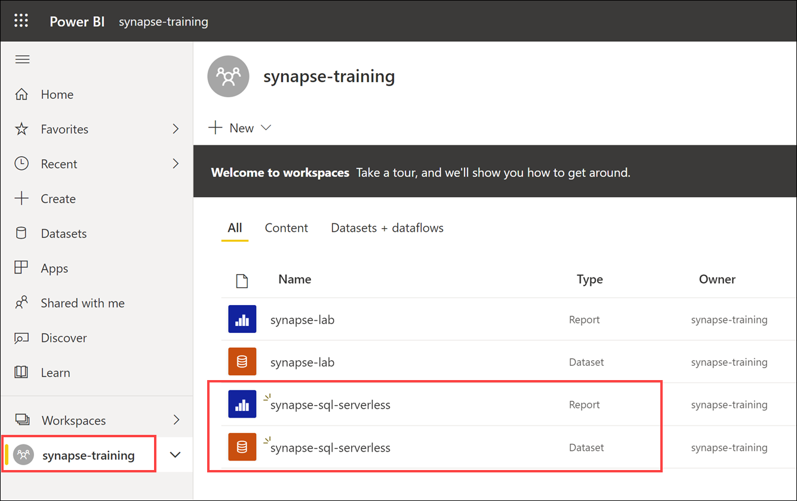

16. Select the **Settings** gear icon on the upper-right of the page, then select **Settings**. If you do not see the gear icon,you will need to select the ellipses (...) to view the menu item.

    

17. Select the **Datasets** tab **(1)**, then select the **synapse-sql-serverless** dataset **(2)**. If you see an error message under `Data source credentials` that your data source can't be refreshed because the credentials are invalid, select **Edit credentials (3)**. It may take a few seconds for this section to appear.

    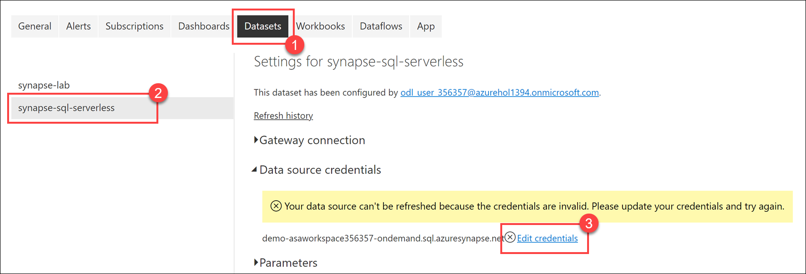

18. In the dialog that appears, select the **OAuth2** authentication method, then select **Sign in**. Enter your credentials if prompted.

    

19. In [Azure Synapse Studio](https://web.azuresynapse.net), navigate to the **Develop** hub.

    

20. Expand the Power BI group, expand your Power BI linked service (for example, `handson_powerbi`), right-click on **Power BI reports** and select **Refresh** to update the list of reports. You should see the two Power BI reports you created in this lab (`synapse-lab` and `synapse-sql-serverless`).

    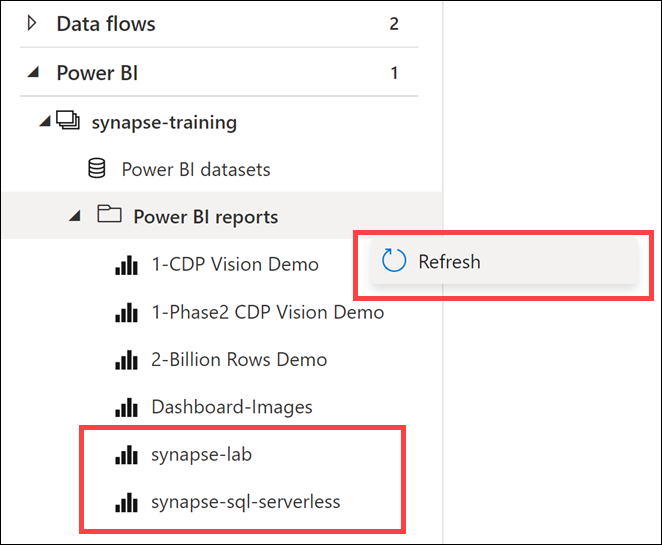

21. Select the **`synapse-lab`** report. You can view and edit the report directly within Synapse Studio!

    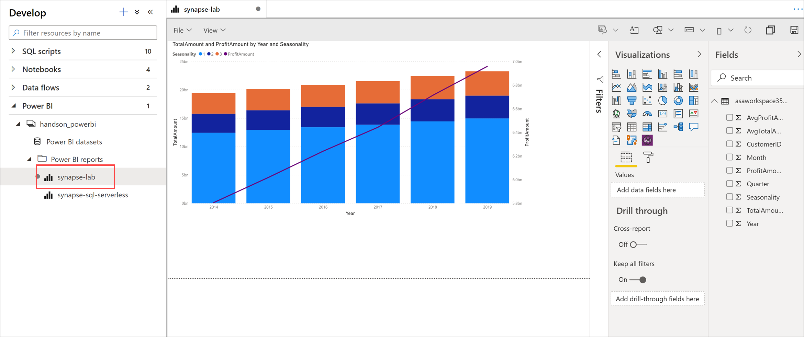

22. Select the **`synapse-sql-serverless`** report. You should be able to view and edit this report as well.

    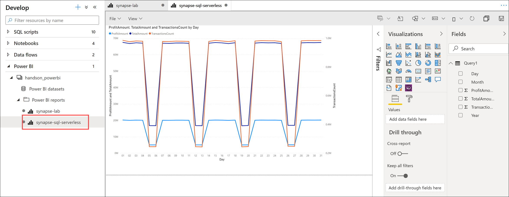

## Exercise 4: Cleanup

Complete these steps to free up resources you no longer need.

### Task 1: Pause the dedicated SQL pool

1. Open Synapse Studio (<https://web.azuresynapse.net/>).

2. Select the **Manage** hub.

    

3. Select **SQL pools** in the left-hand menu **(1)**. Hover over the name of the dedicated SQL pool and select **Pause (2)**.

    

4. When prompted, select **Pause**.

    
